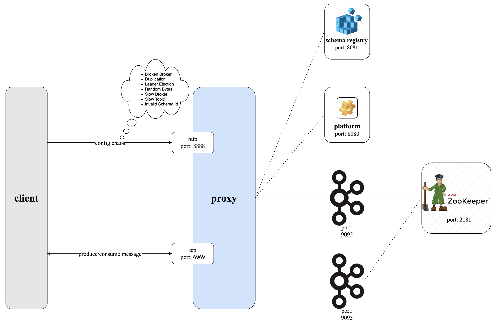

# Conduktor Gateway Chaos Demo

## What is Conduktor Gateway Chaos?

Chaos testing is the process of testing a distributed computing system to ensure that it can withstand unexpected disruptions. Kafka is an extremely resilient system and so it can be difficult to injects disruptions in order to be sure that applications can handle them.

Conduktor Gateway comes to the rescue, simulating common Kafka disruptions without and actual disruption occurring in the underlying Kafka cluster. 

In this demo we will inject the following disruptions with Conduktor Gateway and observe the result:

* Simulate Broken Brokers - Inject intermittent errors in client connections to brokers
* Duplication - Simulate request duplication
* Simulate Leader Election Errors - Simulate leader elections on the underlying Kafka cluster
* Simulate message corruption - Add random bytes to message data
* Simulate Slow Broker - Introduce intermittent latency in broker communication
* Slow Producers & Consumers - Introduce latency for specific topics
* Simulate Invalid Schema Id - Simulate broker responses as if the schema provided in a message was invalid

### Architecture diagram


## Running the demo: Setup

### Step 1: Review the environment

As can be seen from `docker-compose.yaml` the demo environment consists of the following:

* A single Zookeeper Server
* A 2 node Kafka cluster
* A single Conduktor Gateway container
* A single Schema Registry
* A Kafka Client container (this provides nothing more than a place to run kafka client commands)

### Step 2: Start the environment

Start the environment with

```bash
docker compose up --wait --detach

```

We have already created a `username`, called `someUsername`, for our virtual cluster which is provided in the definition of `clientConfig/gateway.properties`, we will use this to interact with Gateway throughout this demo.

```bash
cat clientConfig/gateway.properties
```

We create topics using the Kafka console tools, the below creates a topic named `conduktorTopic`

```bash
docker compose exec kafka-client \
  kafka-topics \
    --bootstrap-server conduktor-gateway:6969 \
    --command-config /clientConfig/gateway.properties \
    --create --if-not-exists \
    --topic conduktorTopic
```

List the created topic

```bash
docker compose exec kafka-client \
  kafka-topics \
    --bootstrap-server conduktor-gateway:6969 \
    --command-config /clientConfig/gateway.properties \
    --list
```

## Running the demo: Injecting Chaos

Conduktor Gateway provides a number of different ways to inject Chaos into your data flows:

* [Simulate Broken Brokers](#brokenBroker)
* [Duplicate Message on Produce](#duplicateWrites)
* [Simulate Leader Election Errors](#leaderElection)
* [Simulate Message Corruption](#randomBytes)
* [Simulate Slow Broker](#slowBroker)
* [Simulate Slow Producers & Consumers](#slowTopic)
* [Simulate Invalid Schema Id](#invalidSchema)

### <a name="brokenBroker"></a> Step 4: Simulate Broken Brokers

Conduktor Gateway exposes a REST API to configure the chaos features.

The command below will create a broken broker interceptor against the virtual cluster `someCluster`, instructing Conduktor Gateway to inject failures for some Produce requests that are consistent with broker side issues. 

```bash
docker compose exec kafka-client \
  curl \
    --user 'admin:conduktor' \
    --request POST "conduktor-gateway:8888/admin/interceptors/v1/vcluster/someCluster/interceptor/broken-broker" \
    --header 'Content-Type: application/json' \
    --data-raw '{
        "pluginClass": "io.conduktor.gateway.interceptor.chaos.SimulateBrokenBrokersPlugin",
        "priority": 100,
        "config": {
            "rateInPercent": 30,
            "errorMap": {
                "FETCH": "UNKNOWN_SERVER_ERROR",
                "PRODUCE": "CORRUPT_MESSAGE"
            }
        }
    }'
```

We can confirm the interceptor exists on the virtual cluster.
(We use `jq` for readability, if you don't have this installed remove simply the `| jq` from the below command.)
```bash
docker compose exec kafka-client \
  curl \
    --user 'admin:conduktor' \
    --request GET "conduktor-gateway:8888/admin/interceptors/v1/vcluster/someCluster/interceptors" \
    --header 'Content-Type: application/json' | jq
```

### Step 5: Inject some chaos

Let's produce some records to our created topic and observe some errors being injected by Conduktor Gateway.
Remember this will go to the virtual cluster `someCluster` where the topic conduktorTopic lives.

This should produce warnings as we inteded.

```bash
docker-compose exec kafka-client \
  kafka-producer-perf-test \
      --producer.config /clientConfig/gateway.properties \
      --record-size 10 \
      --throughput 10 \
      --num-records 10 \
      --topic conduktorTopic
```

This should produce output similar to this:

```bash
[2023-07-12 12:12:11,213] WARN [Producer clientId=perf-producer-client] Got error produce response with correlation id 64 on topic-partition conduktorTopic-0, retrying (2147483646 attempts left). Error: CORRUPT_MESSAGE (org.apache.kafka.clients.producer.internals.Sender)
[2023-07-12 12:12:12,109] WARN [Producer clientId=perf-producer-client] Got error produce response with correlation id 74 on topic-partition conduktorTopic-0, retrying (2147483646 attempts left). Error: OUT_OF_ORDER_SEQUENCE_NUMBER (org.apache.kafka.clients.producer.internals.Sender)
...
10 records sent, 5.031447 records/sec (0.00 MB/sec), 14587.31 ms avg latency, 19299.00 ms max latency, 14557 ms 50th, 18895 ms 95th, 19299 ms 99th, 19299 ms 99.9th.
```

Note the `CORRUPT_MESSAGE` errors, your results will vary each run so don't pay too much attention to any variation in latency figures.

### Step 6: Reset

To delete the interceptor and stop chaos injection run the below:

```bash
docker-compose exec kafka-client \
  curl \
    --user 'admin:conduktor' \
    --request DELETE "conduktor-gateway:8888/admin/interceptors/v1/vcluster/someCluster/interceptor/broken-broker"
```

and confirm by listing the interceptors for the virtual cluster, you expect an empty list `{"interceptors":[]}`:

```bash
docker-compose exec kafka-client \
  curl \
    --user "admin:conduktor" \
    conduktor-gateway:8888/admin/interceptors/v1/vcluster/someCluster/interceptors
```

### Step 7: Run with no Chaos

To verify, let's run the produce test again to confirm there are no errors

```bash
docker-compose exec kafka-client \
  kafka-producer-perf-test \
      --producer.config /clientConfig/gateway.properties \
      --record-size 100 \
      --throughput 10 \
      --num-records 100 \
      --topic conduktorTopic
```

This should produce output similar to the following:

```bash
52 records sent, 10.3 records/sec (0.00 MB/sec), 16.0 ms avg latency, 388.0 ms max latency.
100 records sent, 10.001000 records/sec (0.00 MB/sec), 10.69 ms avg latency, 388.00 ms max latency, 5 ms 50th, 43 ms 95th, 388 ms 99th, 388 ms 99.9th.
```

### <a name="duplicateWrites"></a> Step 8: Duplicate Message on Produce

First let's create a new topic to operate on.
```bash
docker-compose exec kafka-client \
  kafka-topics \
    --bootstrap-server conduktor-gateway:6969 \
    --command-config /clientConfig/gateway.properties \
    --create --if-not-exists \
    --topic conduktorTopicDuplicate
```
Conduktor Gateway exposes a REST API to configure the chaos features.

The command below will create a duplicate message on produce interceptor against the virtual cluster `someCluster`, instructing Conduktor Gateway to inject duplicate records on produce requests.


```bash
docker-compose exec kafka-client \
  curl \
    --user 'admin:conduktor' \
    --request POST "conduktor-gateway:8888/admin/interceptors/v1/vcluster/someCluster/interceptor/duplicate-resource" \
    --header 'Content-Type: application/json' \
    --data-raw '{
        "pluginClass": "io.conduktor.gateway.interceptor.chaos.DuplicateResourcesPlugin",
        "priority": 100,
        "config": {
            "topic": "conduktorTopicDuplicate",
            "rateInPercent": 100
        }
    }'
```
### Step 9: Inject some chaos

Let's produce some records to our created topic.

```bash
docker-compose exec \
  kafka-client kafka-producer-perf-test \
      --producer.config /clientConfig/gateway.properties \
      --record-size 100 \
      --throughput 10 \
      --num-records 10 \
      --topic conduktorTopicDuplicate
```

And see the duplicated records:

```bash
docker-compose exec kafka-client \
  kafka-console-consumer \
      --bootstrap-server conduktor-gateway:6969 \
      --consumer.config /clientConfig/gateway.properties \
      --from-beginning \
      --topic conduktorTopicDuplicate \
      --max-messages 20
```

This should produce output similar to this:

```bash
SSXVNJHPDQDXVCRASTVYBCWVMGNYKRXVZXKGXTSPSJDGYLUEGQFLAQLOCFLJBEPOWFNSOMYARHAOPUFOJHHDXEHXJBHWGSMZJGNL
SSXVNJHPDQDXVCRASTVYBCWVMGNYKRXVZXKGXTSPSJDGYLUEGQFLAQLOCFLJBEPOWFNSOMYARHAOPUFOJHHDXEHXJBHWGSMZJGNL
ONJVXZXZOZITKXJBOZWDJMCBOSYQQKCPRRDCZWMRLFXBLGQPRPGRNTAQOOSVXPKJPJLAVSQCCRXFRROLLHWHOHFGCFWPNDLMWCSS
ONJVXZXZOZITKXJBOZWDJMCBOSYQQKCPRRDCZWMRLFXBLGQPRPGRNTAQOOSVXPKJPJLAVSQCCRXFRROLLHWHOHFGCFWPNDLMWCSS
HWXQQYKALAAWCMXYLMZALGDESKKTEESEMPRHROVKUMPSXHELIDQEOOHOIHEGJOAZBVPUMCHSHGXZYXXQRUICRIJGQEBBWAXABQRI
HWXQQYKALAAWCMXYLMZALGDESKKTEESEMPRHROVKUMPSXHELIDQEOOHOIHEGJOAZBVPUMCHSHGXZYXXQRUICRIJGQEBBWAXABQRI
RUGZJUUVFYQOVCDEDXYFPRLGSGZXSNIAVODTJKSQWHNWVPSAMZKOUDTWHIORJSCZIQYPCZMBYWKDIKOKYNGWPXZWMKRDCMBXKFUI
RUGZJUUVFYQOVCDEDXYFPRLGSGZXSNIAVODTJKSQWHNWVPSAMZKOUDTWHIORJSCZIQYPCZMBYWKDIKOKYNGWPXZWMKRDCMBXKFUI
LWDHBFXRFAOPRUGDFLPDLHXXCXCUPLWGDPPHEMJGMTVMFQQFVCUPOFYWLDUEBICKPZKHKVMCJVWVKTXBKAPWAPENUEZNWNWDCACD
LWDHBFXRFAOPRUGDFLPDLHXXCXCUPLWGDPPHEMJGMTVMFQQFVCUPOFYWLDUEBICKPZKHKVMCJVWVKTXBKAPWAPENUEZNWNWDCACD
RLPIPHJQQKMOFDQSPKKNURFBORJLBPCBIWTSJNPRBNITTKJYWAHWGKZYNUSFISPIYPIOGAUPZDXHCFVGXGIVVCPFHIXAACZXZLFD
RLPIPHJQQKMOFDQSPKKNURFBORJLBPCBIWTSJNPRBNITTKJYWAHWGKZYNUSFISPIYPIOGAUPZDXHCFVGXGIVVCPFHIXAACZXZLFD
MOOSSNTKUPJQEIRRQAMUCTBLBSVPDDYOIHAOODZNJTVHDCIEGTAVMYZOCIVSKUNSMXEKBEWNZPRPWPUJABJXNQBOXSHOEGMJSNBU
MOOSSNTKUPJQEIRRQAMUCTBLBSVPDDYOIHAOODZNJTVHDCIEGTAVMYZOCIVSKUNSMXEKBEWNZPRPWPUJABJXNQBOXSHOEGMJSNBU
TGTIFVEQPSYBDXEXORPQDDODZGBELOISTRWXMEYWVVHGMJKWLJCCHPKAFRASZEYQZCVLFSLOWTLBMPPWPPFPQSAZPTULSTCDMODY
TGTIFVEQPSYBDXEXORPQDDODZGBELOISTRWXMEYWVVHGMJKWLJCCHPKAFRASZEYQZCVLFSLOWTLBMPPWPPFPQSAZPTULSTCDMODY
KZGSRFQTRFTGCNMNXQQIYVUQZHVNIPHZWVBSGOBYIFDNNXUTBBQUYNXOZCSICGRTZSSRHROJRGBHMHEQJRDLOQBEPTOBMYLMIGPP
KZGSRFQTRFTGCNMNXQQIYVUQZHVNIPHZWVBSGOBYIFDNNXUTBBQUYNXOZCSICGRTZSSRHROJRGBHMHEQJRDLOQBEPTOBMYLMIGPP
DPOLTEUVDGATCGYPQOGOYYESKEGBLOCBIYSLQEYGCCIPBXPNSPKDYTBEWDHBHWVDPLOVHJPNYGJUHKKHDASNFGZDAIWWQEPPBRJK
DPOLTEUVDGATCGYPQOGOYYESKEGBLOCBIYSLQEYGCCIPBXPNSPKDYTBEWDHBHWVDPLOVHJPNYGJUHKKHDASNFGZDAIWWQEPPBRJK
```

Note the duplicated messages.

### Step 10: Reset

To delete the interceptor and stop chaos injection run the below:

```bash
docker-compose exec kafka-client \
  curl \
    --user 'admin:conduktor' \
    --request DELETE "conduktor-gateway:8888/admin/interceptors/v1/vcluster/someCluster/interceptor/duplicate-resource"
```
and confirm by listing the interceptors for the virtual cluster, you expect an empty list `{"interceptors":[]}`:

```bash
docker-compose exec kafka-client \
  curl \
    --user "admin:conduktor" \
    conduktor-gateway:8888/admin/interceptors/v1/vcluster/someCluster/interceptors
```
### <a name="leaderElection"></a> Step 11: Simulate Leader Election Errors

Conduktor Gateway exposes a REST API to configure the chaos features.

The command below will create a `simulate leader election errors` interceptor against the virtual cluster `someCluster`, instructing Conduktor Gateway to simulate a leader election on partitions being produced to through Conduktor Gateway.

```bash
docker-compose exec kafka-client \
  curl \
    --user 'admin:conduktor' \
    --request POST "conduktor-gateway:8888/admin/interceptors/v1/vcluster/someCluster/interceptor/leader-election" \
    --header 'Content-Type: application/json' \
    --data-raw '{
        "pluginClass": "io.conduktor.gateway.interceptor.chaos.SimulateLeaderElectionsErrorsPlugin",
        "priority": 100,
        "config": {
          "rateInPercent": 50
        }
    }'
```
### Step 12: Inject some chaos

Let's produce some records to our created topic.

```bash
docker-compose exec kafka-client \
  kafka-producer-perf-test \
      --producer.config /clientConfig/gateway.properties \
      --record-size 100 \
      --throughput 10 \
      --num-records 10 \
      --topic conduktorTopic
```

This should produce output similar to this:

```bash
[2022-11-17 14:15:18,481] WARN [Producer clientId=perf-producer-client] Received invalid metadata error in produce request on partition conduktorTopic-0 due to org.apache.kafka.common.errors.NotLeaderOrFollowerException: For requests intended only for the leader, this error indicates that the broker is not the current leader. For requests intended for any replica, this error indicates that the broker is not a replica of the topic partition.. Going to request metadata update now (org.apache.kafka.clients.producer.internals.Sender)
[2022-11-17 14:15:18,584] WARN [Producer clientId=perf-producer-client] Got error produce response with correlation id 121 on topic-partition conduktorTopic-0, retrying (2147483588 attempts left). Error: NOT_LEADER_OR_FOLLOWER (org.apache.kafka.clients.producer.internals.Sender)
[2022-11-17 14:15:18,584] WARN [Producer clientId=perf-producer-client] Received invalid metadata error in produce request on partition conduktorTopic-0 due to org.apache.kafka.common.errors.NotLeaderOrFollowerException: For requests intended only for the leader, this error indicates that the broker is not the current leader. For requests intended for any replica, this error indicates that the broker is not a replica of the topic partition.. Going to request metadata update now (org.apache.kafka.clients.producer.internals.Sender)
1 records sent, 0.2 records/sec (0.00 MB/sec), 6511.0 ms avg latency, 6511.0 ms max latency.
10 records sent, 1.531159 records/sec (0.00 MB/sec), 6010.20 ms avg latency, 6511.00 ms max latency, 6118 ms 50th, 6511 ms 95th, 6511 ms 99th, 6511 ms 99.9th.
```

Note both the different error types, and the exceptions indicating that the current leader has changed.

### Step 13: Reset

To delete the interceptor and stop chaos injection run the below:

```bash
docker-compose exec kafka-client \
  curl \
    --user 'admin:conduktor' \
    --request DELETE "conduktor-gateway:8888/admin/interceptors/v1/vcluster/someCluster/interceptor/leader-election"
```
and confirm by listing the interceptors for the virtual cluster, you expect an empty list `{"interceptors":[]}`:

```bash
docker-compose exec kafka-client \
  curl \
    --user "admin:conduktor" \
    conduktor-gateway:8888/admin/interceptors/v1/vcluster/someCluster/interceptors
```

### <a name="randomBytes"></a> Step 14: Simulate Message Corruption

First let's create a new topic to operate on.

```bash
docker-compose exec kafka-client \
  kafka-topics \
    --bootstrap-server conduktor-gateway:6969 \
    --command-config /clientConfig/gateway.properties \
    --create --if-not-exists \
    --topic conduktorTopicRandomBytes
```

Conduktor Gateway exposes a REST API to configure the chaos features.

The command below will create a `simulate message corruption` interceptor against the virtual cluster `someCluster`. This instructs Conduktor Gateway to simulate message corruption by appending random bytes to messages produced.

```bash
docker-compose exec kafka-client \
  curl \
    --user 'admin:conduktor' \
    --request POST "conduktor-gateway:8888/admin/interceptors/v1/vcluster/someCluster/interceptor/random-bytes" \
    --header 'Content-Type: application/json' \
    --data-raw '{
        "pluginClass": "io.conduktor.gateway.interceptor.chaos.ProduceSimulateMessageCorruptionPlugin",
        "priority": 100,
        "config": { 
          "topic": "conduktorTopicRandomBytes",  
          "sizeInBytes": 10,
          "rateInPercent": 100
        }
    }'
```
### Step 15: Inject some chaos

Let's produce some records to our created topic.

```bash
docker compose exec kafka-client \
  kafka-producer-perf-test \
    --producer.config /clientConfig/gateway.properties \
    --record-size 100 \
    --throughput 10 \
    --num-records 10 \
    --topic conduktorTopicRandomBytes
```

And see the appended bytes in the records:

```bash
docker compose exec kafka-client \
  kafka-console-consumer \
      --bootstrap-server conduktor-gateway:6969 \
      --consumer.config /clientConfig/gateway.properties \
      --from-beginning \
      --topic conduktorTopicRandomBytes \
      --max-messages 10
```

This should produce output similar to this:

```bash
TGTIFVEQPSYBDXEXORPQDDODZGBELOISTRWXMEYWVVHGMJKWLJCCHPKAFRASZEYQZCVLFSLOWTLBMPPWPPFPQSAZPTULSTCDMODY
KZGSRFQTRFTGCNMNXQQIYVUQZHVNIPHZWVBSGOBYIFDNNXUTBBQUYNXOZCSICGRTZSSRHROJRGBHMHEQJRDLOQBEPTOBMYLMIGPP
DPOLTEUVDGATCGYPQOGOYYESKEGBLOCBIYSLQEYGCCIPBXPNSPKDYTBEWDHBHWVDPLOVHJPNYGJUHKKHDASNFGZDAIWWQEPPBRJK
SSXVNJHPDQDXVCRASTVYBCWVMGNYKRXVZXKGXTSPSJDGYLUEGQFLAQLOCFLJBEPOWFNSOMYARHAOPUFOJHHDXEHXJBHWGSMZJGNLH|��>�yC
ONJVXZXZOZITKXJBOZWDJMCBOSYQQKCPRRDCZWMRLFXBLGQPRPGRNTAQOOSVXPKJPJLAVSQCCRXFRROLLHWHOHFGCFWPNDLMWCSSv��k�z�
HWXQQYKALAAWCMXYLMZALGDESKKTEESEMPRHROVKUMPSXHELIDQEOOHOIHEGJOAZBVPUMCHSHGXZYXXQRUICRIJGQEBBWAXABQRI�����W�N
RUGZJUUVFYQOVCDEDXYFPRLGSGZXSNIAVODTJKSQWHNWVPSAMZKOUDTWHIORJSCZIQYPCZMBYWKDIKOKYNGWPXZWMKRDCMBXKFUI��*2�Ћ�
LWDHBFXRFAOPRUGDFLPDLHXXCXCUPLWGDPPHEMJGMTVMFQQFVCUPOFYWLDUEBICKPZKHKVMCJVWVKTXBKAPWAPENUEZNWNWDCACD	�'6�x���
```

Note the longer messages with extra bytes.
A similar plugin is available for simulating message corrpution on the consumer side too!

### Step 16: Reset

To stop chaos injection run the below:

```bash
docker-compose exec kafka-client \
  curl \
    --user 'admin:conduktor' \
    --request DELETE "conduktor-gateway:8888/admin/interceptors/v1/vcluster/someCluster/interceptor/random-bytes"
```

and confirm the removal of the interceptor from the virtual cluster `someCluster`;

```bash
docker-compose exec kafka-client \
  curl \
    --user "admin:conduktor" \
    conduktor-gateway:8888/admin/interceptors/v1/vcluster/someCluster/interceptors
```

### <a name="slowBroker"></a> Step 17: Simulate Slow Broker

Conduktor Gateway exposes a REST API to configure the chaos features.

The command below will create a `simulate slow broker` interceptor against the virtual cluster `someCluster`. This instructs Conduktor Gateway to simulate slow responses from brokers.

```bash
docker-compose exec kafka-client \
  curl \
    --user 'admin:conduktor' \
    --request POST "conduktor-gateway:8888/admin/interceptors/v1/vcluster/someCluster/interceptor/slow-broker" \
    --header 'Content-Type: application/json' \
    --data-raw '{
        "pluginClass": "io.conduktor.gateway.interceptor.chaos.SimulateSlowBrokerPlugin",
        "priority": 100,
        "config": {
          "rateInPercent": 100,
          "minLatencyMs":100,
          "maxLatencyMs":1200
        }
    }'
```
### Step 18: Inject some chaos

Let's produce some records to our created topic.

```bash
docker-compose exec kafka-client \
  kafka-producer-perf-test \
    --producer.config /clientConfig/gateway.properties \
    --record-size 100 \
    --throughput 10 \
    --num-records 10 \
    --topic conduktorTopic
```

This should produce output similar to this:

```bash
1 records sent, 0.1 records/sec (0.00 MB/sec), 7357.0 ms avg latency, 7357.0 ms max latency.
[2022-11-17 15:21:28,803] WARN [Producer clientId=perf-producer-client] Got error produce response with correlation id 5 on topic-partition conduktorTopic-0, retrying (2147483646 attempts left). Error: OUT_OF_ORDER_SEQUENCE_NUMBER (org.apache.kafka.clients.producer.internals.Sender)
[2022-11-17 15:21:28,805] WARN [Producer clientId=perf-producer-client] Got error produce response with correlation id 6 on topic-partition conduktorTopic-0, retrying (2147483646 attempts left). Error: OUT_OF_ORDER_SEQUENCE_NUMBER (org.apache.kafka.clients.producer.internals.Sender)
[2022-11-17 15:21:28,805] WARN [Producer clientId=perf-producer-client] Got error produce response with correlation id 7 on topic-partition conduktorTopic-0, retrying (2147483646 attempts left). Error: OUT_OF_ORDER_SEQUENCE_NUMBER (org.apache.kafka.clients.producer.internals.Sender)
[2022-11-17 15:21:29,062] WARN [Producer clientId=perf-producer-client] Got error produce response with correlation id 8 on topic-partition conduktorTopic-0, retrying (2147483646 attempts left). Error: OUT_OF_ORDER_SEQUENCE_NUMBER (org.apache.kafka.clients.producer.internals.Sender)
10 records sent, 0.066271 records/sec (0.00 MB/sec), 48360.70 ms avg latency, 120005.00 ms max latency, 2195 ms 50th, 120005 ms 95th, 120005 ms 99th, 120005 ms 99.9th.
```

Note the very high latency numbers indicating slow responses.
You may also get some additional errors depending what version you are running where it tries to rebalance.

### Step 19: Reset

To delete the interceptor and stop chaos injection run the below:

```bash
docker-compose exec kafka-client \
  curl \
    --user 'admin:conduktor' \
    --request DELETE "conduktor-gateway:8888/admin/interceptors/v1/vcluster/someCluster/interceptor/slow-broker"
```

and confirm by listing the interceptors for the virtual cluster, you expect an empty list `{"interceptors":[]}`:

```bash
docker-compose exec kafka-client \
  curl \
    --user "admin:conduktor" \
    conduktor-gateway:8888/admin/interceptors/v1/vcluster/someCluster/interceptors
```
### <a name="slowTopic"></a> Step 20: Simulate Slow Producers & Consumers

Conduktor Gateway exposes a REST API to configure the chaos features.

The command below will create a `simulate slow producers and consumers` interceptor against the virtual cluster `someCluster`. This instructs Conduktor Gateway to simulate slow responses from brokers, but only on a set of topics rather than all trafic.

```bash
docker-compose exec kafka-client \
  kafka-topics \
    --bootstrap-server conduktor-gateway:6969 \
    --command-config /clientConfig/gateway.properties \
    --create --if-not-exists \
    --topic conduktorTopicSlow
```

```bash
docker-compose exec kafka-client \
  curl \
    --user 'admin:conduktor' \
    --request POST "conduktor-gateway:8888/admin/interceptors/v1/vcluster/someCluster/interceptor/slow-topic" \
    --header 'Content-Type: application/json' \
    --data-raw '{
        "pluginClass": "io.conduktor.gateway.interceptor.chaos.SimulateSlowProducersConsumersPlugin",
        "priority": 100,
        "config": {
          "topic": "conduktorTopicSlow",
          "rateInPercent": 100,
          "minLatencyMs":100,
          "maxLatencyMs":1200
        }
    }'
```
### Step 21: Inject some chaos

Let's produce some records to our created topic.

```bash
docker-compose exec kafka-client \
  kafka-producer-perf-test \
      --producer.config /clientConfig/gateway.properties \
      --record-size 100 \
      --throughput 10 \
      --num-records 10 \
      --topic conduktorTopicSlow
```

This should produce output similar to this:

```bash
1 records sent, 0.1 records/sec (0.00 MB/sec), 7251.0 ms avg latency, 7251.0 ms max latency.
[2022-11-17 15:26:32,507] WARN [Producer clientId=perf-producer-client] Got error produce response with correlation id 5 on topic-partition conduktorTopic-0, retrying (2147483646 attempts left). Error: OUT_OF_ORDER_SEQUENCE_NUMBER (org.apache.kafka.clients.producer.internals.Sender)
[2022-11-17 15:26:32,510] WARN [Producer clientId=perf-producer-client] Got error produce response with correlation id 6 on topic-partition conduktorTopic-0, retrying (2147483646 attempts left). Error: OUT_OF_ORDER_SEQUENCE_NUMBER (org.apache.kafka.clients.producer.internals.Sender)
[2022-11-17 15:26:32,510] WARN [Producer clientId=perf-producer-client] Got error produce response with correlation id 7 on topic-partition conduktorTopic-0, retrying (2147483646 attempts left). Error: OUT_OF_ORDER_SEQUENCE_NUMBER (org.apache.kafka.clients.producer.internals.Sender)
[2022-11-17 15:26:32,511] WARN [Producer clientId=perf-producer-client] Got error produce response with correlation id 8 on topic-partition conduktorTopic-0, retrying (2147483646 attempts left). Error: OUT_OF_ORDER_SEQUENCE_NUMBER (org.apache.kafka.clients.producer.internals.Sender)
10 records sent, 1.354463 records/sec (0.00 MB/sec), 6830.00 ms avg latency, 7251.00 ms max latency, 6900 ms 50th, 7251 ms 95th, 7251 ms 99th, 7251 ms 99.9th.
```

Note the very high latency numbers indicating slow responses.

### Step 22: Reset

To delete the interceptor and stop chaos injection run the below:

```bash
docker-compose exec kafka-client \
  curl \
    --user 'admin:conduktor' \
    --request DELETE "conduktor-gateway:8888/admin/interceptors/v1/vcluster/someCluster/interceptor/slow-topic"
```

and confirm by listing the interceptors for the virtual cluster, you expect an empty list `{"interceptors":[]}`:

```bash
docker-compose exec kafka-client \
  curl \
    --user "admin:conduktor" \
    conduktor-gateway:8888/admin/interceptors/v1/vcluster/someCluster/interceptors
```
### <a name="invalidSchema"></a> Step 23: Simulate Invalid Schema Id

First let's create a new topic to operate on.

```bash
docker-compose exec kafka-client \
  kafka-topics \
    --bootstrap-server conduktor-gateway:6969 \
    --command-config /clientConfig/gateway.properties \
    --create --if-not-exists \
    --topic conduktorTopicSchema
```

Conduktor Gateway exposes a REST API to configure interceptors.

The command below will create a `simulate invalid schema Id` interceptor against the virtual cluster `someCluster`. This instructs Conduktor Gateway to inject Schema Ids into messages, simulating a situation where clients cannot deserialize messages with the schema information provided.

```bash
docker-compose exec kafka-client \
  curl \
    --user 'admin:conduktor' \
    --request POST "conduktor-gateway:8888/admin/interceptors/v1/vcluster/someCluster/interceptor/invalid-schema" \
    --header 'Content-Type: application/json' \
    --data-raw '{
        "pluginClass": "io.conduktor.gateway.interceptor.chaos.SimulateInvalidSchemaIdPlugin",
        "priority": 100,
        "config": {
          "topic": "conduktorTopicSchema",
          "invalidSchemaId": 999,
          "target": "CONSUME"
        }
    }'
  ```
### Step 24: Inject some chaos

Let's produce a record to our created topic.

```bash
cat clientConfig/payload.json | docker compose exec -T schema-registry \
  kafka-json-schema-console-producer \
    --bootstrap-server conduktor-gateway:6969 \
    --topic conduktorTopicSchema  \
    --producer.config /clientConfig/gateway.properties \
    --property value.schema='{ 
        "title": "someSchema", 
        "type": "object", 
        "properties": { 
          "some-valid": { 
            "type": "string" 
          }
        }
      }'
```

And consume them with a schema aware consumer.

```bash
docker-compose exec schema-registry \
  kafka-json-schema-console-consumer \
    --bootstrap-server conduktor-gateway:6969 \
    --topic conduktorTopicSchema \
    --consumer.config /clientConfig/gateway.properties \
    --from-beginning 
```

This should produce output similar to this:

```bash
Processed a total of 1 messages
[2022-11-17 15:59:13,184] ERROR Unknown error when running consumer:  (kafka.tools.ConsoleConsumer$)
org.apache.kafka.common.errors.SerializationException: Error retrieving JSON schema for id 999
	at io.confluent.kafka.serializers.AbstractKafkaSchemaSerDe.toKafkaException(AbstractKafkaSchemaSerDe.java:259)
	at io.confluent.kafka.serializers.json.AbstractKafkaJsonSchemaDeserializer.deserialize(AbstractKafkaJsonSchemaDeserializer.java:182)
	at io.confluent.kafka.formatter.json.JsonSchemaMessageFormatter$JsonSchemaMessageDeserializer.deserialize(JsonSchemaMessageFormatter.java:130)
	at io.confluent.kafka.formatter.json.JsonSchemaMessageFormatter$JsonSchemaMessageDeserializer.deserialize(JsonSchemaMessageFormatter.java:103)
	at io.confluent.kafka.formatter.json.JsonSchemaMessageFormatter.writeTo(JsonSchemaMessageFormatter.java:94)
	at io.confluent.kafka.formatter.SchemaMessageFormatter.writeTo(SchemaMessageFormatter.java:181)
	at kafka.tools.ConsoleConsumer$.process(ConsoleConsumer.scala:116)
	at kafka.tools.ConsoleConsumer$.run(ConsoleConsumer.scala:76)
	at kafka.tools.ConsoleConsumer$.main(ConsoleConsumer.scala:53)
	at kafka.tools.ConsoleConsumer.main(ConsoleConsumer.scala)
Caused by: io.confluent.kafka.schemaregistry.client.rest.exceptions.RestClientException: Schema 999 not found; error code: 40403
	at io.confluent.kafka.schemaregistry.client.rest.RestService.sendHttpRequest(RestService.java:301)
	at io.confluent.kafka.schemaregistry.client.rest.RestService.httpRequest(RestService.java:371)
	at io.confluent.kafka.schemaregistry.client.rest.RestService.getId(RestService.java:840)
	at io.confluent.kafka.schemaregistry.client.rest.RestService.getId(RestService.java:813)
	at io.confluent.kafka.schemaregistry.client.CachedSchemaRegistryClient.getSchemaByIdFromRegistry(CachedSchemaRegistryClient.java:294)
	at io.confluent.kafka.schemaregistry.client.CachedSchemaRegistryClient.getSchemaBySubjectAndId(CachedSchemaRegistryClient.java:417)
	at io.confluent.kafka.serializers.json.AbstractKafkaJsonSchemaDeserializer.deserialize(AbstractKafkaJsonSchemaDeserializer.java:119)
	... 8 more

```

### Step 25: Reset

To delete the interceptor and stop chaos injection run the below:

```bash
docker-compose exec kafka-client \
  curl \
    --user 'admin:conduktor' \
    --request DELETE "conduktor-gateway:8888/admin/interceptors/v1/vcluster/someCluster/interceptor/invalid-schema"
```

and confirm by listing the interceptors for the virtual cluster, you expect an empty list `{"interceptors":[]}`:

```bash
docker-compose exec kafka-client \
  curl \
    --user "admin:conduktor" \
    conduktor-gateway:8888/admin/interceptors/v1/vcluster/someCluster/interceptors
```

# Conclusion
In this demo we have simulated several highly chaotic scenarios that applications need to handle, in a controlled manner. Be that latency, message quality, infrastructure issues or human error, all can be simulated.  

These are a sample of the types of situations that can be simulated, if you have others or more detailed scenarios you'd want to simualte then [get in touch](https://www.conduktor.io/contact/demo), we'd love to speak with you. 