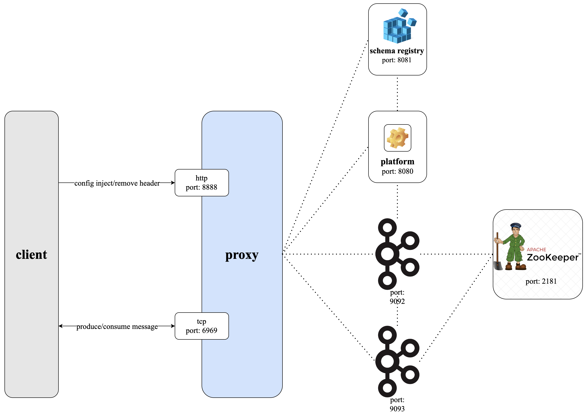
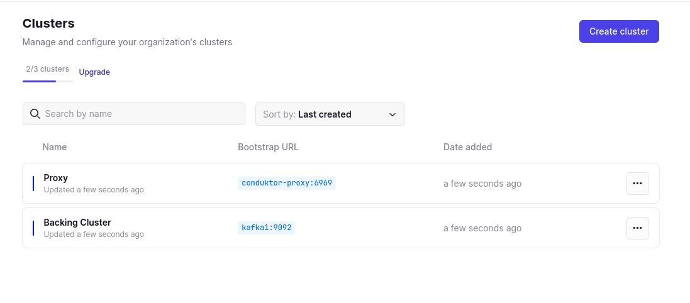
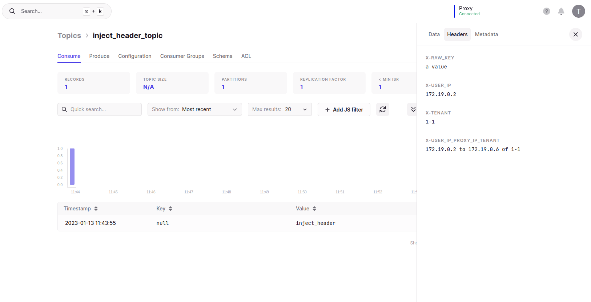
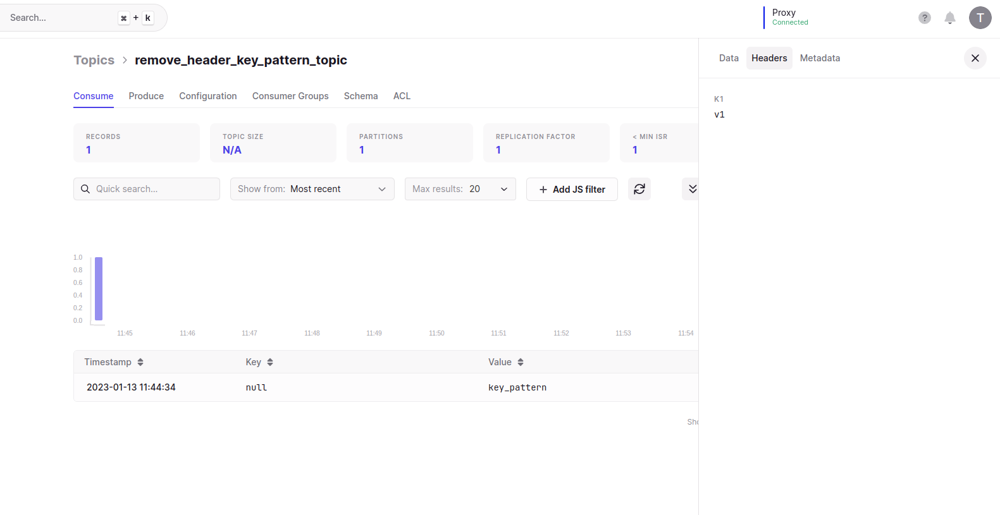
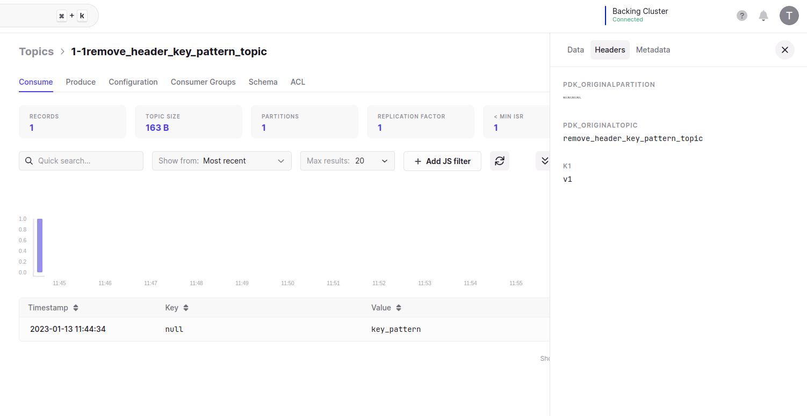

# Conduktor Gateway Dynamic Header Injection & Removal Demo

There are multiple interceptors available for manipulating headers, either injection or regex based removal. This demo will run you through some of these use cases step-by-step.

### Architecture diagram


## Running the demo

Conduktor Gateway provides a number of different ways to inject/remove headers:

* [Inject Header](#injectHeader)
* [Remove Header With Key Pattern Only](#removeHeaderKeyPatternOnly)
* [Remove Header With Value Pattern Only](#removeHeaderKeyValueOnly)
* [Remove Header With Both Key And Value Pattern](#removeHeaderKeyValuePattern)

### Step 1: Review the environment

As can be seen from `docker-compose.yaml` the demo environment consists of the following:

* A single Zookeeper Server
* A 2 node Kafka cluster
* A single Conduktor Gateway container
* A Conduktor Console container
* A Kafka Client container (this provides nothing more than a place to run kafka client commands)

### Step 2: Review the Console configuration

`platform-config.yaml` defines configurations for connecting to 2 clusters:

* Backing Kafka - this is a direct connection to the underlying Kafka cluster hosting the demo
* Gateway - a connection to Conduktor Gateway, which sits as a proxy infront of the underlying Kafka

Note: Gateway and backing Kafka can use different security schemes. 
In this case the backing Kafka is PLAINTEXT but the Gateway is SASL_PLAIN.

### Step 3: Start the environment

Start the environment with

```bash
docker compose up --detach

```

### Step 4: Create topics

We create a base set of topics using the Kafka CLI tools;

```bash
docker compose exec kafka-client \
  kafka-topics \
    --bootstrap-server conduktor-gateway:6969 \
    --command-config /clientConfig/gateway.properties \
    --create --if-not-exists \
    --topic injectHeaderTopic

docker compose exec kafka-client \
  kafka-topics \
    --bootstrap-server conduktor-gateway:6969 \
    --command-config /clientConfig/gateway.properties \
    --create --if-not-exists \
    --topic removeHeaderKeyPatternTopic

docker compose exec kafka-client \
  kafka-topics \
    --bootstrap-server conduktor-gateway:6969 \
    --command-config /clientConfig/gateway.properties \
    --create --if-not-exists \
    --topic removeHeaderValuePatternTopic

docker compose exec kafka-client \
  kafka-topics \
    --bootstrap-server conduktor-gateway:6969 \
    --command-config /clientConfig/gateway.properties \
    --create --if-not-exists \
    --topic removeHeaderKeyValuePatternTopic
```
List the created topics

```bash
docker compose exec kafka-client \
  kafka-topics \
    --bootstrap-server conduktor-gateway:6969 \
    --command-config /clientConfig/gateway.properties \
    --list
```

### <a name="injectHeader"></a> Step 5: Inject Header

Use the Admin API to add the inject header interceptor. 

The command below will add an interceptor to Conduktor Gateway to inject headers with values of user ip, username and Gateway ip in records on the topic `injectHeaderTopic`. 

```bash
docker compose exec kafka-client \
  curl \
    --silent \
    --user admin:conduktor \
    --request POST "conduktor-gateway:8888/admin/interceptors/v1/vcluster/someCluster/username/someUsername/interceptor/injectHeader" \
    --header 'Content-Type: application/json' \
    --data-raw '{
        "pluginClass": "io.conduktor.gateway.interceptor.DynamicHeaderInjectionPlugin",
        "priority": 100,
        "config": {
            "topic": "injectHeaderTopic",
            "headers": {
              "X-RAW_KEY": "a value",
              "X-USER_IP": "{{userIp}}",
              "X-USERNAME": "{{user}}",
              "X-USER_IP_GATEWAY_IP_USERNAME": "{{userIp}} to {{gatewayIp}} of {{user}}"
            }
        }
    }'
```
Confirm the interceptor exists.
(We use `jq` for readability, if you don't have this installed remove simply the `| jq` from the below command.)
```bash
docker compose exec kafka-client \
  curl \
    --user 'admin:conduktor' \
    --request GET "conduktor-gateway:8888/admin/interceptors/v1/vcluster/someCluster/username/someUsername/interceptors" \
    --header 'Content-Type: application/json' | jq
```

```json
{
  "interceptors": [
    {
      "name": "injectHeader",
      "pluginClass": "io.conduktor.gateway.interceptor.DynamicHeaderInjectionPlugin",
      "apiKey": null,
      "priority": 100,
      "timeoutMs": null,
      "config": {
        "topic": "injectHeaderTopic",
        "headers": {
          "X-RAW_KEY": "a value",
          "X-USER_IP": "{{userIp}}",
          "X-USERNAME": "{{user}}",
          "X-USER_IP_GATEWAY_IP_USERNAME": "{{userIp}} to {{gatewayIp}} of {{user}}"
        }
      }
    }
  ]
}
```

### Step 6: Produce data to the topic

Let's produce a simple record to the `injectHeaderTopic` topic.

```bash
echo 'inject_header' | docker compose exec -T kafka-client \
    kafka-console-producer  \
        --bootstrap-server conduktor-gateway:6969 \
        --producer.config /clientConfig/gateway.properties \
        --topic injectHeaderTopic
```

### Step 7: Consume from the topic

Let's consume from our `injectHeaderTopic`.

```bash
docker compose exec kafka-client \
  kafka-console-consumer \
    --bootstrap-server conduktor-gateway:6969 \
    --consumer.config /clientConfig/gateway.properties \
    --topic injectHeaderTopic \
    --from-beginning \
    --max-messages 1 \
    --property print.headers=true
```

You should see the message with headers as below;
```
X-RAW_KEY:a value,X-USERNAME:someUsername,X-USER_IP:172.21.0.3,X-USER_IP_GATEWAY_IP_USERNAME:172.21.0.3 to 172.21.0.6 of someUsername	inject_header
```

### Step 8: Confirm injected headers at rest

To confirm the message headers are injected in Kafka we can consume directly from the underlying Kafka cluster.

```bash
docker compose exec kafka-client \
  kafka-console-consumer \
    --bootstrap-server kafka1:9092 \
    --topic someClusterinjectHeaderTopic \
    --from-beginning \
    --max-messages 1 \
    --property print.headers=true
```

### <a name="removeHeaderKeyPatternOnly"></a> Step 9: Remove Headers With Only a Specifc Key Pattern

Let's create another interceptor against our user for the remove header with key pattern only e.g. to remove headers which key matches the pattern `k0.*'` in records on the topic `removeHeaderKeyPatternTopic`.

```bash
docker compose exec kafka-client \
  curl \
    --user "admin:conduktor" \
    --request POST "conduktor-gateway:8888/admin/interceptors/v1/vcluster/someCluster/username/someUsername/interceptor/removeHeader" \
    --header 'Content-Type: application/json' \
    --data-raw '{
        "pluginClass": "io.conduktor.gateway.interceptor.safeguard.MessageHeaderRemovalPlugin",
        "priority": 100,
        "config": {
            "topic": "removeHeaderKeyPatternTopic",
            "headerKeyRegex": "k0.*"
          }
    }'
```


### Step 10: Produce data to the topic

Let's produce a simple record to the `removeHeaderKeyPatternTopic` topic.

```bash
echo 'k0:v0,k1:v1^key_pattern' | docker compose exec -T kafka-client \
    kafka-console-producer  \
        --bootstrap-server conduktor-gateway:6969 \
        --producer.config /clientConfig/gateway.properties \
        --topic removeHeaderKeyPatternTopic \
        --property parse.key=false \
        --property parse.headers=true \
        --property headers.delimiter=^ \
        --property headers.separator=, \
        --property headers.key.separator=:
```

### Step 11: Consume from the topic

Let's consume from our `removeHeaderKeyPatternTopic`.

```bash
docker compose exec kafka-client \
  kafka-console-consumer \
    --bootstrap-server conduktor-gateway:6969 \
    --consumer.config /clientConfig/gateway.properties \
    --topic removeHeaderKeyPatternTopic \
    --from-beginning \
    --max-messages 1 \
    --property print.headers=true
```

You should see the message with headers as below

```
k1:v1   key_pattern
```

### Step 12: Observe headers are not removed with the matching key pattern, at rest

This interceptor only removes the messages on consume rather than produce as such you'll see them on the backing Kafka cluster, because you're not consuming through Gateway in this case.
To observe the message headers are intact in the backing Kafka cluster;

```bash
docker compose exec kafka-client \
  kafka-console-consumer \
    --bootstrap-server kafka1:9092 \
    --topic someClusterremoveHeaderKeyPatternTopic \
    --from-beginning \
    --max-messages 1 \
    --property print.headers=true
```

You should see an output similar to the below:

```
k0:v0,k1:v1     key_pattern
```

### Step 13: Visualise the workflow

> To take part in the remaining steps in this demo require a Conduktor Console license. For more information on this visit the [Console page](https://www.conduktor.io/console/) or [contact us](https://www.conduktor.io/contact/). 
> Without a license you can follow along how you can visualise what we did today in Console. Please note the UI may change as we're constantly improving.

### Step 14: View the clusters in Conduktor Console

From Conduktor Platform navigate to Admin -> Clusters, you should see 2 clusters as below:



### Step 15: View the injected headers messages in Conduktor Console

Navigate to `Console` and select the `Gateway` cluster from the top right. You should now see the `injectHeaderTopic` topic and clicking on it will show you an injected headers version of the produced message.



### Step 16: View the injected headers messages in Conduktor Console

Navigate to `Console` and select the `Backing Cluster` cluster from the top right. You should now see the `someClusterinjectHeaderTopic` topic (ignore the someCluster prefix for now) and clicking on it will show you an injected headers version of the produced message.


### Step 17: View the removed headers by key pattern messages in Conduktor Console

Navigate to `Console` and select the `Gateway` cluster from the top right. You should now see the `removeHeaderKeyPatternTopic` topic and clicking on it will show you a removed version of the produced message.



### Step 18: View the not removed headers messages in Conduktor Console

Navigate to `Console` and select the `Backing Cluster` cluster from the top right. You should now see the `someClusterremoveHeaderKeyPatternTopic` topic (ignore the someCluster prefix for now) and clicking on it will show you a removed headers version of the produced message.



# Conclusion
We have reviewed the manipulation of headers injection and removal interceptors available in Gateway.

This of course is but one of the many features availble from the Gateway, for further questions on how Gateway can help take your Kafka experience to the next level [contact us](https://www.conduktor.io/contact/).