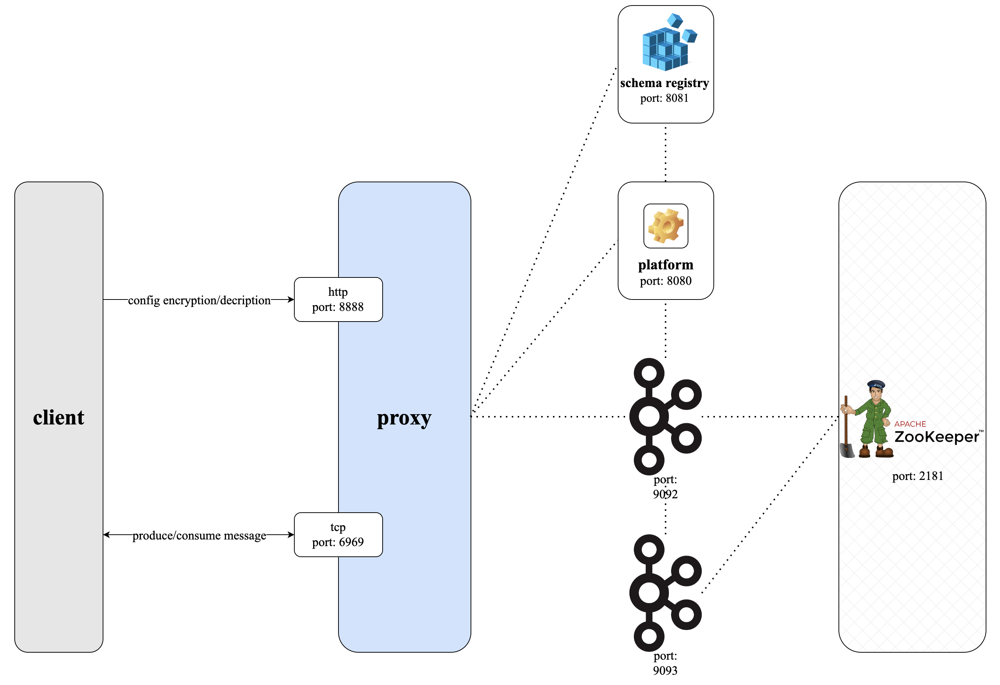
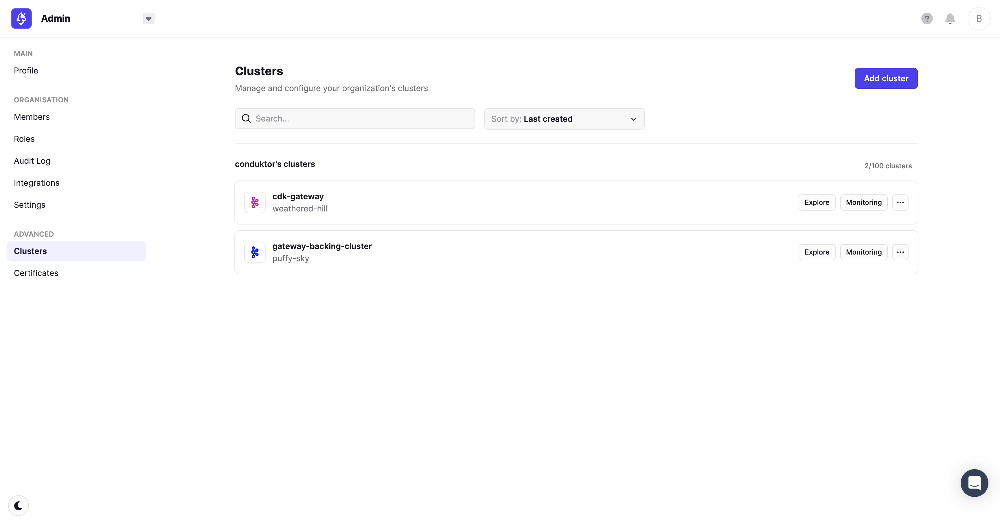
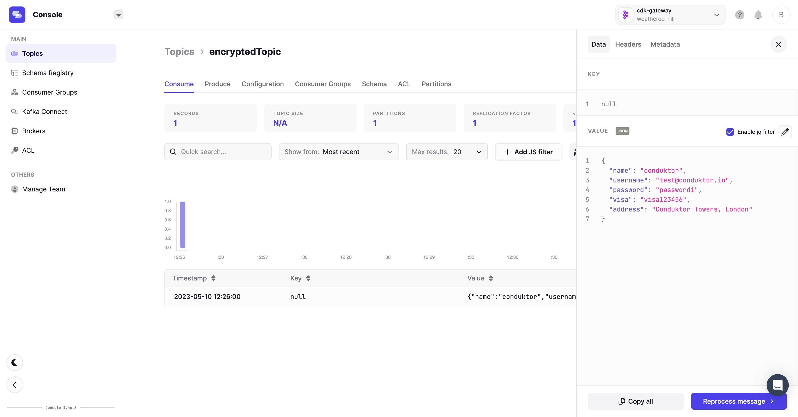
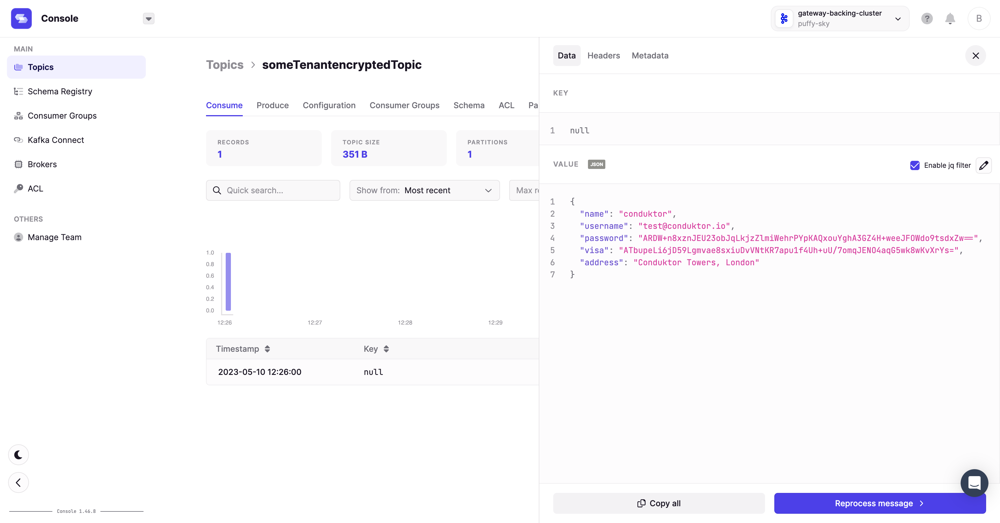

# Conduktor Gateway Encryption Demo

## What is Conduktor Gateway Encryption?

Conduktor Gateway's encryption feature encrypts sensitive fields within messages as they are produced through the Gateway. 

These fields are stored on disk encrypted but can easily be read by clients reading through the Gateway. (We also support an encrypt on fetch functionality for keeping your data secure when working with 3rd parties and partners, we won't demo that today but get in touch to discuss further.)

### Architecture diagram


## Running the demo

### Step 1: Review the environment

As can be seen from `docker-compose.yaml` the demo environment consists of the following:

* A single Zookeeper Server
* A 2 node Kafka cluster
* A single Conduktor Gateway container
* A Kafka Client container (this provides nothing more than a place to run kafka client commands)
* A Conduktor Platform container

### Step 2: Review the platform configuration

`platform-config.yaml` defines 2 clusters:

* Backing Kafka - this is a direct connection to the underlying Kafka cluster hosting the demo
* Gateway - a connection through Conduktor Gateway to the underlying Kafka

Note: Gateway and backing Kafka can use different security schemes. 
In this case the backing Kafka is PLAINTEXT but the Gateway is SASL_PLAIN.

### Step 3: Start the environment

Start the environment with

```bash
docker compose up --wait --detach
```

### Step 4: Create topics

To start let's create a topic named `encryptedTopic`.

```bash
docker compose exec kafka-client \
  kafka-topics \
    --bootstrap-server conduktor-gateway:6969 \
    --command-config /clientConfig/gateway.properties \
    --create --if-not-exists \
    --topic encryptedTopic
```

and confirm creation with a list call

```bash
docker compose exec kafka-client \
  kafka-topics \
    --bootstrap-server conduktor-gateway:6969 \
    --command-config /clientConfig/gateway.properties \
    --list
```

### Step 5: Configure encryption

Now let's create an encryption interceptor via the Admin API.

The configuration of this interceptor will encrypt the `password` and `visa` fields in records on our topic `encryptedTopic`. 

```bash
docker compose exec kafka-client \
  curl \
    --silent \
    --user "admin:conduktor" \
    --request POST "conduktor-gateway:8888/admin/interceptors/v1/vcluster/someCluster/interceptor/encrypt" \
    --header 'Content-Type: application/json' \
    --data-raw '{
        "pluginClass": "io.conduktor.gateway.interceptor.EncryptPlugin",
        "priority": 100,
        "config": {
            "topic": "encryptedTopic",
            "schemaRegistryConfig": {
                "host": "http://schema-registry:8081"
            },
            "fields": [ {
                "fieldName": "password",
                "keySecretId": "password-secret",
                "algorithm": { 
                    "type": "AES_GCM",
                    "kms": "IN_MEMORY"
                }
            },
            {
                "fieldName": "visa",
                "keySecretId": "visa-scret",
                "algorithm": {
                    "type": "AES_GCM",
                    "kms": "IN_MEMORY"
                }
            }]
        }
    }' 
```

and confirm succesful creation by listing the interceptors for virtual cluster `someCluster`.

(We use `jq` for readability, if you don't have this installed remove simply the `| jq` from the below command.)

```bash
docker compose exec kafka-client \
  curl \
    --silent \
    --user "admin:conduktor" \
    conduktor-gateway:8888/admin/interceptors/v1/vcluster/someCluster/interceptors | jq
```

### Step 6: Configure Decryption

Next we configure Conduktor Gateway to decrypt the fields when fetching the data.

```bash
docker compose exec kafka-client \
  curl \
    --silent \
    --user "admin:conduktor" \
    --request POST "conduktor-gateway:8888/admin/interceptors/v1/vcluster/someCluster/interceptor/decrypt" \
    --header 'Content-Type: application/json' \
    --data-raw '{
        "pluginClass": "io.conduktor.gateway.interceptor.DecryptPlugin",
        "priority": 100,
        "config": {
            "topic": "encryptedTopic",
            "schemaRegistryConfig": {
                "host": "http://schema-registry:8081"
            }
        }
    }'
```

and list the interceptors for virtual cluster someCluster:

```bash
docker compose exec kafka-client \
  curl \
    --silent \
    --user "admin:conduktor" \
    conduktor-gateway:8888/admin/interceptors/v1/vcluster/someCluster/interceptors | jq
```

### Step 7: Produce data to the topic

Let's produce a simple record to the encrypted topic.

```bash
echo '{ 
    "name": "conduktor",
    "username": "test@conduktor.io",
    "password": "password1",
    "visa": "visa123456",
    "address": "Conduktor Towers, London" 
}' | jq -c | docker compose exec -T schema-registry \
    kafka-json-schema-console-producer  \
        --bootstrap-server conduktor-gateway:6969 \
        --producer.config /clientConfig/gateway.properties \
        --topic encryptedTopic \
        --property value.schema='{ 
            "title": "User",
            "type": "object",
            "properties": { 
                "name": { "type": "string" },
                "username": { "type": "string" },
                "password": { "type": "string" },
                "visa": { "type": "string" },
                "address": { "type": "string" } 
            } 
        }'
```

### Step 8: Consume from the topic

Let's consume from our `encryptedTopic`.

```bash
docker compose exec schema-registry \
  kafka-json-schema-console-consumer \
    --bootstrap-server conduktor-gateway:6969 \
    --consumer.config /clientConfig/gateway.properties \
    --topic encryptedTopic \
    --from-beginning \
    --max-messages 1 | jq
```

You should see the encrypted fields have been decrypted on read as below:

```json
{
  "name": "conduktor",
  "username": "test@conduktor.io",
  "password": "password1",
  "visa": "visa123456",
  "address": "Conduktor Towers, London"
}
```

### Step 9: Confirm encryption at rest

To confirm the fields are encrypted in Kafka we can consume directly from the underlying Kafka cluster, rather than from Gateway as we did previously.

```bash
docker compose exec schema-registry \
  kafka-json-schema-console-consumer \
    --bootstrap-server kafka1:9092 \
    --topic someClusterencryptedTopic \
    --from-beginning \
    --max-messages 1 | jq
```

You should see an output similar to the below:

```json
{
  "name": "conduktor",
  "username": "test@conduktor.io",
  "password": "AUXGXFa8bcMPws2DXsnBTVxzwpWyQusuUsEPWtKItFnGoQoQLd4zSfZjqofomWHdqA==",
  "visa": "ARA3jO6WyWNuhg2wwag0ouLbAGE7fjs+lCAJeXx9J6BZzM/FEiJt5afv4dPf1qNDWS8=",
  "address": "Conduktor Towers, London"
}
```

## Step 10: Visualise the workflow

> To take part in the remaining steps in this demo require a Conduktor Console license. For more information on this visit the [Console page](https://www.conduktor.io/console/) or [contact us](https://www.conduktor.io/contact/). 
> Without a license you can follow along how you can visualise what we did today in Console. Please note the UI may change as we're constantly improving.

### Step 11: Viewing the clusters in Conduktor Console

From Conduktor Platform navigate to Admin -> Clusters, you can see 2 clusters as below:



### Step 12: View the unencrypted messages in Conduktor Console

Navigate to `Console` and select the `cdk-gateway` virtual cluster from the top right. You should now see the `encryptedTopic` topic and clicking on it will show you an unencrypted version of the produced message. A you are able to encrypt and decrypt the message in Gateway.



### Step 13: View the encrypted messages in Conduktor Console

Navigating to `Console` and select the `kafka-backing-cluster` cluster from the cluster selector in the top right. You should now see the `someClusterencryptedTopic` topic (ignore the virtual cluster prefix for now) and clicking on it will show you an encrypted version of the produced message. What you see without Gateway.



### Step 14: Performance impact

Encryption won't come without some trade-off elsewhere and you might be worried about how much of an impact this has on perormance. Let us put those fears to be by demonstrating the low impact on performance.

[](https://asciinema.org/a/IDVSYFYL2xjAQSN2cPhZ7Hfih)

Create a performance topic
```bash
docker compose exec kafka-client \
    kafka-topics \
        --bootstrap-server conduktor-gateway:6969 \
        --command-config /clientConfig/gateway.properties \
        --create --if-not-exists \
        --topic encryption-performance
```

Let's apply the encryption on this topic

```bash
docker compose exec kafka-client \
  curl \
    --silent \
    --user "admin:conduktor" \
    --request POST "conduktor-gateway:8888/admin/interceptors/v1/vcluster/someCluster/interceptor/performanceEncrypt" \
    --header 'Content-Type: application/json' \
    --data-raw '{
        "pluginClass": "io.conduktor.gateway.interceptor.EncryptPlugin",
        "priority": 100,
        "config": {
            "topic": "encryption-performance",
            "fields": [ { 
                "fieldName": "password",
                "keySecretId": "password-secret",
                "algorithm": { 
                    "type": "AES_GCM",
                    "kms": "IN_MEMORY"
                }
            },
            { 
                "fieldName": "visa",
                "keySecretId": "visa-secret",
                "algorithm": { 
                    "type": "AES_GCM",
                    "kms": "IN_MEMORY"
                } 
            }]
        }
    }'
```

Let's create an example file for `kafka-producer-perf-test`, the benchmark tool that comes with Kafka.

```bash
echo '{"name":"tom","username":"tom@conduktor.io","password":"motorhead","visa":"#abc123","address":"Chancery lane, London"}' > customers.json
echo '{"name":"florent","username":"florent@conduktor.io","password":"kitesurf","visa":"#qsdsqd","address":"Jumeira 1, Dubai"}' >> customers.json
```

Let's copy it to the container where `kafka-producer-perf-test` will run.

```bash
docker compose cp customers.json kafka-client:/home/appuser
```

Then run the benchmark

```bash
docker compose exec kafka-client \
    kafka-producer-perf-test \
        --topic encryption-performance \
        --throughput -1 \
        --num-records 1000000 \
        --producer-props bootstrap.servers=conduktor-gateway:6969 linger.ms=100 \
        --producer.config /clientConfig/gateway.properties \
        --payload-file customers.json
```

# Conclusion
We have today reviewed how you can encrypt your data, setup the decryption all whilst ensuring it is encrypted at rest.

We have shown this visually using Console and shown the inevitable, but low, impact on performance.

This of course is but one of the many features available from the Gateway, for further questions on how Gateway can help take your Kafka experience to the next level [contact us](https://www.conduktor.io/contact/).