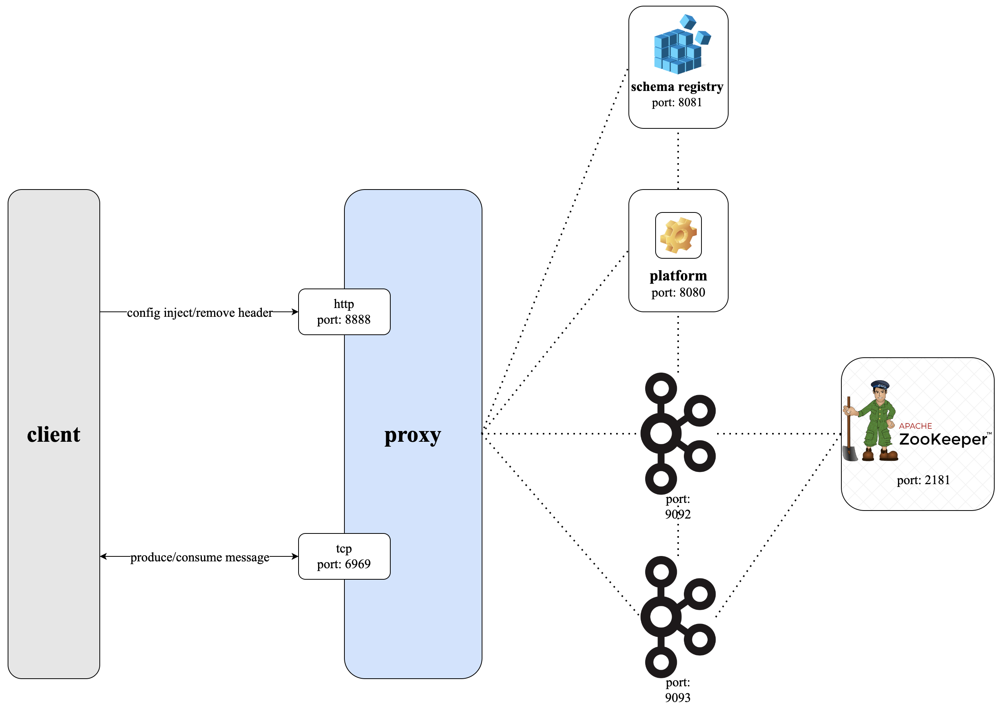
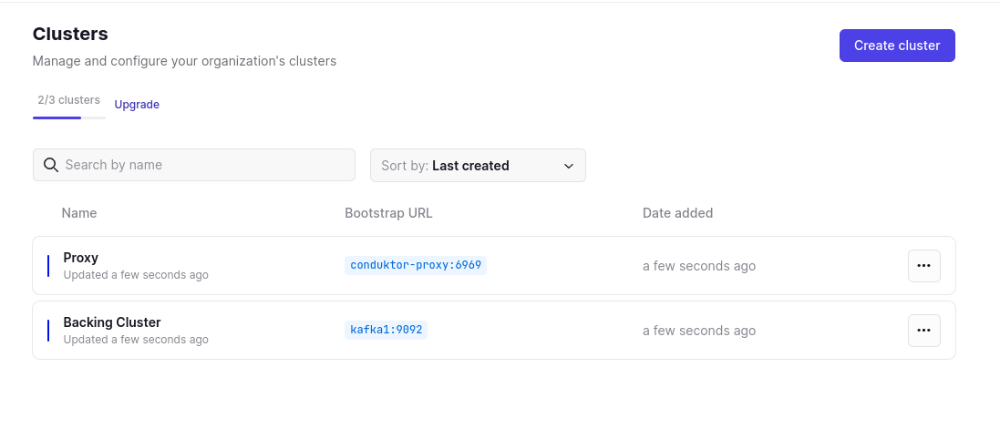
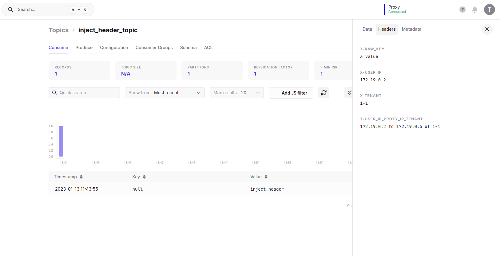
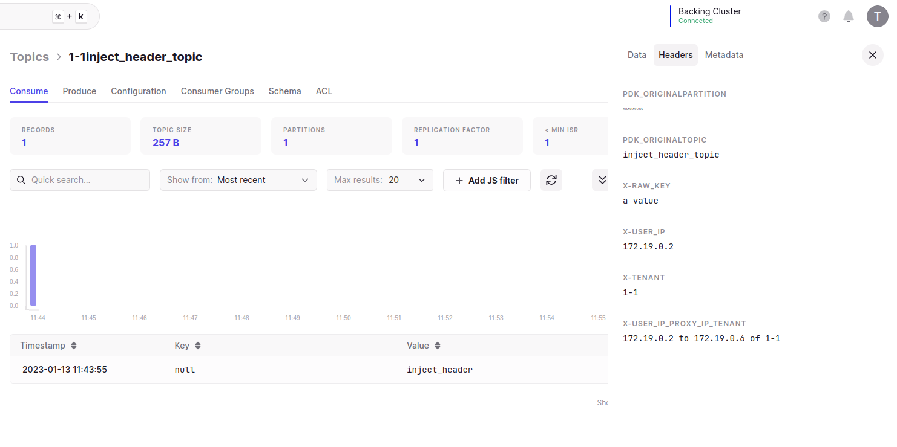
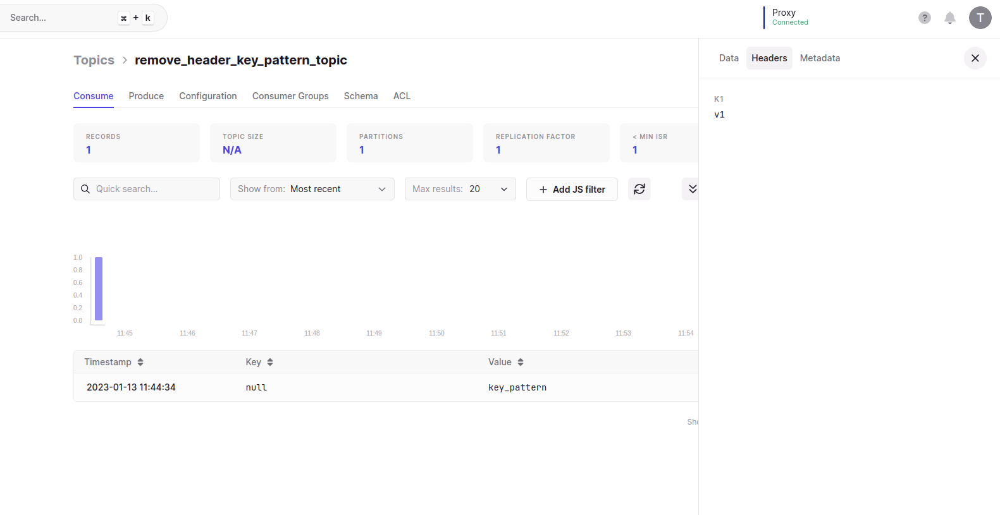
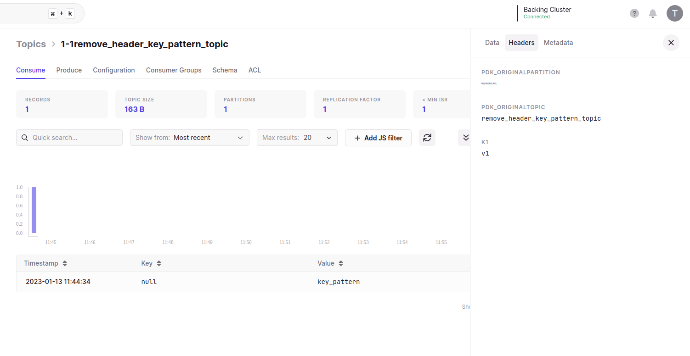
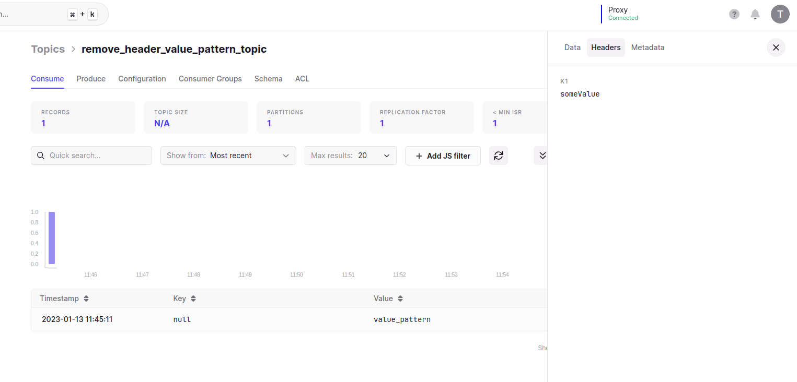
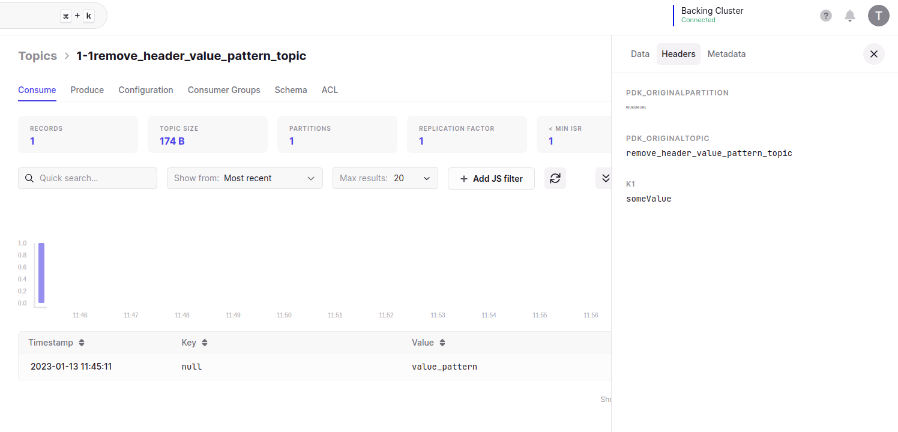
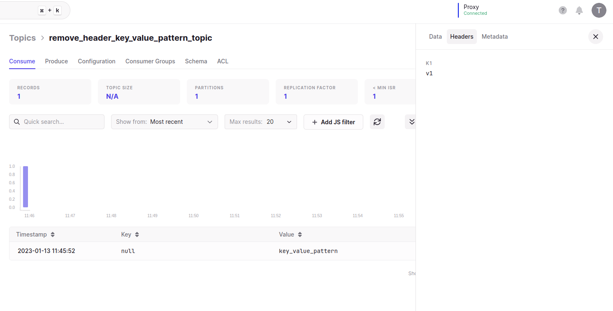
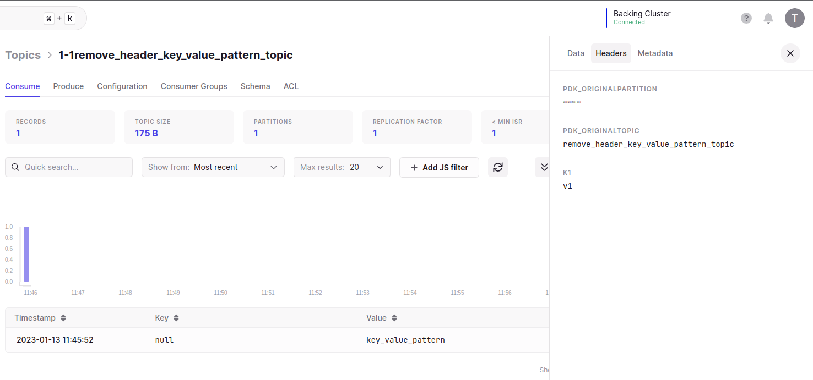

# Conduktor Gateway Inject/Remove Header Demo

## What is Conduktor Gateway Inject/Remove Header?

Conduktor Gateway's inject/remove header feature inject or remove headers of the messages as they are produced through the Gateway.

### Architecture diagram


### Video

[](https://asciinema.org/a/4oGSTAsrntPIvxLaRl1vkD9Bb)

## Running the demo

Conduktor Gateway provides a number of different ways to inject/remove headers into your data:

* [Inject Header](#injectHeader)
* [Remove Header With Key Pattern Only](#removeHeaderKeyPatternOnly)
* [Remove Header With Value Pattern Only](#removeHeaderKeyValueOnly)
* [Remove Header With Both Key And Value Pattern](#removeHeaderKeyValuePattern)

### Step 1: Review the environment

As can be seen from `docker-compose.yaml` the demo environment consists of the following:

* A single Zookeeper Server
* A 2 node Kafka cluster
* A single Conduktor Gateway container
* A Conduktor Platform container
* A Kafka Client container (this provides nothing more than a place to run kafka client commands)

### Step 2: Review the platform configuration

`platform-config.yaml` defines 2 clusters:

* Backing Kafka - this is a direct connection to the underlying Kafka cluster hosting the demo
* Proxy - a connection through Conduktor Gateway to the underlying Kafka

Note: Gateway and backing Kafka can use different security schemes. 
In this case the backing Kafka is PLAINTEXT but the Gateway is SASL_PLAIN.

### Step 3: Start the environment

Start the environment with

```bash
docker-compose up -d zookeeper kafka1 kafka2 kafka-client
sleep 10
docker-compose up -d conduktor-proxy
sleep 5
echo "Environment started"
```

### Step 4: Create topics

We create a base set of topics using the Kafka console tools:

```bash
docker-compose exec kafka-client \
  kafka-topics \
    --bootstrap-server conduktor-proxy:6969 \
    --command-config /clientConfig/proxy.properties \
    --create --if-not-exists \
    --topic injectHeaderTopic

docker-compose exec kafka-client \
  kafka-topics \
    --bootstrap-server conduktor-proxy:6969 \
    --command-config /clientConfig/proxy.properties \
    --create --if-not-exists \
    --topic removeHeaderKeyPatternTopic

docker-compose exec kafka-client \
  kafka-topics \
    --bootstrap-server conduktor-proxy:6969 \
    --command-config /clientConfig/proxy.properties \
    --create --if-not-exists \
    --topic removeHeaderValuePatternTopic

docker-compose exec kafka-client \
  kafka-topics \
    --bootstrap-server conduktor-proxy:6969 \
    --command-config /clientConfig/proxy.properties \
    --create --if-not-exists \
    --topic removeHeaderKeyValuePatternTopic
```
List the created topics

```bash
docker-compose exec kafka-client \
  kafka-topics \
    --bootstrap-server conduktor-proxy:6969 \
    --command-config /clientConfig/proxy.properties \
    --list
```

### <a name="injectHeader"></a> Step 5: Inject Header

The same REST API can be used to configure the inject header feature. 

The command below will instruct Conduktor Gateway to inject headers with value user ip, tenant and Gateway ip in records on topic `injectHeaderTopic`. 

```bash
docker-compose exec kafka-client curl \
    -u superUser:superUser \
    -vvv \
    --request POST "conduktor-proxy:8888/tenant/someTenant/feature/inject-header" \
    --header 'Content-Type: application/json' \
    --data-raw '{
        "config": {
            "topic": "injectHeaderTopic",
            "keys": {
              "X-RAW_KEY": "a value",
              "X-USER_IP": "{{userIp}}",
              "X-TENANT": "{{tenant}}",
              "X-USER_IP_PROXY_IP_TENANT": "{{userIp}} to {{proxyIp}} of {{tenant}}"
            }
        },
        "direction": "REQUEST",
        "apiKeys": "PRODUCE"
    }'
```


### Step 6: Produce data to the topic

Let's produce a simple record to the `injectHeaderTopic` topic.

```bash
echo 'inject_header' | docker-compose exec -T kafka-client \
    kafka-console-producer  \
        --bootstrap-server conduktor-proxy:6969 \
        --producer.config /clientConfig/proxy.properties \
        --topic injectHeaderTopic
```

### Step 7: Consume from the topic

Let's consume from our `injectHeaderTopic`.

```bash
docker-compose exec kafka-client \
  kafka-console-consumer \
    --bootstrap-server conduktor-proxy:6969 \
    --consumer.config /clientConfig/proxy.properties \
    --topic injectHeaderTopic \
    --from-beginning \
    --max-messages 1 \
    --property print.headers=true
```

You should see the message with headers as below

```
X-RAW_KEY:a value,X-USER_IP:172.19.0.3,X-TENANT:someTenant,X-USER_IP_PROXY_IP_TENANT:172.19.0.3 to 172.19.0.6 of 1-someTenant   inject_header
```

### Step 8: Confirm inject headers at rest

To confirm the message headers are injected in Kafka we can consume directly from the underlying Kafka cluster.

```bash
docker-compose exec kafka-client \
  kafka-console-consumer \
    --bootstrap-server kafka1:9092 \
    --topic someTenantinjectHeaderTopic \
    --from-beginning \
    --max-messages 1 \
    --property print.headers=true
```

You should see an output similar to the below:

```
X-RAW_KEY:a value,X-USER_IP:172.19.0.2,X-TENANT:someTenant,X-USER_IP_PROXY_IP_TENANT:172.19.0.2 to 172.19.0.6 of someTenant      inject_header
```

### <a name="removeHeaderKeyPatternOnly"></a> Step 9: Remove Header With Key Pattern Only

The same REST API can be used to configure the remove header with key pattern only feature.

The command below will instruct Conduktor Gateway to remove headers which key matches the pattern `k0.*'` in records on topic `removeHeaderKeyPatternTopic`.

```bash
docker-compose exec kafka-client curl \
    -u superUser:superUser \
    -vvv \
    --request POST "conduktor-proxy:8888/tenant/someTenant/feature/remove-header" \
    --header 'Content-Type: application/json' \
    --data-raw '{
        "config": {
            "topic": "removeHeaderKeyPatternTopic",
            "keyPattern": "k0.*"
        },
        "direction": "REQUEST",
        "apiKeys": "PRODUCE"
    }'
```


### Step 10: Produce data to the topic

Let's produce a simple record to the `removeHeaderKeyPatternTopic` topic.

```bash
echo 'k0:v0,k1:v1^key_pattern' | docker-compose exec -T kafka-client \
    kafka-console-producer  \
        --bootstrap-server conduktor-proxy:6969 \
        --producer.config /clientConfig/proxy.properties \
        --topic removeHeaderKeyPatternTopic \
        --property parse.key=false \
        --property parse.headers=true \
        --property headers.delimiter=^ \
        --property headers.separator=, \
        --property headers.key.separator=:
```

### Step 11: Consume from the topic

Let's consume from our `removeHeaderKeyPatternTopic`.

```bash
docker-compose exec kafka-client \
  kafka-console-consumer \
    --bootstrap-server conduktor-proxy:6969 \
    --consumer.config /clientConfig/proxy.properties \
    --topic removeHeaderKeyPatternTopic \
    --from-beginning \
    --max-messages 1 \
    --property print.headers=true
```

You should see the message with headers as below

```
k1:v1   key_pattern
```

### Step 12: Confirm remove headers with key pattern at rest

To confirm the message headers are removed in Kafka we can consume directly from the underlying Kafka cluster.

```bash
docker-compose exec kafka-client \
  kafka-console-consumer \
    --bootstrap-server kafka1:9092 \
    --topic someTenantremoveHeaderKeyPatternTopic \
    --from-beginning \
    --max-messages 1 \
    --property print.headers=true
```

You should see an output similar to the below:

```
k1:v1      key_pattern
```

### <a name="removeHeaderValuePatternOnly"></a> Step 13: Remove Header With Value Pattern Only

The same REST API can be used to configure the remove header with value pattern only feature.

The command below will instruct Conduktor Gateway to remove headers which value matches the pattern `value.*'` in records on topic `removeHeaderValuePatternTopic`.

```bash
docker-compose exec kafka-client curl \
    -u superUser:superUser \
    -vvv \
    --request POST "conduktor-proxy:8888/tenant/someTenant/feature/remove-header" \
    --header 'Content-Type: application/json' \
    --data-raw '{
        "config": {
            "topic": "removeHeaderValuePatternTopic",
            "valuePattern": "value.*"
        },
        "direction": "REQUEST",
        "apiKeys": "PRODUCE"
    }'
```


### Step 14: Produce data to the topic

Let's produce a simple record to the `removeHeaderValuePatternTopic` topic.

```bash
echo 'k0:value0,k1:someValue^value_pattern' | docker-compose exec -T kafka-client \
    kafka-console-producer  \
        --bootstrap-server conduktor-proxy:6969 \
        --producer.config /clientConfig/proxy.properties \
        --topic removeHeaderValuePatternTopic \
        --property parse.key=false \
        --property parse.headers=true \
        --property headers.delimiter=^ \
        --property headers.separator=, \
        --property headers.key.separator=:
```

### Step 15: Consume from the topic

Let's consume from our `removeHeaderValuePatternTopic`.

```bash
docker-compose exec kafka-client \
  kafka-console-consumer \
    --bootstrap-server conduktor-proxy:6969 \
    --consumer.config /clientConfig/proxy.properties \
    --topic removeHeaderValuePatternTopic \
    --from-beginning \
    --max-messages 1 \
    --property print.headers=true
```

You should see the message with headers as below

```
k1:someValue   value_pattern
```

### Step 16: Confirm remove headers with value pattern at rest

To confirm the message headers are removed in Kafka we can consume directly from the underlying Kafka cluster.

```bash
docker-compose exec kafka-client \
  kafka-console-consumer \
    --bootstrap-server kafka1:9092 \
    --topic someTenantremoveHeaderValuePatternTopic \
    --from-beginning \
    --max-messages 1 \
    --property print.headers=true
```

You should see an output similar to the below:

```
k1:someValue   value_pattern
```

### <a name="removeHeaderKeyValuePattern"></a> Step 17: Remove Header With Both Key And Value Pattern

The same REST API can be used to configure the remove header with both key and value pattern feature.

The command below will instruct Conduktor Gateway to remove headers which key matches the pattern `k0.*'` and value matches the pattern `v0.*`  in records on topic `removeHeaderKeyValuePatternTopic`.

```bash
docker-compose exec kafka-client curl \
    -u superUser:superUser \
    -vvv \
    --request POST "conduktor-proxy:8888/tenant/someTenant/feature/remove-header" \
    --header 'Content-Type: application/json' \
    --data-raw '{
        "config": {
            "topic": "removeHeaderKeyValuePatternTopic",
            "keyPattern": "k0.*",
            "valuePattern": "v0.*"
        },
        "direction": "REQUEST",
        "apiKeys": "PRODUCE"
    }'
```


### Step 18: Produce data to the topic

Let's produce a simple record to the `removeHeaderKeyValuePatternTopic` topic.

```bash
echo 'k0:v0,k1:v1^key_value_pattern' | docker-compose exec -T kafka-client \
    kafka-console-producer  \
        --bootstrap-server conduktor-proxy:6969 \
        --producer.config /clientConfig/proxy.properties \
        --topic removeHeaderKeyValuePatternTopic \
        --property parse.key=false \
        --property parse.headers=true \
        --property headers.delimiter=^ \
        --property headers.separator=, \
        --property headers.key.separator=:
```

### Step 19: Consume from the topic

Let's consume from our `removeHeaderKeyValuePatternTopic`.

```bash
docker-compose exec kafka-client \
  kafka-console-consumer \
    --bootstrap-server conduktor-proxy:6969 \
    --consumer.config /clientConfig/proxy.properties \
    --topic removeHeaderKeyValuePatternTopic \
    --from-beginning \
    --max-messages 1 \
    --property print.headers=true
```

You should see the message with headers as below

```
k1:v1   key_value_pattern
```

### Step 20: Confirm inject headers at rest

To confirm the message headers are removed in Kafka we can consume directly from the underlying Kafka cluster.

```bash
docker-compose exec kafka-client \
  kafka-console-consumer \
    --bootstrap-server kafka1:9092 \
    --topic someTenantremoveHeaderKeyValuePatternTopic \
    --from-beginning \
    --max-messages 1 \
    --property print.headers=true
```

You should see an output similar to the below:

```
k1:v1   key_value_pattern
```

### Step 21: Log into the platform

> The remaining steps in this demo require a Conduktor Platform license. For more information on this [Arrange a technical demo](https://www.conduktor.io/contact/demo)

Once you have a license key, place it in `platform-config.yaml` under the key: `license` e.g.:

```yaml
license: "eyJhbGciOiJFUzI1NiIsInR5cCI6I..."
```

the start the Conduktor Platform container:

```bash
docker-compose up -d conduktor-platform
```

From a browser, navigate to `http://localhost:8080` and use the following to log in (as specified in `platform-config.yaml`):

Username: bob@conduktor.io
Password: admin

### Step 22: View the clusters in Conduktor Platform

From Conduktor Platform navigate to Admin -> Clusters, you should see 2 clusters as below:



### Step 23: View the injected headers messages in Conduktor Platform

Navigate to `Console` and select the `Proxy` cluster from the top right. You should now see the `injectHeaderTopic` topic and clicking on it will show you an injected headers version of the produced message.



### Step 24: View the injected headers messages in Conduktor Platform

Navigate to `Console` and select the `Backing Cluster` cluster from the top right. You should now see the `someTenantinjectHeaderTopic` topic (ignore the someTenant prefix for now) and clicking on it will show you an injected headers version of the produced message.



### Step 25: View the removed headers by key pattern messages in Conduktor Platform

Navigate to `Console` and select the `Proxy` cluster from the top right. You should now see the `removeHeaderKeyPatternTopic` topic and clicking on it will show you a removed version of the produced message.



### Step 26: View the removed headers messages in Conduktor Platform

Navigate to `Console` and select the `Backing Cluster` cluster from the top right. You should now see the `someTenantremoveHeaderKeyPatternTopic` topic (ignore the someTenant prefix for now) and clicking on it will show you a removed headers version of the produced message.



### Step 27: View the removed headers by key pattern messages in Conduktor Platform

Navigate to `Console` and select the `Proxy` cluster from the top right. You should now see the `removeHeaderValuePatternTopic` topic and clicking on it will show you a removed version of the produced message.



### Step 28: View the removed headers messages in Conduktor Platform

Navigate to `Console` and select the `Backing Cluster` cluster from the top right. You should now see the `someTenantremoveHeaderValuePatternTopic` topic (ignore the someTenant prefix for now) and clicking on it will show you a removed headers version of the produced message.



### Step 29: View the removed headers by both key and value pattern messages in Conduktor Platform

Navigate to `Console` and select the `Proxy` cluster from the top right. You should now see the `removeHeaderKeyValuePatternTopic` topic and clicking on it will show you a removed version of the produced message.



### Step 30: View the removed headers messages in Conduktor Platform

Navigate to `Console` and select the `Backing Cluster` cluster from the top right. You should now see the `someTenantremoveHeaderKeyValuePatternTopic` topic (ignore the someTenant prefix for now) and clicking on it will show you a removed headers version of the produced message.


