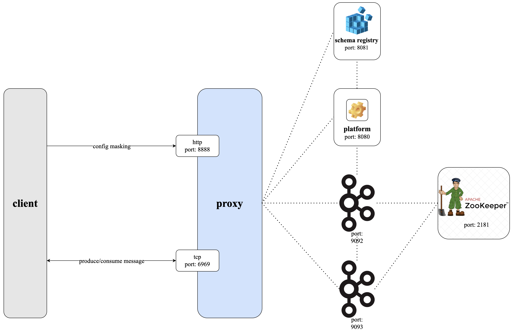
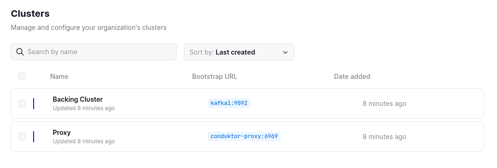
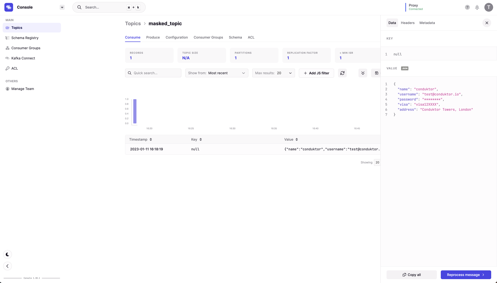

# Conduktor Gateway Data Masking Demo

## What is Conduktor Gateway Data Masking?

Conduktor Gateway's data masking feature masks sensitive fields within messages as they are consumed through the Gateway.

### Architecture diagram


### Video

[](https://asciinema.org/a/TifQJzrUBufiun4QktEUgEt0I)

## Running the demo

### Step 1: Review the environment

As can be seen from `docker-compose.yaml` the demo environment consists of the following:

* A single Zookeeper Server
* A 2 node Kafka cluster
* A single Conduktor Gateway container
* A Conduktor Platform container
* A Kafka Client container (this provides nothing more than a place to run kafka client commands)

### Step 2: Review the platform configuration

`platform-config.yaml` defines 2 clusters:

* Backing Kafka - this is a direct connection to the underlying Kafka cluster hosting the demo
* Proxy - a connection through Conduktor Gateway to the underlying Kafka

Note: Proxy and backing Kafka can use different security schemes. 
In this case the backing Kafka is PLAINTEXT but the proxy is SASL_PLAIN.

### Step 3: Start the environment

Start the environment with

```bash

# setup our environment 
docker-compose up -d zookeeper kafka1 kafka2 kafka-client schema-registry
sleep 10
docker-compose up -d conduktor-proxy
sleep 5
echo "Environment started"
```

### Step 4: Create topics

We create topics using the Kafka console tools, the below creates a topic named `maskedTopic`

```bash
# Create a topic
docker-compose exec kafka-client \
  kafka-topics \
    --bootstrap-server conduktor-proxy:6969 \
    --command-config /clientConfig/proxy.properties \
    --create --if-not-exists \
    --topic maskedTopic
```

List the created topic

```bash
# Check it has been created
docker-compose exec kafka-client \
  kafka-topics \
    --bootstrap-server conduktor-proxy:6969 \
    --command-config /clientConfig/proxy.properties \
    --list
```

### Step 5: Configure masking

The same REST API can be used to configure the masking feature. 

The command below will instruct Conduktor Proxy to mask the `password` and `visa` fields in records. 

```bash
# Mask configuration
docker-compose exec kafka-client curl \
    -u superUser:superUser \
    -vvv \
    --request POST "conduktor-proxy:8888/tenant/someTenant/feature/data-masking" \
    --header 'Content-Type: application/json' \
    --data-raw '{
                  "config": {
                    "policies": [
                      {
                        "name": "Mask password",
                        "rule": {
                          "type": "MASK_ALL",
                          "maskingString": "********"
                        },
                        "fields": [
                          "password"
                        ]
                      },
                      {
                        "name": "Mask visa",
                        "rule": {
                          "type": "MASK_LAST_N",
                          "maskingChar": "X",
                          "count": 4
                        },
                        "fields": [
                          "visa"
                        ]
                      }
                    ]
                  },
                  "direction": "RESPONSE",
                  "apiKeys": "FETCH"
                }'
```

### Step 6: Produce data to the topic

Let's produce a simple record to the masked topic.

```bash
# So we can produce...
echo '{ 
    "name": "conduktor",
    "username": "test@conduktor.io",
    "password": "password1",
    "visa": "visa123456",
    "address": "Conduktor Towers, London" 
}' | jq -c | docker-compose exec -T schema-registry \
    kafka-json-schema-console-producer  \
        --bootstrap-server conduktor-proxy:6969 \
        --producer.config /clientConfig/proxy.properties \
        --topic maskedTopic \
        --property value.schema='{ 
            "title": "User",
            "type": "object",
            "properties": { 
                "name": { "type": "string" },
                "username": { "type": "string" },
                "password": { "type": "string" },
                "visa": { "type": "string" },
                "address": { "type": "string" } 
            } 
        }'
```

### Step 7: Consume from the topic

Let's consume from our `maskedTopic`.

```bash
# And consume through the proxy, it's masked
docker-compose exec schema-registry \
  kafka-json-schema-console-consumer \
    --bootstrap-server conduktor-proxy:6969 \
    --consumer.config /clientConfig/proxy.properties \
    --topic maskedTopic \
    --from-beginning \
    --max-messages 1 | jq .
```

You should see the masked fields as below:

```json
{
  "name": "conduktor",
  "username": "test@conduktor.io",
  "password": "********",
  "visa": "visa12XXXX",
  "address": "Conduktor Towers, London"
}
```

### Step 8: Consume from the underlying topic

Let's consume directly from the underlying Kafka cluster.

```bash
# And consume through the underlying cluster
docker-compose exec schema-registry \
  kafka-json-schema-console-consumer \
    --bootstrap-server kafka1:9092 \
    --topic someTenantmaskedTopic \
    --from-beginning \
    --max-messages 1 | jq .
```

### Step 9: Log into the platform

> The remaining steps in this demo require a Conduktor Platform license. For more information on this [Arrange a technical demo](https://www.conduktor.io/contact/demo)

Once you have a license key, place it in `platform-config.yaml` under the key: `license` e.g.:

```yaml
license: "eyJhbGciOiJFUzI1NiIsInR5cCI6I..."
```

the start the Conduktor Platform container:

```bash
docker-compose up -d conduktor-platform
```

From a browser, navigate to `http://localhost:8080` and use the following to log in (as specified in `platform-config.yaml`):

Username: bob@conduktor.io
Password: admin

### Step 10: View the clusters in Conduktor Platform

From Conduktor Platform navigate to Admin -> Clusters, you should see 2 clusters as below:



### Step 11: View the masked messages in Conduktor Platform

Navigate to `Console` and select the `Proxy` cluster from the top right. You should now see the `maskedTopic` topic and clicking on it will show you a masked version of the produced message.



### Step 12: View the messages in Conduktor Platform

Navigate to `Console` and select the `Backing Cluster` cluster from the top right. You should now see the `1-1maskedTopic` topic (ignore the 1-1 prefix for now) and clicking on it will show you the produced message.


