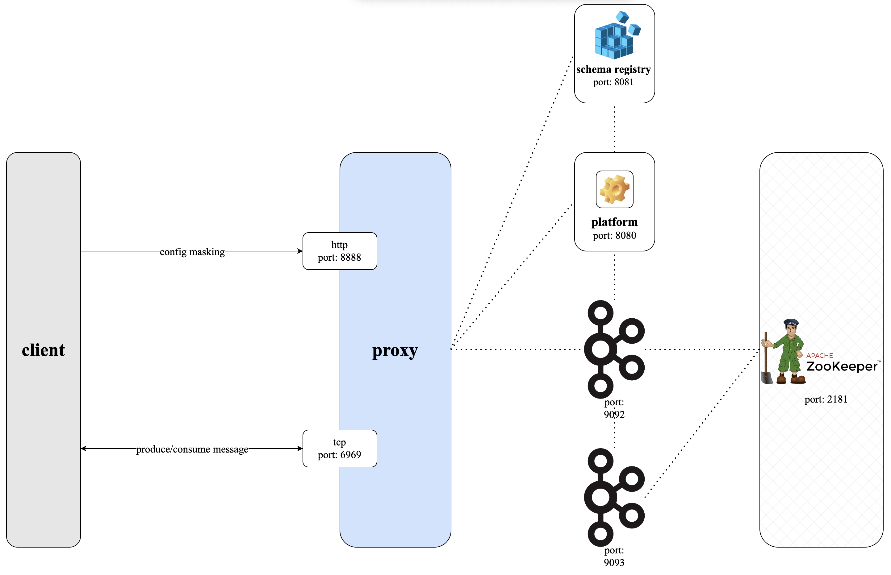

# Conduktor Gateway Data Masking Demo

## What is Conduktor Gateway Data Masking?

Conduktor Gateway's data masking feature masks sensitive fields within messages as they are consumed through the Gateway.

### Architecture diagram


## Running the demo

### Step 1: Review the environment

As can be seen from `docker-compose.yaml` the demo environment consists of the following:

* A single Zookeeper Server
* A 2 node Kafka cluster
* A single Conduktor Gateway container
* A Conduktor Console container
* A Kafka Client container (this provides nothing more than a place to run kafka client commands)

### Step 2: Review the Console configuration

`platform-config.yaml` defines 2 clusters:

* Backing Kafka - this is a direct connection to the underlying Kafka cluster hosting the demo
* Gateway - a connection to Conduktor Gateway

Note: Gateway and backing Kafka can use different security schemes. 
In this case the backing Kafka is PLAINTEXT but the proxy is SASL_PLAIN.

### Step 3: Start the environment

Start the environment with

```bash
docker compose up -d
```

### Step 4: Create topics

Let's creates a topic named `maskedTopic`

```bash
docker compose exec kafka-client \
  kafka-topics \
    --bootstrap-server conduktor-gateway:6969 \
    --command-config /clientConfig/gateway.properties \
    --create --if-not-exists \
    --topic maskedTopic
```

List the created topic

```bash
# Check it has been created
docker compose exec kafka-client \
  kafka-topics \
    --bootstrap-server conduktor-gateway:6969 \
    --command-config /clientConfig/gateway.properties \
    --list
```

### Step 5: Configure masking

The same REST API can be used to create the masking interceptor. 

The command below will add a masking interceptor, configured to mask the `password` and `visa` fields in records.

```bash
docker compose exec kafka-client \
  curl \
    --user admin:conduktor \
    --request POST "conduktor-gateway:8888/admin/interceptors/v1/tenants/someTenant/interceptors/masker" \
    --header 'Content-Type: application/json' \
    --data-raw '{
                  "pluginClass": "io.conduktor.gateway.interceptor.FieldLevelDataMaskingPlugin",
                  "priority": 100,
                  "config": {
                    "schemaRegistryConfig": {
                        "host": "http://schema-registry:8081"
                    },
                    "policies": [
                      {
                        "name": "Mask password",
                        "rule": {
                          "type": "MASK_ALL"
                        },
                        "fields": [
                          "password"
                        ]
                      },
                      {
                        "name": "Mask visa",
                        "rule": {
                          "type": "MASK_LAST_N",
                          "maskingChar": "X",
                          "numberOfChars": 4
                        },
                        "fields": [
                          "visa"
                        ]
                      }
                    ]
                  }
                }'
```

### Step 6: Produce data to the topic

Let's produce a simple record to the masked topic.

```bash
echo '{ 
    "name": "conduktor",
    "username": "test@conduktor.io",
    "password": "password1",
    "visa": "visa123456",
    "address": "Conduktor Towers, London" 
}' | jq -c | docker compose exec -T schema-registry \
    kafka-json-schema-console-producer  \
        --bootstrap-server conduktor-gateway:6969 \
        --producer.config /clientConfig/gateway.properties \
        --topic maskedTopic \
        --property schema.registry.url=http://schema-registry:8081 \
        --property value.schema='{ 
            "title": "User",
            "type": "object",
            "properties": { 
                "name": { "type": "string" },
                "username": { "type": "string" },
                "password": { "type": "string" },
                "visa": { "type": "string" },
                "address": { "type": "string" } 
            } 
        }'
```

### Step 7: Consume from the topic

Let's consume from our `maskedTopic`.

```bash
# And consume through the Gateway, it's masked
docker compose exec schema-registry \
   kafka-json-schema-console-consumer \
    --bootstrap-server conduktor-gateway:6969 \
    --consumer.config /clientConfig/gateway.properties \
    --property schema.registry.url=http://schema-registry:8081 \
    --topic maskedTopic \
    --from-beginning \
    --max-messages 1 | jq
```

You should see the masked fields as below:

```json
{
  "name": "conduktor",
  "username": "test@conduktor.io",
  "password": "********",
  "visa": "visa12XXXX",
  "address": "Conduktor Towers, London"
}
```

### Step 8: Consume from the underlying topic

Let's consume directly from the underlying Kafka cluster.

```bash
# And consume through the underlying cluster
docker compose exec schema-registry \
  kafka-json-schema-console-consumer \
    --bootstrap-server kafka1:9092 \
    --property schema.registry.url=http://schema-registry:8081 \
    --topic someTenantmaskedTopic \
    --from-beginning \
    --max-messages 1 | jq
```

### Step 9: Visualise the workflow

> To take part in the remaining steps in this demo require a Conduktor Console license. For more information on this visit the [Console page](https://www.conduktor.io/console/) or [contact us](https://www.conduktor.io/contact/). 
> Without a license you can follow along how you can visualise what we did today in Console. Please note the UI may change as we're constantly improving.

### Step 10: View the clusters in Conduktor Console

From Conduktor Platform navigate to Admin -> Clusters, you should see 2 clusters as below:


### Step 11: View the masked messages in Conduktor Console

Navigate to `Console` and select the `Gateway` cluster from the top right. You should now see the `maskedTopic` topic and clicking on it will show you a masked version of the produced message.


### Step 12: View the messages in Conduktor Console

Navigate to `Console` and select the `Kafka Backing Cluster` cluster from the top right. You should now see the `someTenantmaskedTopic` topic (ignore the tenant name prefix for now) and clicking on it will show you the produced message.


# Conclusion
We have reviewed adding a masking interceptor to our topic and seen how it is masked for those it's meant to be. We have also peeked at the underlying kafka cluster to see the data still unmasked.

If you found this interesting you may also like the encryption demos.

This of course is but one of the many features availble from the Gateway, for further questions on how Gateway can help take your Kafka experience to the next level [contact us](https://www.conduktor.io/contact/).
