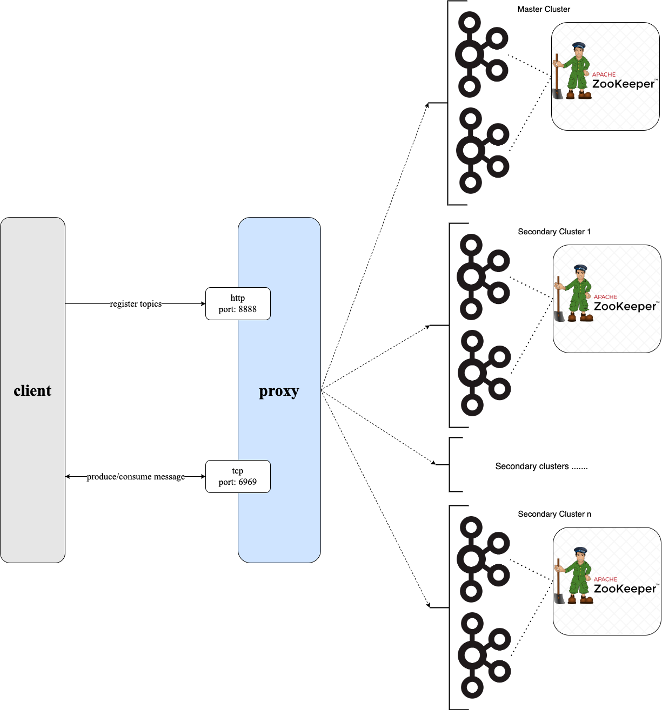

# Conduktor Gateway Merged Clusters Demo

## What is Conduktor Gateway Merged Clusters?

Imagine being able to bring all your Kafka clusters together into a instance for clients to access.  Conduktor's Merge Clusters feature does just this.

Conduktor Gateway can sit in front of multiple Kafka clusters, making them appear as a single cluster to end users.

Test applications can read live production data from a production cluster, for realistic testing, without affecting or altering that production data, and then use test topics on a test cluster to write data, all without having to reconfigure any applications.  There is no need to do expensive replication of data to get useful and accurate testing data.  



Another potential application is failover, this made much simpler by Conduktor Gateway managing the routing in your Kafka environment.  Say you want to do a managed failover from cluster A to cluster B as part of planned maintenance.  If your applications connects to Conduktor Gateway, to do this move just alter the Gateway configuration, and your applications are routed to the new cluster, with no need for application restarts or changes.

Data costs and complexity are reduced by consolidating data from multiple sources in to a central resource.  For example, you might have data centres in multiple regions, perhaps because they are close to the applications using that data, but also because of legal requirements to keep data stored in a particular region. Conduktor Gateway gives a central consuming application access to data in all these regions, with a single set of connection configuration and a single set of credentials. Requests are routed to the right backend cluster, avoiding replication and avoiding complicated sets of configuration. Gateway manages the complexity of the multiple backends, allowing the application team to focus on getting the most value from the easily accessible data.


This example demonstrate this last use case - how to bring together data from multiple sources, into a single access point that can be read by a single consumer.

### Video

[](https://asciinema.org/a/crmwYEknaA61THMW5mzrd11SI)

## Running the demo

### Step 1: Review the environment

As can be seen from `docker-compose.yaml` the demo environment consists of two kafka clusters. Each cluster has:

  * A single Zookeeper Server
  * A 2 node Kafka cluster
  * A single Conduktor Gateway container
  * A Kafka Client container (this provides nothing more than a place to run kafka client commands)

### Step 2: Start the environment

Start the environment using:

```bash
docker-compose up --detach --wait 
```

### Step 3: Create topics
Create a topic on each of the backing kafka clusters, connecting to each individual Kafka cluster directly and creating topics using the Kafka console tools.  Both topics here are called `cars` but they don't have to have the same name.

In the next steps, we'll set the gateway topic `eu_cars` to route to the `kafka1_m` cluster's `cars` topic and the gateway topic `us_cars` to route to the `kafka1_s1` cluster's `cars` topic.

```bash
docker-compose exec kafka-client \
  kafka-topics \
    --bootstrap-server kafka1_m:9092 \
    --create --if-not-exists \
    --topic cars
```

```bash
docker-compose exec kafka-client \
  kafka-topics \
    --bootstrap-server kafka1_s1:19092 \
    --create --if-not-exists \
    --topic cars
```

Next, register these topics and the associated cluster id with Conduktor Gateway.  These commands make a `topic Mapping` which is the mapping that defines the routing from the topic the client applications calling the Gateway specify though to the name of the topic on the Kafka cluster that this topic has been configured to route to.  This example routes the topic `eu_cars`, as seen by the client application, on to the `cars` topic on the main (default) cluster, and the topic `us_cars` to the `cars` topic on the secondary cluster (`cluster1`).

First, `eu_cars`:

```
docker-compose exec kafka-client\
  curl \
    --user "admin:conduktor" \
    --request POST 'conduktor-gateway:8888/admin/vclusters/v1/vcluster/someCluster/topics/eu_cars' \
    --header 'Content-Type: application/json' \
    --data-raw '{
        "physicalTopicName": "cars",
        "readOnly": false,
        "concentrated": false
    }'

```

Then, `us_cars`:
```bash
docker-compose exec kafka-client\
  curl \
    --user "admin:conduktor" \
    --request POST 'conduktor-gateway:8888/admin/vclusters/v1/vcluster/someCluster/topics/eu_cars' \
    --header 'Content-Type: application/json' \
    --data-raw '{
        "physicalTopicName": "cars",
        "readOnly": false,
        "concentrated": false
    }'
```

```bash
docker-compose exec kafka-client curl \
--silent \
-H "content-type:application/json" \
-H "authorization:Basic bm9uZTpub25l" \
'conduktor-proxy:8888/topicMappings/passThroughTenant/us_cars' \
-d '{ "clusterId" : "cluster1", "topicName":"cars", "isVirtual": "true"}'

docker-compose exec kafka-client curl \
-X POST \
-H "content-type:application/json" \
-H "authorization:Basic bm9uZTpub25l" \
'conduktor-proxy:8888/topics/passThroughTenant' -d '{"name":"us_cars"}'
```

You can see the mappings you just defined with the following command.  Note that [multi-tenancy](https://github.com/conduktor/conduktor-proxy-demos/tree/chris/merge-cluster-demo/multi-tenant) is baked in to the Conduktor Gateway, and here the default `passThroughTenant` is used:

```bash
docker-compose exec kafka-client curl  -H "content-type:application/json" -H "authorization:Basic bm9uZTpub25l" \
'conduktor-proxy:8888/topicMappings/passThroughTenant' | jq
```


### Step 4: Produce data to the topic

Let's produce a simple record to the `eu_cars` topic and the `us_cars` topic going via the Gateway, consume these messages, and then see how the messages are routed to the right backing cluster:

First, send the messages via Gateway:

```bash
echo 'eu_car_record' | docker-compose exec -T kafka-client \
    kafka-console-producer  \
        --bootstrap-server conduktor-proxy:6969 \
        --topic eu_cars
```

```bash
echo 'us_car_record' | docker-compose exec -T kafka-client \
    kafka-console-producer  \
        --bootstrap-server conduktor-proxy:6969 \
        --topic us_cars
```

### Step 5: Consume to verify

Next, consume via Gateway to see that the messages have been sent successfully, and are received on the correct topic:

```bash
docker-compose exec kafka-client \
  kafka-console-consumer \
    --bootstrap-server conduktor-proxy:6969 \
    --topic eu_cars \
    --from-beginning \
    --max-messages 1 
```

You should see the message:

```text
eu_car_record
```

```bash
docker-compose exec kafka-client \
  kafka-console-consumer \
    --bootstrap-server conduktor-proxy:6969 \
    --topic us_cars \
    --from-beginning \
    --max-messages 1 
```

You should see the message:

```text
us_car_record
```

To show that the messages were routed correctly on the backing Kafka clusters, consume directly from these clusters, not going via the Gateway:

```bash
docker-compose exec kafka-client \
  kafka-console-consumer \
    --bootstrap-server kafka1_m:9092 \
    --topic cars \
    --from-beginning \
    --max-messages 1 
```

You should see the message:

```text
eu_car_record
```

```bash
docker-compose exec kafka-client \
  kafka-console-consumer \
    --bootstrap-server kafka1_s1:19092 \
    --topic cars \
    --from-beginning \
    --max-messages 1 
```

You should see the message:

```text
us_car_record
```

### Step 6: Combine topics from different clusters in a single consumer

A Kafka consumer can read from multiple topics, and this feature works with merge clusters, enabling you to simply and easily combine reads from multiple clusters in a single application

```bash
docker-compose exec kafka-client \
  kafka-console-consumer \
    --bootstrap-server conduktor-proxy:6969 \
    --whitelist 'us_cars|eu_cars' \
    --from-beginning \
    --max-messages 2 
```

You should see the combined messages from both topics being displayed:

```text
eu_car_record
us_car_record
```

### Step 7: End the demo

To end the demo and clean up the running containers bring the docker environment down:

```bash
docker-compose down
```