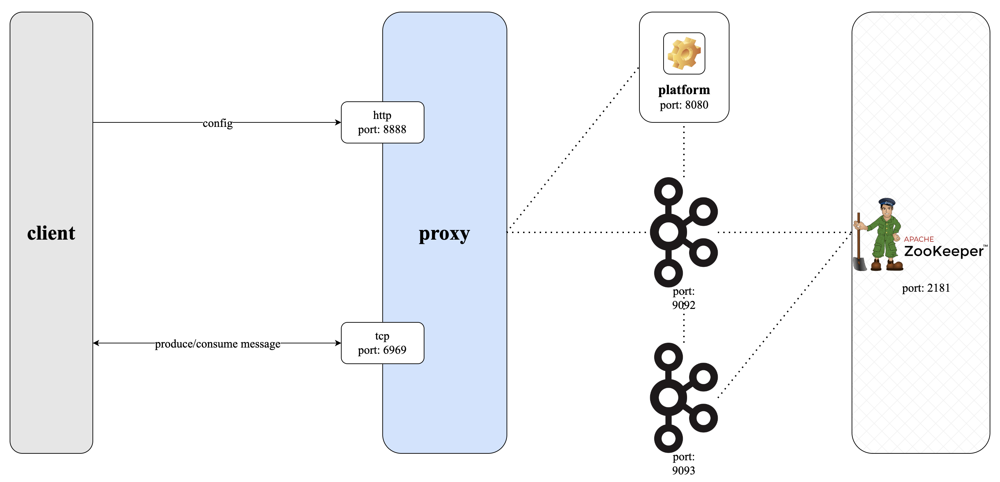
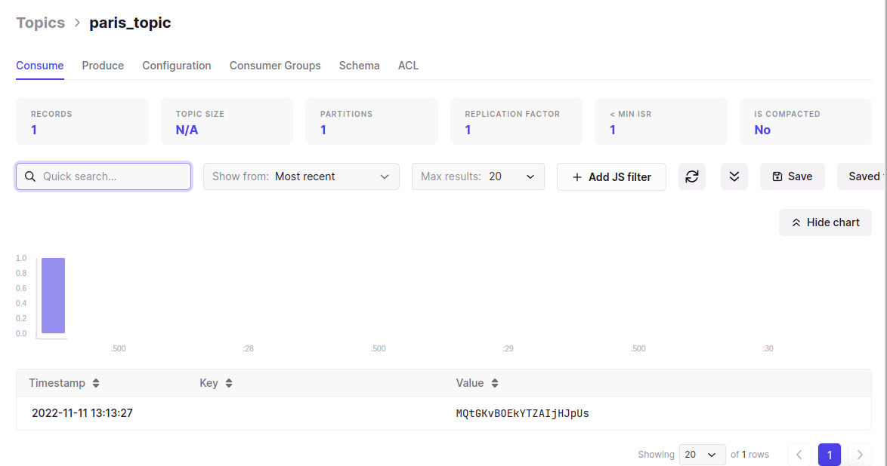

# Conduktor Gateway Multi-tenant Demo

## What is Multi-tenancy?

Conduktor Gateway's multi-tenancy feature allows 1 Kafka cluster to appear as a number of isolated clusters to clients. Each virtual cluster/tenant can be operated upon separately with no concern of side effects for the others.

### Architecture diagram


## Running the demo

### Step 1: Review the environment

As can be seen from `docker-compose.yaml` the demo environment consists of the following:

* A single Zookeeper Server
* A 2 node Kafka cluster
* A single Conduktor Gateway container
* A Kafka Client container (this provides nothing more than a place to run kafka client commands)

### Step 2: Review the platform configuration

`platform-config.yaml` defines 3 clusters:

* Backing Kafka - this is a direct connection to the underlying Kafka cluster hosting the demo
* London - a connection through Conduktor Gateway that represents the London virtual cluster/enant
* Paris - a connection through Conduktor Gateway that represents the Paris virutal cluster/tenant

Note: Tenancy is determined by the SASL credentials configured for each cluster. These credentials provide a token that encodes tenancy information.

### Step 3: Start the environment

Start the environment with

```bash
docker compose up -d
```

### Step 4: Create topics

Let's create some topics using the Kafka console tools, the below creates a topic name `londonTopic` in virtual cluster `London` and `parisTopic` in virtual cluster `Paris`.

```bash
docker compose exec kafka-client kafka-topics --bootstrap-server conduktor-gateway:6969 --command-config /clientConfig/london.properties --create --topic londonTopic
docker compose exec kafka-client kafka-topics --bootstrap-server conduktor-gateway:6969 --command-config /clientConfig/paris.properties --create --topic parisTopic
```

List all topics from both virutal clusters to see that, although they are hosted on the same underlying cluster, the topics are isolated from eachother:

```bash
docker compose exec kafka-client kafka-topics --bootstrap-server conduktor-gateway:6969 --command-config /clientConfig/london.properties --list
docker compose exec kafka-client kafka-topics --bootstrap-server conduktor-gateway:6969 --command-config /clientConfig/paris.properties --list
```

### Step 5: Produce data to the topics

You can produce with the CLI tools as follows:

```bash
echo testMessageLondon | docker compose exec -T kafka-client kafka-console-producer --bootstrap-server conduktor-gateway:6969 --producer.config /clientConfig/london.properties --topic londonTopic
echo testMessageParis | docker compose exec -T kafka-client kafka-console-producer --bootstrap-server conduktor-gateway:6969 --producer.config /clientConfig/paris.properties --topic parisTopic
```

### Step 6: Consume from the topics

And consume the messages produced above. 

```bash
docker compose exec kafka-client kafka-console-consumer --bootstrap-server conduktor-gateway:6969 --consumer.config /clientConfig/london.properties --topic londonTopic --from-beginning --max-messages 1
```

```bash
docker compose exec kafka-client kafka-console-consumer --bootstrap-server conduktor-gateway:6969 --consumer.config /clientConfig/paris.properties --topic parisTopic --from-beginning --max-messages 1
```

You could see how the message `testMessageLondon` cannot be consumed from the `Paris` virtual cluster client due to cluster isolation. It is not aware of this topic in a different "cluster".

You could see this from running the below command, you would get the `{parisTopic=UNKNOWN_TOPIC_OR_PARTITION}` error untill timeout . The command is show that trying to find the parisTopic from perspective of London (using the london.properties client) is not possible.

WARNING lots of output don't run unless you really want to! You will get 5 minutes of the retry message if using default parameters.
```bash
docker compose exec kafka-client kafka-console-consumer --bootstrap-server conduktor-gateway:6969 --consumer.config /clientConfig/london.properties --topic parisTopic --from-beginning --max-messages 1
```

`WARN [Consumer clientId=console-consumer, groupId=console-consumer-68780] Error while fetching metadata with correlation id 921 : {parisTopic=UNKNOWN_TOPIC_OR_PARTITION} (org.apache.kafka.clients.NetworkClient)`

### Step 7: Applying Multi-tenancy to existing topics (topic mapping)

During migration to Conduktor Gateway you may want to make up a tenant population from existing topics in your Kafka cluster. Conduktor Gateway allows this via the administration APIs. For more detail on the APIs check the Conduktor docs site.
In this next section we will create topics on the backing Kafka cluster and add them to tenants within Conduktor Gateway.

Let's start by creating some pre-exiting topics on the backing Kafka cluster and adding data to them.

```bash
docker compose exec kafka-client kafka-topics --bootstrap-server kafka1:9092 --create --topic existingLondonTopic
docker compose exec kafka-client kafka-topics --bootstrap-server kafka1:9092 --create --topic existingSharedTopic
echo existingLondonMessage | docker compose exec -T kafka-client kafka-console-producer --bootstrap-server kafka1:9092 --topic existingLondonTopic
echo existingSharedMessage | docker compose exec -T kafka-client kafka-console-producer --bootstrap-server kafka1:9092 --topic existingSharedTopic
```

### Step 8: Configuring tenants for existing topics

We'll create the following mappings:
* tenant: `London` can see `existingLondonTopic` and `existingSharedTopic`
* tenant: `Paris` can see only `existingSharedTopic`

First we create a topic mapping for each topic. These map a topic name for the tenant to a topic name in the backing Kafka cluster. These names do not have to match but they match here for clarity.  
&nbsp;  

First let's add the mapping of the topic name for the London virtual cluster and place in the url parameter,`.../existingLondonTopic`, to the topic name in the backing cluster which is what we place in the payload `"physicalTopicName": "existingLondonTopic"`.

```bash
docker compose exec kafka-client \
 curl \
    --user admin:conduktor \
    -X POST conduktor-gateway:8888/admin/multitenancy/v1/tenants/london/topics/existingLondonTopic \
    --header 'Content-Type: application/json' \
    --data-raw '{ 
        "physicalTopicName": "existingLondonTopic",
        "readOnly": false,
        "concentrated": false
        }'
```

and again to add the mapping existingSharedTopic into the London virtual cluster.
```bash
docker compose exec kafka-client \
 curl \
    --user admin:conduktor \
    -X POST conduktor-gateway:8888/admin/multitenancy/v1/tenants/london/topics/existingSharedTopic \
    --header 'Content-Type: application/json' \
    --data-raw '{ 
        "physicalTopicName": "existingSharedTopic",
        "readOnly": false,
        "concentrated": false
        }'
```

and finally to add the mapping existingSharedTopic also into the Paris virtual cluster.
```bash
docker compose exec kafka-client \
 curl \
    --user admin:conduktor \
    -X POST conduktor-gateway:8888/admin/multitenancy/v1/tenants/paris/topics/existingSharedTopic \
    --header 'Content-Type: application/json' \
    --data-raw '{ 
        "physicalTopicName": "existingSharedTopic",
        "readOnly": false,
        "concentrated": false
        }'
```
&nbsp;  


### Step 9: List the topics from the different tenants

```bash
docker compose exec kafka-client kafka-topics --bootstrap-server conduktor-gateway:6969 --command-config /clientConfig/london.properties --list
```

```bash
docker compose exec kafka-client kafka-topics --bootstrap-server conduktor-gateway:6969 --command-config /clientConfig/paris.properties --list
```
You should see that the Paris tenant can only see `existingSharedTopic` whereas London can see `existingSharedTopic` and `existingLondonTopic`.

### Step 10: Consume from the topics

```bash
docker compose exec kafka-client kafka-console-consumer --bootstrap-server conduktor-gateway:6969 --consumer.config /clientConfig/london.properties --topic existingLondonTopic --from-beginning --max-messages 1
```

```bash
docker compose exec kafka-client kafka-console-consumer --bootstrap-server conduktor-gateway:6969 --consumer.config /clientConfig/london.properties --topic existingSharedTopic --from-beginning --max-messages 1
```

```bash
docker compose exec kafka-client kafka-console-consumer --bootstrap-server conduktor-gateway:6969 --consumer.config /clientConfig/paris.properties --topic existingSharedTopic --from-beginning --max-messages 1
```

On `existingSharedTopic` the same messages are available to both tenants.


### Step 11: Visualise what we've been doing

A lot of what we demo'd you've had to use your CLI but checking out the changes can also be done visually with tools such as [Conduktor Console](https://www.conduktor.io/).

We won't demo all the steps of Console today but show a quick view on what we have done and how quickly it could be done visually.


#### Step 12: View the clusters

From what we did today you can see our 3 clusters as below:


We can create topics with a click of `Create Topic`.


Creating a topic in our virtual cluster `London` named `londonTopic` and one in `Paris` named `parisTopic`.

Switching back and forth between the `London` and `Paris` clusters and you would see that they only show the topics relevant to their clusters. 

We produced some messages to the newly created topics.


Now we select a Value format of `String` and click `Generate Once` to create a a sample message. Clicking `Produce` will produce the message to the cluster.


To consume messages, select the `Consume` tab in Conduktor Platform

.

# Conclusion

Today we ran through the idea of multi-tenany to create virtual clusters available for clients without the cost and time of needing additional backing Kafka clusters.
We looked at how these are isolated, how to set them up from new and how they're compatible mapping to existing topics.

To hear more about how multi-tenancy can work for you [get in touch](https://www.conduktor.io/contact/sales/), we'd love to hear from you!
