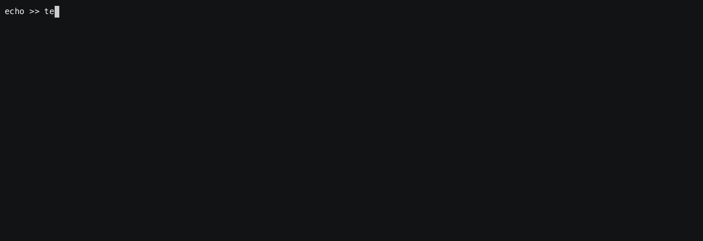

# Client Id validation


## View the full demo in realtime

You can either follow all the steps manually, or just enjoy the recording

[](https://asciinema.org/a/9S6Y6WZcnwKhK2dXMX7clqNLu)

### Review the docker compose environment

As can be seen from `docker-compose.yaml` the demo environment consists of the following services:

* gateway1
* gateway2
* kafka1
* kafka2
* kafka3
* schema-registry
* zookeeper

```sh
cat docker-compose.yaml
```

<details>
  <summary>File content</summary>

```yaml
version: '3.7'
services:
  zookeeper:
    image: confluentinc/cp-zookeeper:latest
    hostname: zookeeper
    container_name: zookeeper
    environment:
      ZOOKEEPER_CLIENT_PORT: 2801
      ZOOKEEPER_TICK_TIME: 2000
    healthcheck:
      test: nc -zv 0.0.0.0 2801 || exit 1
      interval: 5s
      retries: 25
  kafka1:
    hostname: kafka1
    container_name: kafka1
    image: confluentinc/cp-kafka:latest
    ports:
    - 19092:19092
    environment:
      KAFKA_BROKER_ID: 1
      KAFKA_ZOOKEEPER_CONNECT: zookeeper:2801
      KAFKA_LISTENERS: INTERNAL://:9092,EXTERNAL_SAME_HOST://:19092
      KAFKA_ADVERTISED_LISTENERS: INTERNAL://kafka1:9092,EXTERNAL_SAME_HOST://localhost:19092
      KAFKA_LISTENER_SECURITY_PROTOCOL_MAP: INTERNAL:PLAINTEXT,EXTERNAL_SAME_HOST:PLAINTEXT
      KAFKA_INTER_BROKER_LISTENER_NAME: INTERNAL
      KAFKA_GROUP_INITIAL_REBALANCE_DELAY_MS: 0
      KAFKA_LOG4J_LOGGERS: kafka.authorizer.logger=INFO
      KAFKA_LOG4J_ROOT_LOGLEVEL: WARN
      KAFKA_AUTO_CREATE_TOPICS_ENABLE: false
    depends_on:
      zookeeper:
        condition: service_healthy
    healthcheck:
      test: nc -zv kafka1 9092 || exit 1
      interval: 5s
      retries: 25
  kafka2:
    hostname: kafka2
    container_name: kafka2
    image: confluentinc/cp-kafka:latest
    ports:
    - 19093:19093
    environment:
      KAFKA_BROKER_ID: 2
      KAFKA_ZOOKEEPER_CONNECT: zookeeper:2801
      KAFKA_LISTENERS: INTERNAL://:9093,EXTERNAL_SAME_HOST://:19093
      KAFKA_ADVERTISED_LISTENERS: INTERNAL://kafka2:9093,EXTERNAL_SAME_HOST://localhost:19093
      KAFKA_LISTENER_SECURITY_PROTOCOL_MAP: INTERNAL:PLAINTEXT,EXTERNAL_SAME_HOST:PLAINTEXT
      KAFKA_INTER_BROKER_LISTENER_NAME: INTERNAL
      KAFKA_GROUP_INITIAL_REBALANCE_DELAY_MS: 0
      KAFKA_LOG4J_LOGGERS: kafka.authorizer.logger=INFO
      KAFKA_LOG4J_ROOT_LOGLEVEL: WARN
      KAFKA_AUTO_CREATE_TOPICS_ENABLE: false
    depends_on:
      zookeeper:
        condition: service_healthy
    healthcheck:
      test: nc -zv kafka2 9093 || exit 1
      interval: 5s
      retries: 25
  kafka3:
    image: confluentinc/cp-kafka:latest
    hostname: kafka3
    container_name: kafka3
    ports:
    - 19094:19094
    environment:
      KAFKA_BROKER_ID: 3
      KAFKA_ZOOKEEPER_CONNECT: zookeeper:2801
      KAFKA_LISTENERS: INTERNAL://:9094,EXTERNAL_SAME_HOST://:19094
      KAFKA_ADVERTISED_LISTENERS: INTERNAL://kafka3:9094,EXTERNAL_SAME_HOST://localhost:19094
      KAFKA_LISTENER_SECURITY_PROTOCOL_MAP: INTERNAL:PLAINTEXT,EXTERNAL_SAME_HOST:PLAINTEXT
      KAFKA_INTER_BROKER_LISTENER_NAME: INTERNAL
      KAFKA_GROUP_INITIAL_REBALANCE_DELAY_MS: 0
      KAFKA_LOG4J_LOGGERS: kafka.authorizer.logger=INFO
      KAFKA_LOG4J_ROOT_LOGLEVEL: WARN
      KAFKA_AUTO_CREATE_TOPICS_ENABLE: false
    depends_on:
      zookeeper:
        condition: service_healthy
    healthcheck:
      test: nc -zv kafka3 9094 || exit 1
      interval: 5s
      retries: 25
  schema-registry:
    image: confluentinc/cp-schema-registry:latest
    hostname: schema-registry
    container_name: schema-registry
    ports:
    - 8081:8081
    environment:
      SCHEMA_REGISTRY_HOST_NAME: schema-registry
      SCHEMA_REGISTRY_KAFKASTORE_BOOTSTRAP_SERVERS: kafka1:9092,kafka2:9093,kafka3:9094
      SCHEMA_REGISTRY_LOG4J_ROOT_LOGLEVEL: WARN
      SCHEMA_REGISTRY_LISTENERS: http://0.0.0.0:8081
      SCHEMA_REGISTRY_KAFKASTORE_TOPIC: _schemas
      SCHEMA_REGISTRY_SCHEMA_REGISTRY_GROUP_ID: schema-registry
    volumes:
    - type: bind
      source: .
      target: /clientConfig
      read_only: true
    depends_on:
      kafka1:
        condition: service_healthy
      kafka2:
        condition: service_healthy
      kafka3:
        condition: service_healthy
    healthcheck:
      test: nc -zv schema-registry 8081 || exit 1
      interval: 5s
      retries: 25
  gateway1:
    image: conduktor/conduktor-gateway:2.5.0
    hostname: gateway1
    container_name: gateway1
    environment:
      KAFKA_BOOTSTRAP_SERVERS: kafka1:9092,kafka2:9093,kafka3:9094
      GATEWAY_ADVERTISED_HOST: localhost
      GATEWAY_MODE: VCLUSTER
      GATEWAY_SECURITY_PROTOCOL: SASL_PLAINTEXT
      GATEWAY_FEATURE_FLAGS_ANALYTICS: false
    depends_on:
      kafka1:
        condition: service_healthy
      kafka2:
        condition: service_healthy
      kafka3:
        condition: service_healthy
    ports:
    - 6969:6969
    - 6970:6970
    - 6971:6971
    - 8888:8888
    healthcheck:
      test: curl localhost:8888/health
      interval: 5s
      retries: 25
  gateway2:
    image: conduktor/conduktor-gateway:2.5.0
    hostname: gateway2
    container_name: gateway2
    environment:
      KAFKA_BOOTSTRAP_SERVERS: kafka1:9092,kafka2:9093,kafka3:9094
      GATEWAY_ADVERTISED_HOST: localhost
      GATEWAY_MODE: VCLUSTER
      GATEWAY_SECURITY_PROTOCOL: SASL_PLAINTEXT
      GATEWAY_FEATURE_FLAGS_ANALYTICS: false
      GATEWAY_START_PORT: 7969
    depends_on:
      kafka1:
        condition: service_healthy
      kafka2:
        condition: service_healthy
      kafka3:
        condition: service_healthy
    ports:
    - 7969:7969
    - 7970:7970
    - 7971:7971
    - 8889:8888
    healthcheck:
      test: curl localhost:8888/health
      interval: 5s
      retries: 25
networks:
  demo: null
```

</details>

 <details>
  <summary>docker compose ps</summary>

```
NAME              IMAGE                                    COMMAND                  SERVICE           CREATED          STATUS                    PORTS
gateway1          conduktor/conduktor-gateway:2.5.0        "java -cp @/app/jib-…"   gateway1          28 seconds ago   Up 16 seconds (healthy)   0.0.0.0:6969-6971->6969-6971/tcp, 0.0.0.0:8888->8888/tcp
gateway2          conduktor/conduktor-gateway:2.5.0        "java -cp @/app/jib-…"   gateway2          28 seconds ago   Up 16 seconds (healthy)   0.0.0.0:7969-7971->7969-7971/tcp, 0.0.0.0:8889->8888/tcp
kafka1            confluentinc/cp-kafka:latest             "/etc/confluent/dock…"   kafka1            28 seconds ago   Up 22 seconds (healthy)   9092/tcp, 0.0.0.0:19092->19092/tcp
kafka2            confluentinc/cp-kafka:latest             "/etc/confluent/dock…"   kafka2            28 seconds ago   Up 21 seconds (healthy)   9092/tcp, 0.0.0.0:19093->19093/tcp
kafka3            confluentinc/cp-kafka:latest             "/etc/confluent/dock…"   kafka3            28 seconds ago   Up 21 seconds (healthy)   9092/tcp, 0.0.0.0:19094->19094/tcp
schema-registry   confluentinc/cp-schema-registry:latest   "/etc/confluent/dock…"   schema-registry   28 seconds ago   Up 16 seconds (healthy)   0.0.0.0:8081->8081/tcp
zookeeper         confluentinc/cp-zookeeper:latest         "/etc/confluent/dock…"   zookeeper         28 seconds ago   Up 27 seconds (healthy)   2181/tcp, 2888/tcp, 3888/tcp

```

</details>

## Starting the docker environment

Start all your docker processes, wait for them to be up and ready, then run in background

* `--wait`: Wait for services to be `running|healthy`. Implies detached mode.
* `--detach`: Detached mode: Run containers in the background

```sh
docker compose up --detach --wait
```

<details>
  <summary>Realtime command output</summary>

  

</details>


<details>
<summary>Command output</summary>

```sh

docker compose up --detach --wait
 Network safeguard-client-id_default  Creating
 Network safeguard-client-id_default  Created
 Container zookeeper  Creating
 Container zookeeper  Created
 Container kafka2  Creating
 Container kafka3  Creating
 Container kafka1  Creating
 Container kafka2  Created
 Container kafka1  Created
 Container kafka3  Created
 Container schema-registry  Creating
 Container gateway1  Creating
 Container gateway2  Creating
 gateway1 The requested image's platform (linux/amd64) does not match the detected host platform (linux/arm64/v8) and no specific platform was requested 
 gateway2 The requested image's platform (linux/amd64) does not match the detected host platform (linux/arm64/v8) and no specific platform was requested 
 Container gateway1  Created
 Container gateway2  Created
 Container schema-registry  Created
 Container zookeeper  Starting
 Container zookeeper  Started
 Container zookeeper  Waiting
 Container zookeeper  Waiting
 Container zookeeper  Waiting
 Container zookeeper  Healthy
 Container kafka3  Starting
 Container zookeeper  Healthy
 Container kafka2  Starting
 Container zookeeper  Healthy
 Container kafka1  Starting
 Container kafka2  Started
 Container kafka1  Started
 Container kafka3  Started
 Container kafka1  Waiting
 Container kafka2  Waiting
 Container kafka3  Waiting
 Container kafka3  Waiting
 Container kafka1  Waiting
 Container kafka2  Waiting
 Container kafka3  Waiting
 Container kafka1  Waiting
 Container kafka2  Waiting
 Container kafka1  Healthy
 Container kafka3  Healthy
 Container kafka3  Healthy
 Container kafka1  Healthy
 Container kafka2  Healthy
 Container gateway1  Starting
 Container kafka3  Healthy
 Container kafka1  Healthy
 Container kafka2  Healthy
 Container schema-registry  Starting
 Container kafka2  Healthy
 Container gateway2  Starting
 Container schema-registry  Started
 Container gateway1  Started
 Container gateway2  Started
 Container kafka3  Waiting
 Container schema-registry  Waiting
 Container gateway1  Waiting
 Container gateway2  Waiting
 Container zookeeper  Waiting
 Container kafka1  Waiting
 Container kafka2  Waiting
 Container kafka2  Healthy
 Container kafka3  Healthy
 Container kafka1  Healthy
 Container zookeeper  Healthy
 Container schema-registry  Healthy
 Container gateway2  Healthy
 Container gateway1  Healthy

```

</details>
      


## Creating virtual cluster `teamA`

Creating virtual cluster `teamA` on gateway `gateway1`

```sh
token=$(curl \
    --request POST "http://localhost:8888/admin/vclusters/v1/vcluster/teamA/username/sa" \
    --header 'Content-Type: application/json' \
    --user 'admin:conduktor' \
    --silent \
    --data-raw '{"lifeTimeSeconds": 7776000}' | jq -r ".token")

echo  """
bootstrap.servers=localhost:6969
security.protocol=SASL_PLAINTEXT
sasl.mechanism=PLAIN
sasl.jaas.config=org.apache.kafka.common.security.plain.PlainLoginModule required username='sa' password='$token';
""" > teamA-sa.properties
```

<details>
  <summary>Realtime command output</summary>

  

</details>


<details>
<summary>Command output</summary>

```sh

token=$(curl \
    --request POST "http://localhost:8888/admin/vclusters/v1/vcluster/teamA/username/sa" \
    --header 'Content-Type: application/json' \
    --user 'admin:conduktor' \
    --silent \
    --data-raw '{"lifeTimeSeconds": 7776000}' | jq -r ".token")
curl     --request POST "http://localhost:8888/admin/vclusters/v1/vcluster/teamA/username/sa"     --header 'Content-Type: application/json'     --user 'admin:conduktor'     --silent     --data-raw '{"lifeTimeSeconds": 7776000}' | jq -r ".token"

echo  """
bootstrap.servers=localhost:6969
security.protocol=SASL_PLAINTEXT
sasl.mechanism=PLAIN
sasl.jaas.config=org.apache.kafka.common.security.plain.PlainLoginModule required username='sa' password='$token';
""" > teamA-sa.properties

```

</details>
      


## Creating topic `users` on `teamA`

Creating topic `users` on `teamA`
* Topic `users` with partitions:1 and replication-factor:1

```sh
kafka-topics \
    --bootstrap-server localhost:6969 \
    --command-config teamA-sa.properties \
    --replication-factor 1 \
    --partitions 1 \
    --create --if-not-exists \
    --topic users
```

<details>
  <summary>Realtime command output</summary>

  

</details>


<details>
<summary>Command output</summary>

```sh

kafka-topics \
    --bootstrap-server localhost:6969 \
    --command-config teamA-sa.properties \
    --replication-factor 1 \
    --partitions 1 \
    --create --if-not-exists \
    --topic users
Created topic users.

```

</details>
      


## Listing topics in `teamA`


```sh
kafka-topics \
    --bootstrap-server localhost:6969 \
    --command-config teamA-sa.properties \
    --list
```

<details>
  <summary>Realtime command output</summary>

  

</details>


<details>
<summary>Command output</summary>

```sh

kafka-topics \
    --bootstrap-server localhost:6969 \
    --command-config teamA-sa.properties \
    --list
users

```

</details>
      


## Adding interceptor `client-id`


Creating the interceptor named `client-id` of the plugin `io.conduktor.gateway.interceptor.safeguard.ClientIdRequiredPolicyPlugin` using the following payload

```json
{
  "pluginClass" : "io.conduktor.gateway.interceptor.safeguard.ClientIdRequiredPolicyPlugin",
  "priority" : 100,
  "config" : {
    "namingConvention" : "naming-convention-.*"
  }
}
```

Here's how to send it:

```sh
cat step-08-client-id.json | jq

curl \
    --request POST "http://localhost:8888/admin/interceptors/v1/vcluster/teamA/interceptor/client-id" \
    --header 'Content-Type: application/json' \
    --user 'admin:conduktor' \
    --silent \
    --data @step-08-client-id.json | jq
```

<details>
  <summary>Realtime command output</summary>

  

</details>


<details>
<summary>Command output</summary>

```sh

cat step-08-client-id.json | jq
{
  "pluginClass": "io.conduktor.gateway.interceptor.safeguard.ClientIdRequiredPolicyPlugin",
  "priority": 100,
  "config": {
    "namingConvention": "naming-convention-.*"
  }
}

curl \
    --request POST "http://localhost:8888/admin/interceptors/v1/vcluster/teamA/interceptor/client-id" \
    --header 'Content-Type: application/json' \
    --user 'admin:conduktor' \
    --silent \
    --data @step-08-client-id.json | jq
{
  "message": "client-id is created"
}

```

</details>
      


## Listing interceptors for `teamA`

Listing interceptors on `gateway1` for virtual cluster `teamA`

```sh
curl \
    --request GET 'http://localhost:8888/admin/interceptors/v1/vcluster/teamA' \
    --header 'Content-Type: application/json' \
    --user 'admin:conduktor' \
    --silent | jq
```

<details>
  <summary>Realtime command output</summary>

  

</details>


<details>
<summary>Command output</summary>

```sh

curl \
    --request GET 'http://localhost:8888/admin/interceptors/v1/vcluster/teamA' \
    --header 'Content-Type: application/json' \
    --user 'admin:conduktor' \
    --silent | jq
{
  "interceptors": [
    {
      "name": "client-id",
      "pluginClass": "io.conduktor.gateway.interceptor.safeguard.ClientIdRequiredPolicyPlugin",
      "apiKey": null,
      "priority": 100,
      "timeoutMs": 9223372036854775807,
      "config": {
        "namingConvention": "naming-convention-.*"
      }
    }
  ]
}

```

</details>
      


## Creating topic `customers` on `teamA`

Creating topic `customers` on `teamA`
* Topic `customers` with partitions:1 and replication-factor:1

```sh
kafka-topics \
    --bootstrap-server localhost:6969 \
    --command-config teamA-sa.properties \
    --replication-factor 1 \
    --partitions 1 \
    --create --if-not-exists \
    --topic customers
```

> [!IMPORTANT]
> We get the following exception
>
> ```sh
> org.apache.kafka.common.errors.PolicyViolationException:
>> clientId 'adminclient-20' is invalid, naming convention must match with regular expression 'naming-convention-.*'
> ```


<details>
  <summary>Realtime command output</summary>

  

</details>


<details>
<summary>Command output</summary>

```sh

kafka-topics \
    --bootstrap-server localhost:6969 \
    --command-config teamA-sa.properties \
    --replication-factor 1 \
    --partitions 1 \
    --create --if-not-exists \
    --topic customers
[2024-01-23 00:33:26,091] WARN [AdminClient clientId=adminclient-1] Received error POLICY_VIOLATION from node -1 when making an ApiVersionsRequest with correlation id 0. Disconnecting. (org.apache.kafka.clients.NetworkClient)
[2024-01-23 00:33:26,223] WARN [AdminClient clientId=adminclient-1] Received error POLICY_VIOLATION from node -1 when making an ApiVersionsRequest with correlation id 1. Disconnecting. (org.apache.kafka.clients.NetworkClient)
[2024-01-23 00:33:26,459] WARN [AdminClient clientId=adminclient-1] Received error POLICY_VIOLATION from node -1 when making an ApiVersionsRequest with correlation id 2. Disconnecting. (org.apache.kafka.clients.NetworkClient)
[2024-01-23 00:33:26,704] WARN [AdminClient clientId=adminclient-1] Received error POLICY_VIOLATION from node -1 when making an ApiVersionsRequest with correlation id 3. Disconnecting. (org.apache.kafka.clients.NetworkClient)
[2024-01-23 00:33:27,144] WARN [AdminClient clientId=adminclient-1] Received error POLICY_VIOLATION from node -1 when making an ApiVersionsRequest with correlation id 4. Disconnecting. (org.apache.kafka.clients.NetworkClient)
[2024-01-23 00:33:28,190] WARN [AdminClient clientId=adminclient-1] Received error POLICY_VIOLATION from node -1 when making an ApiVersionsRequest with correlation id 5. Disconnecting. (org.apache.kafka.clients.NetworkClient)
[2024-01-23 00:33:29,228] WARN [AdminClient clientId=adminclient-1] Received error POLICY_VIOLATION from node -1 when making an ApiVersionsRequest with correlation id 6. Disconnecting. (org.apache.kafka.clients.NetworkClient)
[2024-01-23 00:33:30,269] WARN [AdminClient clientId=adminclient-1] Received error POLICY_VIOLATION from node -1 when making an ApiVersionsRequest with correlation id 7. Disconnecting. (org.apache.kafka.clients.NetworkClient)
[2024-01-23 00:33:31,415] WARN [AdminClient clientId=adminclient-1] Received error POLICY_VIOLATION from node -1 when making an ApiVersionsRequest with correlation id 8. Disconnecting. (org.apache.kafka.clients.NetworkClient)
[2024-01-23 00:33:32,356] WARN [AdminClient clientId=adminclient-1] Received error POLICY_VIOLATION from node -1 when making an ApiVersionsRequest with correlation id 9. Disconnecting. (org.apache.kafka.clients.NetworkClient)
[2024-01-23 00:33:33,314] WARN [AdminClient clientId=adminclient-1] Received error POLICY_VIOLATION from node -1 when making an ApiVersionsRequest with correlation id 10. Disconnecting. (org.apache.kafka.clients.NetworkClient)
[2024-01-23 00:33:34,364] WARN [AdminClient clientId=adminclient-1] Received error POLICY_VIOLATION from node -1 when making an ApiVersionsRequest with correlation id 11. Disconnecting. (org.apache.kafka.clients.NetworkClient)
[2024-01-23 00:33:35,432] WARN [AdminClient clientId=adminclient-1] Received error POLICY_VIOLATION from node -1 when making an ApiVersionsRequest with correlation id 12. Disconnecting. (org.apache.kafka.clients.NetworkClient)
[2024-01-23 00:33:36,467] WARN [AdminClient clientId=adminclient-1] Received error POLICY_VIOLATION from node -1 when making an ApiVersionsRequest with correlation id 13. Disconnecting. (org.apache.kafka.clients.NetworkClient)
[2024-01-23 00:33:37,405] WARN [AdminClient clientId=adminclient-1] Received error POLICY_VIOLATION from node -1 when making an ApiVersionsRequest with correlation id 14. Disconnecting. (org.apache.kafka.clients.NetworkClient)
[2024-01-23 00:33:38,450] WARN [AdminClient clientId=adminclient-1] Received error POLICY_VIOLATION from node -1 when making an ApiVersionsRequest with correlation id 15. Disconnecting. (org.apache.kafka.clients.NetworkClient)
[2024-01-23 00:33:39,717] WARN [AdminClient clientId=adminclient-1] Received error POLICY_VIOLATION from node -1 when making an ApiVersionsRequest with correlation id 16. Disconnecting. (org.apache.kafka.clients.NetworkClient)
[2024-01-23 00:33:40,559] WARN [AdminClient clientId=adminclient-1] Received error POLICY_VIOLATION from node -1 when making an ApiVersionsRequest with correlation id 17. Disconnecting. (org.apache.kafka.clients.NetworkClient)
[2024-01-23 00:33:41,618] WARN [AdminClient clientId=adminclient-1] Received error POLICY_VIOLATION from node -1 when making an ApiVersionsRequest with correlation id 18. Disconnecting. (org.apache.kafka.clients.NetworkClient)
[2024-01-23 00:33:42,688] WARN [AdminClient clientId=adminclient-1] Received error POLICY_VIOLATION from node -1 when making an ApiVersionsRequest with correlation id 19. Disconnecting. (org.apache.kafka.clients.NetworkClient)
[2024-01-23 00:33:43,745] WARN [AdminClient clientId=adminclient-1] Received error POLICY_VIOLATION from node -1 when making an ApiVersionsRequest with correlation id 20. Disconnecting. (org.apache.kafka.clients.NetworkClient)
[2024-01-23 00:33:45,017] WARN [AdminClient clientId=adminclient-1] Received error POLICY_VIOLATION from node -1 when making an ApiVersionsRequest with correlation id 21. Disconnecting. (org.apache.kafka.clients.NetworkClient)
[2024-01-23 00:33:46,192] WARN [AdminClient clientId=adminclient-1] Received error POLICY_VIOLATION from node -1 when making an ApiVersionsRequest with correlation id 22. Disconnecting. (org.apache.kafka.clients.NetworkClient)
[2024-01-23 00:33:47,262] WARN [AdminClient clientId=adminclient-1] Received error POLICY_VIOLATION from node -1 when making an ApiVersionsRequest with correlation id 23. Disconnecting. (org.apache.kafka.clients.NetworkClient)
[2024-01-23 00:33:48,323] WARN [AdminClient clientId=adminclient-1] Received error POLICY_VIOLATION from node -1 when making an ApiVersionsRequest with correlation id 24. Disconnecting. (org.apache.kafka.clients.NetworkClient)
[2024-01-23 00:33:49,489] WARN [AdminClient clientId=adminclient-1] Received error POLICY_VIOLATION from node -1 when making an ApiVersionsRequest with correlation id 25. Disconnecting. (org.apache.kafka.clients.NetworkClient)
[2024-01-23 00:33:50,576] WARN [AdminClient clientId=adminclient-1] Received error POLICY_VIOLATION from node -1 when making an ApiVersionsRequest with correlation id 26. Disconnecting. (org.apache.kafka.clients.NetworkClient)
[2024-01-23 00:33:51,514] WARN [AdminClient clientId=adminclient-1] Received error POLICY_VIOLATION from node -1 when making an ApiVersionsRequest with correlation id 27. Disconnecting. (org.apache.kafka.clients.NetworkClient)
[2024-01-23 00:33:52,472] WARN [AdminClient clientId=adminclient-1] Received error POLICY_VIOLATION from node -1 when making an ApiVersionsRequest with correlation id 28. Disconnecting. (org.apache.kafka.clients.NetworkClient)
[2024-01-23 00:33:53,632] WARN [AdminClient clientId=adminclient-1] Received error POLICY_VIOLATION from node -1 when making an ApiVersionsRequest with correlation id 29. Disconnecting. (org.apache.kafka.clients.NetworkClient)
[2024-01-23 00:33:54,770] WARN [AdminClient clientId=adminclient-1] Received error POLICY_VIOLATION from node -1 when making an ApiVersionsRequest with correlation id 30. Disconnecting. (org.apache.kafka.clients.NetworkClient)
[2024-01-23 00:33:55,859] WARN [AdminClient clientId=adminclient-1] Received error POLICY_VIOLATION from node -1 when making an ApiVersionsRequest with correlation id 31. Disconnecting. (org.apache.kafka.clients.NetworkClient)
[2024-01-23 00:33:56,864] WARN [AdminClient clientId=adminclient-1] Received error POLICY_VIOLATION from node -1 when making an ApiVersionsRequest with correlation id 32. Disconnecting. (org.apache.kafka.clients.NetworkClient)
[2024-01-23 00:33:58,029] WARN [AdminClient clientId=adminclient-1] Received error POLICY_VIOLATION from node -1 when making an ApiVersionsRequest with correlation id 33. Disconnecting. (org.apache.kafka.clients.NetworkClient)
[2024-01-23 00:33:59,089] WARN [AdminClient clientId=adminclient-1] Received error POLICY_VIOLATION from node -1 when making an ApiVersionsRequest with correlation id 34. Disconnecting. (org.apache.kafka.clients.NetworkClient)
[2024-01-23 00:34:00,231] WARN [AdminClient clientId=adminclient-1] Received error POLICY_VIOLATION from node -1 when making an ApiVersionsRequest with correlation id 35. Disconnecting. (org.apache.kafka.clients.NetworkClient)
[2024-01-23 00:34:01,391] WARN [AdminClient clientId=adminclient-1] Received error POLICY_VIOLATION from node -1 when making an ApiVersionsRequest with correlation id 36. Disconnecting. (org.apache.kafka.clients.NetworkClient)
[2024-01-23 00:34:02,347] WARN [AdminClient clientId=adminclient-1] Received error POLICY_VIOLATION from node -1 when making an ApiVersionsRequest with correlation id 37. Disconnecting. (org.apache.kafka.clients.NetworkClient)
[2024-01-23 00:34:03,610] WARN [AdminClient clientId=adminclient-1] Received error POLICY_VIOLATION from node -1 when making an ApiVersionsRequest with correlation id 38. Disconnecting. (org.apache.kafka.clients.NetworkClient)
[2024-01-23 00:34:04,588] WARN [AdminClient clientId=adminclient-1] Received error POLICY_VIOLATION from node -1 when making an ApiVersionsRequest with correlation id 39. Disconnecting. (org.apache.kafka.clients.NetworkClient)
[2024-01-23 00:34:05,707] WARN [AdminClient clientId=adminclient-1] Received error POLICY_VIOLATION from node -1 when making an ApiVersionsRequest with correlation id 40. Disconnecting. (org.apache.kafka.clients.NetworkClient)
[2024-01-23 00:34:06,850] WARN [AdminClient clientId=adminclient-1] Received error POLICY_VIOLATION from node -1 when making an ApiVersionsRequest with correlation id 41. Disconnecting. (org.apache.kafka.clients.NetworkClient)
[2024-01-23 00:34:07,790] WARN [AdminClient clientId=adminclient-1] Received error POLICY_VIOLATION from node -1 when making an ApiVersionsRequest with correlation id 42. Disconnecting. (org.apache.kafka.clients.NetworkClient)
[2024-01-23 00:34:08,932] WARN [AdminClient clientId=adminclient-1] Received error POLICY_VIOLATION from node -1 when making an ApiVersionsRequest with correlation id 43. Disconnecting. (org.apache.kafka.clients.NetworkClient)
[2024-01-23 00:34:09,975] WARN [AdminClient clientId=adminclient-1] Received error POLICY_VIOLATION from node -1 when making an ApiVersionsRequest with correlation id 44. Disconnecting. (org.apache.kafka.clients.NetworkClient)
[2024-01-23 00:34:11,114] WARN [AdminClient clientId=adminclient-1] Received error POLICY_VIOLATION from node -1 when making an ApiVersionsRequest with correlation id 45. Disconnecting. (org.apache.kafka.clients.NetworkClient)
[2024-01-23 00:34:12,060] WARN [AdminClient clientId=adminclient-1] Received error POLICY_VIOLATION from node -1 when making an ApiVersionsRequest with correlation id 46. Disconnecting. (org.apache.kafka.clients.NetworkClient)
[2024-01-23 00:34:13,115] WARN [AdminClient clientId=adminclient-1] Received error POLICY_VIOLATION from node -1 when making an ApiVersionsRequest with correlation id 47. Disconnecting. (org.apache.kafka.clients.NetworkClient)
[2024-01-23 00:34:14,254] WARN [AdminClient clientId=adminclient-1] Received error POLICY_VIOLATION from node -1 when making an ApiVersionsRequest with correlation id 48. Disconnecting. (org.apache.kafka.clients.NetworkClient)
[2024-01-23 00:34:15,391] WARN [AdminClient clientId=adminclient-1] Received error POLICY_VIOLATION from node -1 when making an ApiVersionsRequest with correlation id 49. Disconnecting. (org.apache.kafka.clients.NetworkClient)
[2024-01-23 00:34:16,429] WARN [AdminClient clientId=adminclient-1] Received error POLICY_VIOLATION from node -1 when making an ApiVersionsRequest with correlation id 50. Disconnecting. (org.apache.kafka.clients.NetworkClient)
[2024-01-23 00:34:17,582] WARN [AdminClient clientId=adminclient-1] Received error POLICY_VIOLATION from node -1 when making an ApiVersionsRequest with correlation id 51. Disconnecting. (org.apache.kafka.clients.NetworkClient)
[2024-01-23 00:34:19,043] WARN [AdminClient clientId=adminclient-1] Received error POLICY_VIOLATION from node -1 when making an ApiVersionsRequest with correlation id 52. Disconnecting. (org.apache.kafka.clients.NetworkClient)
[2024-01-23 00:34:19,988] WARN [AdminClient clientId=adminclient-1] Received error POLICY_VIOLATION from node -1 when making an ApiVersionsRequest with correlation id 53. Disconnecting. (org.apache.kafka.clients.NetworkClient)
[2024-01-23 00:34:21,125] WARN [AdminClient clientId=adminclient-1] Received error POLICY_VIOLATION from node -1 when making an ApiVersionsRequest with correlation id 54. Disconnecting. (org.apache.kafka.clients.NetworkClient)
[2024-01-23 00:34:22,107] WARN [AdminClient clientId=adminclient-1] Received error POLICY_VIOLATION from node -1 when making an ApiVersionsRequest with correlation id 55. Disconnecting. (org.apache.kafka.clients.NetworkClient)
[2024-01-23 00:34:23,275] WARN [AdminClient clientId=adminclient-1] Received error POLICY_VIOLATION from node -1 when making an ApiVersionsRequest with correlation id 56. Disconnecting. (org.apache.kafka.clients.NetworkClient)
[2024-01-23 00:34:24,526] WARN [AdminClient clientId=adminclient-1] Received error POLICY_VIOLATION from node -1 when making an ApiVersionsRequest with correlation id 57. Disconnecting. (org.apache.kafka.clients.NetworkClient)
[2024-01-23 00:34:25,813] WARN [AdminClient clientId=adminclient-1] Received error POLICY_VIOLATION from node -1 when making an ApiVersionsRequest with correlation id 58. Disconnecting. (org.apache.kafka.clients.NetworkClient)
Error while executing topic command : Timed out waiting for a node assignment. Call: createTopics
[2024-01-23 00:34:25,968] ERROR org.apache.kafka.common.errors.TimeoutException: Timed out waiting for a node assignment. Call: createTopics
 (kafka.admin.TopicCommand$)

```

</details>
      


## Let


```sh
echo >> teamA-sa.properties    
echo "client.id=naming-convention-for-this-application" >> teamA-sa.properties    
```

<details>
  <summary>Realtime command output</summary>

  

</details>


<details>
<summary>Command output</summary>

```sh

echo >> teamA-sa.properties    
echo "client.id=naming-convention-for-this-application" >> teamA-sa.properties    

```

</details>
      


## Creating topic `customers` on `teamA`

Creating topic `customers` on `teamA`
* Topic `customers` with partitions:1 and replication-factor:1

```sh
kafka-topics \
    --bootstrap-server localhost:6969 \
    --command-config teamA-sa.properties \
    --replication-factor 1 \
    --partitions 1 \
    --create --if-not-exists \
    --topic customers
```

<details>
  <summary>Realtime command output</summary>

  

</details>


<details>
<summary>Command output</summary>

```sh

kafka-topics \
    --bootstrap-server localhost:6969 \
    --command-config teamA-sa.properties \
    --replication-factor 1 \
    --partitions 1 \
    --create --if-not-exists \
    --topic customers
Created topic customers.

```

</details>
      


## Check in the audit log that produce was denied

Check in the audit log that produce was denied in cluster `kafka1`

```sh
kafka-console-consumer \
    --bootstrap-server localhost:19092,localhost:19093,localhost:19094 \
    --topic _auditLogs \
    --from-beginning \
    --timeout-ms 3000 \
 | jq 'select(.type=="SAFEGUARD" and .eventData.plugin=="io.conduktor.gateway.interceptor.safeguard.ClientIdRequiredPolicyPlugin")'
```


```json
{
  "id" : "1199bcfb-6f9c-41a6-b05a-581756cd1bff",
  "source" : "krn://cluster=qOQpVbUIT7idKnxdCfStvA",
  "type" : "SAFEGUARD",
  "authenticationPrincipal" : "teamA",
  "userName" : "sa",
  "connection" : {
    "localAddress" : null,
    "remoteAddress" : "/192.168.65.1:21068"
  },
  "specVersion" : "0.1.0",
  "time" : "2024-01-22T23:32:44.169388045Z",
  "eventData" : {
    "level" : "error",
    "plugin" : "io.conduktor.gateway.interceptor.safeguard.ClientIdRequiredPolicyPlugin",
    "message" : "clientId 'adminclient-20' is invalid, naming convention must match with regular expression 'naming-convention-.*'"
  }
}
```


<details>
  <summary>Realtime command output</summary>

  

</details>


<details>
<summary>Command output</summary>

```sh

kafka-console-consumer \
    --bootstrap-server localhost:19092,localhost:19093,localhost:19094 \
    --topic _auditLogs \
    --from-beginning \
    --timeout-ms 3000 \
 | jq 'select(.type=="SAFEGUARD" and .eventData.plugin=="io.conduktor.gateway.interceptor.safeguard.ClientIdRequiredPolicyPlugin")'
{
  "id": "0099d622-6e3a-423e-8165-77f769b7a5d6",
  "source": "krn://cluster=EOp8W_dfTYC47C-jO17DoQ",
  "type": "SAFEGUARD",
  "authenticationPrincipal": "teamA",
  "userName": "sa",
  "connection": {
    "localAddress": null,
    "remoteAddress": "/192.168.65.1:49037"
  },
  "specVersion": "0.1.0",
  "time": "2024-01-22T23:33:26.079328468Z",
  "eventData": {
    "level": "error",
    "plugin": "io.conduktor.gateway.interceptor.safeguard.ClientIdRequiredPolicyPlugin",
    "message": "clientId 'adminclient-1' is invalid, naming convention must match with regular expression 'naming-convention-.*'"
  }
}
{
  "id": "8ad6ce53-f1a4-4e02-b366-a1739d984dfd",
  "source": "krn://cluster=EOp8W_dfTYC47C-jO17DoQ",
  "type": "SAFEGUARD",
  "authenticationPrincipal": "teamA",
  "userName": "sa",
  "connection": {
    "localAddress": null,
    "remoteAddress": "/192.168.65.1:49038"
  },
  "specVersion": "0.1.0",
  "time": "2024-01-22T23:33:26.220261759Z",
  "eventData": {
    "level": "error",
    "plugin": "io.conduktor.gateway.interceptor.safeguard.ClientIdRequiredPolicyPlugin",
    "message": "clientId 'adminclient-1' is invalid, naming convention must match with regular expression 'naming-convention-.*'"
  }
}
{
  "id": "5e31dea0-f177-40ba-bc0e-256634e71711",
  "source": "krn://cluster=EOp8W_dfTYC47C-jO17DoQ",
  "type": "SAFEGUARD",
  "authenticationPrincipal": "teamA",
  "userName": "sa",
  "connection": {
    "localAddress": null,
    "remoteAddress": "/192.168.65.1:49039"
  },
  "specVersion": "0.1.0",
  "time": "2024-01-22T23:33:26.457403385Z",
  "eventData": {
    "level": "error",
    "plugin": "io.conduktor.gateway.interceptor.safeguard.ClientIdRequiredPolicyPlugin",
    "message": "clientId 'adminclient-1' is invalid, naming convention must match with regular expression 'naming-convention-.*'"
  }
}
{
  "id": "a6c2be0b-1b51-45ec-acbb-6dfcdb77e52c",
  "source": "krn://cluster=EOp8W_dfTYC47C-jO17DoQ",
  "type": "SAFEGUARD",
  "authenticationPrincipal": "teamA",
  "userName": "sa",
  "connection": {
    "localAddress": null,
    "remoteAddress": "/192.168.65.1:49040"
  },
  "specVersion": "0.1.0",
  "time": "2024-01-22T23:33:26.697302176Z",
  "eventData": {
    "level": "error",
    "plugin": "io.conduktor.gateway.interceptor.safeguard.ClientIdRequiredPolicyPlugin",
    "message": "clientId 'adminclient-1' is invalid, naming convention must match with regular expression 'naming-convention-.*'"
  }
}
{
  "id": "94136c68-4200-4c82-9ac5-d1e897af37d2",
  "source": "krn://cluster=EOp8W_dfTYC47C-jO17DoQ",
  "type": "SAFEGUARD",
  "authenticationPrincipal": "teamA",
  "userName": "sa",
  "connection": {
    "localAddress": null,
    "remoteAddress": "/192.168.65.1:49041"
  },
  "specVersion": "0.1.0",
  "time": "2024-01-22T23:33:27.140973468Z",
  "eventData": {
    "level": "error",
    "plugin": "io.conduktor.gateway.interceptor.safeguard.ClientIdRequiredPolicyPlugin",
    "message": "clientId 'adminclient-1' is invalid, naming convention must match with regular expression 'naming-convention-.*'"
  }
}
{
  "id": "78b4f258-4b88-4480-abab-c5263b97a798",
  "source": "krn://cluster=EOp8W_dfTYC47C-jO17DoQ",
  "type": "SAFEGUARD",
  "authenticationPrincipal": "teamA",
  "userName": "sa",
  "connection": {
    "localAddress": null,
    "remoteAddress": "/192.168.65.1:49042"
  },
  "specVersion": "0.1.0",
  "time": "2024-01-22T23:33:28.187130010Z",
  "eventData": {
    "level": "error",
    "plugin": "io.conduktor.gateway.interceptor.safeguard.ClientIdRequiredPolicyPlugin",
    "message": "clientId 'adminclient-1' is invalid, naming convention must match with regular expression 'naming-convention-.*'"
  }
}
{
  "id": "0e5b9688-5d32-4cf9-a56b-c9e0c6625367",
  "source": "krn://cluster=EOp8W_dfTYC47C-jO17DoQ",
  "type": "SAFEGUARD",
  "authenticationPrincipal": "teamA",
  "userName": "sa",
  "connection": {
    "localAddress": null,
    "remoteAddress": "/192.168.65.1:49043"
  },
  "specVersion": "0.1.0",
  "time": "2024-01-22T23:33:29.223316469Z",
  "eventData": {
    "level": "error",
    "plugin": "io.conduktor.gateway.interceptor.safeguard.ClientIdRequiredPolicyPlugin",
    "message": "clientId 'adminclient-1' is invalid, naming convention must match with regular expression 'naming-convention-.*'"
  }
}
{
  "id": "b8fc15ff-1369-4ba4-9560-ce023edd5684",
  "source": "krn://cluster=EOp8W_dfTYC47C-jO17DoQ",
  "type": "SAFEGUARD",
  "authenticationPrincipal": "teamA",
  "userName": "sa",
  "connection": {
    "localAddress": null,
    "remoteAddress": "/192.168.65.1:49044"
  },
  "specVersion": "0.1.0",
  "time": "2024-01-22T23:33:30.263958303Z",
  "eventData": {
    "level": "error",
    "plugin": "io.conduktor.gateway.interceptor.safeguard.ClientIdRequiredPolicyPlugin",
    "message": "clientId 'adminclient-1' is invalid, naming convention must match with regular expression 'naming-convention-.*'"
  }
}
{
  "id": "e894e14b-cfbb-41bf-b22b-adcf6f3a0382",
  "source": "krn://cluster=EOp8W_dfTYC47C-jO17DoQ",
  "type": "SAFEGUARD",
  "authenticationPrincipal": "teamA",
  "userName": "sa",
  "connection": {
    "localAddress": null,
    "remoteAddress": "/192.168.65.1:49045"
  },
  "specVersion": "0.1.0",
  "time": "2024-01-22T23:33:31.411930762Z",
  "eventData": {
    "level": "error",
    "plugin": "io.conduktor.gateway.interceptor.safeguard.ClientIdRequiredPolicyPlugin",
    "message": "clientId 'adminclient-1' is invalid, naming convention must match with regular expression 'naming-convention-.*'"
  }
}
{
  "id": "bff27d16-aef4-42d1-8ca6-d2c2fcfaee3c",
  "source": "krn://cluster=EOp8W_dfTYC47C-jO17DoQ",
  "type": "SAFEGUARD",
  "authenticationPrincipal": "teamA",
  "userName": "sa",
  "connection": {
    "localAddress": null,
    "remoteAddress": "/192.168.65.1:49046"
  },
  "specVersion": "0.1.0",
  "time": "2024-01-22T23:33:32.352924846Z",
  "eventData": {
    "level": "error",
    "plugin": "io.conduktor.gateway.interceptor.safeguard.ClientIdRequiredPolicyPlugin",
    "message": "clientId 'adminclient-1' is invalid, naming convention must match with regular expression 'naming-convention-.*'"
  }
}
{
  "id": "741b856b-9888-4b82-898a-2a8ae2e6a1ed",
  "source": "krn://cluster=EOp8W_dfTYC47C-jO17DoQ",
  "type": "SAFEGUARD",
  "authenticationPrincipal": "teamA",
  "userName": "sa",
  "connection": {
    "localAddress": null,
    "remoteAddress": "/192.168.65.1:49047"
  },
  "specVersion": "0.1.0",
  "time": "2024-01-22T23:33:33.310467430Z",
  "eventData": {
    "level": "error",
    "plugin": "io.conduktor.gateway.interceptor.safeguard.ClientIdRequiredPolicyPlugin",
    "message": "clientId 'adminclient-1' is invalid, naming convention must match with regular expression 'naming-convention-.*'"
  }
}
{
  "id": "3dbf8ebb-bdc2-4e77-9e8c-ac680c1e8e1f",
  "source": "krn://cluster=EOp8W_dfTYC47C-jO17DoQ",
  "type": "SAFEGUARD",
  "authenticationPrincipal": "teamA",
  "userName": "sa",
  "connection": {
    "localAddress": null,
    "remoteAddress": "/192.168.65.1:49048"
  },
  "specVersion": "0.1.0",
  "time": "2024-01-22T23:33:34.361390722Z",
  "eventData": {
    "level": "error",
    "plugin": "io.conduktor.gateway.interceptor.safeguard.ClientIdRequiredPolicyPlugin",
    "message": "clientId 'adminclient-1' is invalid, naming convention must match with regular expression 'naming-convention-.*'"
  }
}
{
  "id": "784ee4a8-a84c-424c-a831-4edf9492e164",
  "source": "krn://cluster=EOp8W_dfTYC47C-jO17DoQ",
  "type": "SAFEGUARD",
  "authenticationPrincipal": "teamA",
  "userName": "sa",
  "connection": {
    "localAddress": null,
    "remoteAddress": "/192.168.65.1:49049"
  },
  "specVersion": "0.1.0",
  "time": "2024-01-22T23:33:35.431763166Z",
  "eventData": {
    "level": "error",
    "plugin": "io.conduktor.gateway.interceptor.safeguard.ClientIdRequiredPolicyPlugin",
    "message": "clientId 'adminclient-1' is invalid, naming convention must match with regular expression 'naming-convention-.*'"
  }
}
{
  "id": "6faacdc9-2b90-4728-a31e-7930b1a66786",
  "source": "krn://cluster=EOp8W_dfTYC47C-jO17DoQ",
  "type": "SAFEGUARD",
  "authenticationPrincipal": "teamA",
  "userName": "sa",
  "connection": {
    "localAddress": null,
    "remoteAddress": "/192.168.65.1:49050"
  },
  "specVersion": "0.1.0",
  "time": "2024-01-22T23:33:36.463817917Z",
  "eventData": {
    "level": "error",
    "plugin": "io.conduktor.gateway.interceptor.safeguard.ClientIdRequiredPolicyPlugin",
    "message": "clientId 'adminclient-1' is invalid, naming convention must match with regular expression 'naming-convention-.*'"
  }
}
{
  "id": "9a4040f6-f383-466c-9572-f62614bee2fd",
  "source": "krn://cluster=EOp8W_dfTYC47C-jO17DoQ",
  "type": "SAFEGUARD",
  "authenticationPrincipal": "teamA",
  "userName": "sa",
  "connection": {
    "localAddress": null,
    "remoteAddress": "/192.168.65.1:49051"
  },
  "specVersion": "0.1.0",
  "time": "2024-01-22T23:33:37.405619042Z",
  "eventData": {
    "level": "error",
    "plugin": "io.conduktor.gateway.interceptor.safeguard.ClientIdRequiredPolicyPlugin",
    "message": "clientId 'adminclient-1' is invalid, naming convention must match with regular expression 'naming-convention-.*'"
  }
}
{
  "id": "d991f6ac-b161-4ea5-afd9-339c4bbf6332",
  "source": "krn://cluster=EOp8W_dfTYC47C-jO17DoQ",
  "type": "SAFEGUARD",
  "authenticationPrincipal": "teamA",
  "userName": "sa",
  "connection": {
    "localAddress": null,
    "remoteAddress": "/192.168.65.1:49052"
  },
  "specVersion": "0.1.0",
  "time": "2024-01-22T23:33:38.449592209Z",
  "eventData": {
    "level": "error",
    "plugin": "io.conduktor.gateway.interceptor.safeguard.ClientIdRequiredPolicyPlugin",
    "message": "clientId 'adminclient-1' is invalid, naming convention must match with regular expression 'naming-convention-.*'"
  }
}
{
  "id": "6da13fb1-b017-491d-a6e0-6e951450e057",
  "source": "krn://cluster=EOp8W_dfTYC47C-jO17DoQ",
  "type": "SAFEGUARD",
  "authenticationPrincipal": "teamA",
  "userName": "sa",
  "connection": {
    "localAddress": null,
    "remoteAddress": "/192.168.65.1:49053"
  },
  "specVersion": "0.1.0",
  "time": "2024-01-22T23:33:39.714087627Z",
  "eventData": {
    "level": "error",
    "plugin": "io.conduktor.gateway.interceptor.safeguard.ClientIdRequiredPolicyPlugin",
    "message": "clientId 'adminclient-1' is invalid, naming convention must match with regular expression 'naming-convention-.*'"
  }
}
{
  "id": "65ccce5f-86a4-40f5-8d97-fc8ae3d15e6c",
  "source": "krn://cluster=EOp8W_dfTYC47C-jO17DoQ",
  "type": "SAFEGUARD",
  "authenticationPrincipal": "teamA",
  "userName": "sa",
  "connection": {
    "localAddress": null,
    "remoteAddress": "/192.168.65.1:49054"
  },
  "specVersion": "0.1.0",
  "time": "2024-01-22T23:33:40.556794377Z",
  "eventData": {
    "level": "error",
    "plugin": "io.conduktor.gateway.interceptor.safeguard.ClientIdRequiredPolicyPlugin",
    "message": "clientId 'adminclient-1' is invalid, naming convention must match with regular expression 'naming-convention-.*'"
  }
}
{
  "id": "70bf128c-38af-4390-81be-66eee5adbefa",
  "source": "krn://cluster=EOp8W_dfTYC47C-jO17DoQ",
  "type": "SAFEGUARD",
  "authenticationPrincipal": "teamA",
  "userName": "sa",
  "connection": {
    "localAddress": null,
    "remoteAddress": "/192.168.65.1:49055"
  },
  "specVersion": "0.1.0",
  "time": "2024-01-22T23:33:41.616054169Z",
  "eventData": {
    "level": "error",
    "plugin": "io.conduktor.gateway.interceptor.safeguard.ClientIdRequiredPolicyPlugin",
    "message": "clientId 'adminclient-1' is invalid, naming convention must match with regular expression 'naming-convention-.*'"
  }
}
{
  "id": "8124584d-695c-4582-886e-dca442ffac88",
  "source": "krn://cluster=EOp8W_dfTYC47C-jO17DoQ",
  "type": "SAFEGUARD",
  "authenticationPrincipal": "teamA",
  "userName": "sa",
  "connection": {
    "localAddress": null,
    "remoteAddress": "/192.168.65.1:49056"
  },
  "specVersion": "0.1.0",
  "time": "2024-01-22T23:33:42.688449461Z",
  "eventData": {
    "level": "error",
    "plugin": "io.conduktor.gateway.interceptor.safeguard.ClientIdRequiredPolicyPlugin",
    "message": "clientId 'adminclient-1' is invalid, naming convention must match with regular expression 'naming-convention-.*'"
  }
}
{
  "id": "5ca18767-8c5a-4ac9-a45c-46940204b3b0",
  "source": "krn://cluster=EOp8W_dfTYC47C-jO17DoQ",
  "type": "SAFEGUARD",
  "authenticationPrincipal": "teamA",
  "userName": "sa",
  "connection": {
    "localAddress": null,
    "remoteAddress": "/192.168.65.1:49057"
  },
  "specVersion": "0.1.0",
  "time": "2024-01-22T23:33:43.743730795Z",
  "eventData": {
    "level": "error",
    "plugin": "io.conduktor.gateway.interceptor.safeguard.ClientIdRequiredPolicyPlugin",
    "message": "clientId 'adminclient-1' is invalid, naming convention must match with regular expression 'naming-convention-.*'"
  }
}
{
  "id": "02959b58-2c60-41d2-863c-3f38dfce735a",
  "source": "krn://cluster=EOp8W_dfTYC47C-jO17DoQ",
  "type": "SAFEGUARD",
  "authenticationPrincipal": "teamA",
  "userName": "sa",
  "connection": {
    "localAddress": null,
    "remoteAddress": "/192.168.65.1:49058"
  },
  "specVersion": "0.1.0",
  "time": "2024-01-22T23:33:45.012171129Z",
  "eventData": {
    "level": "error",
    "plugin": "io.conduktor.gateway.interceptor.safeguard.ClientIdRequiredPolicyPlugin",
    "message": "clientId 'adminclient-1' is invalid, naming convention must match with regular expression 'naming-convention-.*'"
  }
}
{
  "id": "9b54cb29-ad9e-4b72-b371-6a282984d17e",
  "source": "krn://cluster=EOp8W_dfTYC47C-jO17DoQ",
  "type": "SAFEGUARD",
  "authenticationPrincipal": "teamA",
  "userName": "sa",
  "connection": {
    "localAddress": null,
    "remoteAddress": "/192.168.65.1:49059"
  },
  "specVersion": "0.1.0",
  "time": "2024-01-22T23:33:46.190872380Z",
  "eventData": {
    "level": "error",
    "plugin": "io.conduktor.gateway.interceptor.safeguard.ClientIdRequiredPolicyPlugin",
    "message": "clientId 'adminclient-1' is invalid, naming convention must match with regular expression 'naming-convention-.*'"
  }
}
{
  "id": "ca0cbaa1-58fc-44a6-823c-928ca06068ee",
  "source": "krn://cluster=EOp8W_dfTYC47C-jO17DoQ",
  "type": "SAFEGUARD",
  "authenticationPrincipal": "teamA",
  "userName": "sa",
  "connection": {
    "localAddress": null,
    "remoteAddress": "/192.168.65.1:49060"
  },
  "specVersion": "0.1.0",
  "time": "2024-01-22T23:33:47.262427797Z",
  "eventData": {
    "level": "error",
    "plugin": "io.conduktor.gateway.interceptor.safeguard.ClientIdRequiredPolicyPlugin",
    "message": "clientId 'adminclient-1' is invalid, naming convention must match with regular expression 'naming-convention-.*'"
  }
}
{
  "id": "91015926-fa2a-4710-9f79-7f188641ec64",
  "source": "krn://cluster=EOp8W_dfTYC47C-jO17DoQ",
  "type": "SAFEGUARD",
  "authenticationPrincipal": "teamA",
  "userName": "sa",
  "connection": {
    "localAddress": null,
    "remoteAddress": "/192.168.65.1:49061"
  },
  "specVersion": "0.1.0",
  "time": "2024-01-22T23:33:48.323098672Z",
  "eventData": {
    "level": "error",
    "plugin": "io.conduktor.gateway.interceptor.safeguard.ClientIdRequiredPolicyPlugin",
    "message": "clientId 'adminclient-1' is invalid, naming convention must match with regular expression 'naming-convention-.*'"
  }
}
{
  "id": "bae3e55f-d49d-475f-b51b-ce4b15778e46",
  "source": "krn://cluster=EOp8W_dfTYC47C-jO17DoQ",
  "type": "SAFEGUARD",
  "authenticationPrincipal": "teamA",
  "userName": "sa",
  "connection": {
    "localAddress": null,
    "remoteAddress": "/192.168.65.1:49062"
  },
  "specVersion": "0.1.0",
  "time": "2024-01-22T23:33:49.486771840Z",
  "eventData": {
    "level": "error",
    "plugin": "io.conduktor.gateway.interceptor.safeguard.ClientIdRequiredPolicyPlugin",
    "message": "clientId 'adminclient-1' is invalid, naming convention must match with regular expression 'naming-convention-.*'"
  }
}
{
  "id": "98eb02cc-4a6f-4a4f-8050-adf4f27fc549",
  "source": "krn://cluster=EOp8W_dfTYC47C-jO17DoQ",
  "type": "SAFEGUARD",
  "authenticationPrincipal": "teamA",
  "userName": "sa",
  "connection": {
    "localAddress": null,
    "remoteAddress": "/192.168.65.1:49063"
  },
  "specVersion": "0.1.0",
  "time": "2024-01-22T23:33:50.575116882Z",
  "eventData": {
    "level": "error",
    "plugin": "io.conduktor.gateway.interceptor.safeguard.ClientIdRequiredPolicyPlugin",
    "message": "clientId 'adminclient-1' is invalid, naming convention must match with regular expression 'naming-convention-.*'"
  }
}
{
  "id": "ff5f4daa-603a-43ac-b08c-8058df8e7f92",
  "source": "krn://cluster=EOp8W_dfTYC47C-jO17DoQ",
  "type": "SAFEGUARD",
  "authenticationPrincipal": "teamA",
  "userName": "sa",
  "connection": {
    "localAddress": null,
    "remoteAddress": "/192.168.65.1:49064"
  },
  "specVersion": "0.1.0",
  "time": "2024-01-22T23:33:51.514186841Z",
  "eventData": {
    "level": "error",
    "plugin": "io.conduktor.gateway.interceptor.safeguard.ClientIdRequiredPolicyPlugin",
    "message": "clientId 'adminclient-1' is invalid, naming convention must match with regular expression 'naming-convention-.*'"
  }
}
{
  "id": "37b5bc98-fc69-4850-9139-eb34c9bafe25",
  "source": "krn://cluster=EOp8W_dfTYC47C-jO17DoQ",
  "type": "SAFEGUARD",
  "authenticationPrincipal": "teamA",
  "userName": "sa",
  "connection": {
    "localAddress": null,
    "remoteAddress": "/192.168.65.1:49065"
  },
  "specVersion": "0.1.0",
  "time": "2024-01-22T23:33:52.471556133Z",
  "eventData": {
    "level": "error",
    "plugin": "io.conduktor.gateway.interceptor.safeguard.ClientIdRequiredPolicyPlugin",
    "message": "clientId 'adminclient-1' is invalid, naming convention must match with regular expression 'naming-convention-.*'"
  }
}
{
  "id": "3c418147-cb2a-462b-8c74-d216418821e5",
  "source": "krn://cluster=EOp8W_dfTYC47C-jO17DoQ",
  "type": "SAFEGUARD",
  "authenticationPrincipal": "teamA",
  "userName": "sa",
  "connection": {
    "localAddress": null,
    "remoteAddress": "/192.168.65.1:49066"
  },
  "specVersion": "0.1.0",
  "time": "2024-01-22T23:33:53.631245383Z",
  "eventData": {
    "level": "error",
    "plugin": "io.conduktor.gateway.interceptor.safeguard.ClientIdRequiredPolicyPlugin",
    "message": "clientId 'adminclient-1' is invalid, naming convention must match with regular expression 'naming-convention-.*'"
  }
}
{
  "id": "173e0b92-af6d-4da1-86c1-d2d634601a2f",
  "source": "krn://cluster=EOp8W_dfTYC47C-jO17DoQ",
  "type": "SAFEGUARD",
  "authenticationPrincipal": "teamA",
  "userName": "sa",
  "connection": {
    "localAddress": null,
    "remoteAddress": "/192.168.65.1:49067"
  },
  "specVersion": "0.1.0",
  "time": "2024-01-22T23:33:54.770576884Z",
  "eventData": {
    "level": "error",
    "plugin": "io.conduktor.gateway.interceptor.safeguard.ClientIdRequiredPolicyPlugin",
    "message": "clientId 'adminclient-1' is invalid, naming convention must match with regular expression 'naming-convention-.*'"
  }
}
{
  "id": "cf14da27-4e87-42df-bc89-732fc104fa16",
  "source": "krn://cluster=EOp8W_dfTYC47C-jO17DoQ",
  "type": "SAFEGUARD",
  "authenticationPrincipal": "teamA",
  "userName": "sa",
  "connection": {
    "localAddress": null,
    "remoteAddress": "/192.168.65.1:49068"
  },
  "specVersion": "0.1.0",
  "time": "2024-01-22T23:33:55.853982926Z",
  "eventData": {
    "level": "error",
    "plugin": "io.conduktor.gateway.interceptor.safeguard.ClientIdRequiredPolicyPlugin",
    "message": "clientId 'adminclient-1' is invalid, naming convention must match with regular expression 'naming-convention-.*'"
  }
}
{
  "id": "6f0b911a-a370-4666-9f05-83b22952206f",
  "source": "krn://cluster=EOp8W_dfTYC47C-jO17DoQ",
  "type": "SAFEGUARD",
  "authenticationPrincipal": "teamA",
  "userName": "sa",
  "connection": {
    "localAddress": null,
    "remoteAddress": "/192.168.65.1:49069"
  },
  "specVersion": "0.1.0",
  "time": "2024-01-22T23:33:56.862797468Z",
  "eventData": {
    "level": "error",
    "plugin": "io.conduktor.gateway.interceptor.safeguard.ClientIdRequiredPolicyPlugin",
    "message": "clientId 'adminclient-1' is invalid, naming convention must match with regular expression 'naming-convention-.*'"
  }
}
{
  "id": "b301df98-bc38-4d44-a4ad-99262bf2e16f",
  "source": "krn://cluster=EOp8W_dfTYC47C-jO17DoQ",
  "type": "SAFEGUARD",
  "authenticationPrincipal": "teamA",
  "userName": "sa",
  "connection": {
    "localAddress": null,
    "remoteAddress": "/192.168.65.1:49070"
  },
  "specVersion": "0.1.0",
  "time": "2024-01-22T23:33:58.029692260Z",
  "eventData": {
    "level": "error",
    "plugin": "io.conduktor.gateway.interceptor.safeguard.ClientIdRequiredPolicyPlugin",
    "message": "clientId 'adminclient-1' is invalid, naming convention must match with regular expression 'naming-convention-.*'"
  }
}
{
  "id": "111a07f8-82e1-40b0-8554-22300939e2a2",
  "source": "krn://cluster=EOp8W_dfTYC47C-jO17DoQ",
  "type": "SAFEGUARD",
  "authenticationPrincipal": "teamA",
  "userName": "sa",
  "connection": {
    "localAddress": null,
    "remoteAddress": "/192.168.65.1:49071"
  },
  "specVersion": "0.1.0",
  "time": "2024-01-22T23:33:59.088476178Z",
  "eventData": {
    "level": "error",
    "plugin": "io.conduktor.gateway.interceptor.safeguard.ClientIdRequiredPolicyPlugin",
    "message": "clientId 'adminclient-1' is invalid, naming convention must match with regular expression 'naming-convention-.*'"
  }
}
{
  "id": "936d99f2-139f-4a14-9b65-c77b4628b9fb",
  "source": "krn://cluster=EOp8W_dfTYC47C-jO17DoQ",
  "type": "SAFEGUARD",
  "authenticationPrincipal": "teamA",
  "userName": "sa",
  "connection": {
    "localAddress": null,
    "remoteAddress": "/192.168.65.1:49072"
  },
  "specVersion": "0.1.0",
  "time": "2024-01-22T23:34:00.231670636Z",
  "eventData": {
    "level": "error",
    "plugin": "io.conduktor.gateway.interceptor.safeguard.ClientIdRequiredPolicyPlugin",
    "message": "clientId 'adminclient-1' is invalid, naming convention must match with regular expression 'naming-convention-.*'"
  }
}
{
  "id": "6cf75681-6327-4877-88c1-beedfb53e289",
  "source": "krn://cluster=EOp8W_dfTYC47C-jO17DoQ",
  "type": "SAFEGUARD",
  "authenticationPrincipal": "teamA",
  "userName": "sa",
  "connection": {
    "localAddress": null,
    "remoteAddress": "/192.168.65.1:49073"
  },
  "specVersion": "0.1.0",
  "time": "2024-01-22T23:34:01.390663929Z",
  "eventData": {
    "level": "error",
    "plugin": "io.conduktor.gateway.interceptor.safeguard.ClientIdRequiredPolicyPlugin",
    "message": "clientId 'adminclient-1' is invalid, naming convention must match with regular expression 'naming-convention-.*'"
  }
}
{
  "id": "38b698d4-9d21-4e48-9e32-2bb2a43a0439",
  "source": "krn://cluster=EOp8W_dfTYC47C-jO17DoQ",
  "type": "SAFEGUARD",
  "authenticationPrincipal": "teamA",
  "userName": "sa",
  "connection": {
    "localAddress": null,
    "remoteAddress": "/192.168.65.1:49074"
  },
  "specVersion": "0.1.0",
  "time": "2024-01-22T23:34:02.344866679Z",
  "eventData": {
    "level": "error",
    "plugin": "io.conduktor.gateway.interceptor.safeguard.ClientIdRequiredPolicyPlugin",
    "message": "clientId 'adminclient-1' is invalid, naming convention must match with regular expression 'naming-convention-.*'"
  }
}
{
  "id": "75cacd21-d6ac-489f-bb49-683aa91b407a",
  "source": "krn://cluster=EOp8W_dfTYC47C-jO17DoQ",
  "type": "SAFEGUARD",
  "authenticationPrincipal": "teamA",
  "userName": "sa",
  "connection": {
    "localAddress": null,
    "remoteAddress": "/192.168.65.1:49075"
  },
  "specVersion": "0.1.0",
  "time": "2024-01-22T23:34:03.607330680Z",
  "eventData": {
    "level": "error",
    "plugin": "io.conduktor.gateway.interceptor.safeguard.ClientIdRequiredPolicyPlugin",
    "message": "clientId 'adminclient-1' is invalid, naming convention must match with regular expression 'naming-convention-.*'"
  }
}
{
  "id": "d5223d8b-6a18-4729-8eb7-0413defe8061",
  "source": "krn://cluster=EOp8W_dfTYC47C-jO17DoQ",
  "type": "SAFEGUARD",
  "authenticationPrincipal": "teamA",
  "userName": "sa",
  "connection": {
    "localAddress": null,
    "remoteAddress": "/192.168.65.1:49076"
  },
  "specVersion": "0.1.0",
  "time": "2024-01-22T23:34:04.589046680Z",
  "eventData": {
    "level": "error",
    "plugin": "io.conduktor.gateway.interceptor.safeguard.ClientIdRequiredPolicyPlugin",
    "message": "clientId 'adminclient-1' is invalid, naming convention must match with regular expression 'naming-convention-.*'"
  }
}
{
  "id": "ce2c5aab-d128-45a1-9fd7-d9125447745a",
  "source": "krn://cluster=EOp8W_dfTYC47C-jO17DoQ",
  "type": "SAFEGUARD",
  "authenticationPrincipal": "teamA",
  "userName": "sa",
  "connection": {
    "localAddress": null,
    "remoteAddress": "/192.168.65.1:49077"
  },
  "specVersion": "0.1.0",
  "time": "2024-01-22T23:34:05.704253208Z",
  "eventData": {
    "level": "error",
    "plugin": "io.conduktor.gateway.interceptor.safeguard.ClientIdRequiredPolicyPlugin",
    "message": "clientId 'adminclient-1' is invalid, naming convention must match with regular expression 'naming-convention-.*'"
  }
}
{
  "id": "6943b2c3-0391-4402-a8fe-f6ecc1709bd0",
  "source": "krn://cluster=EOp8W_dfTYC47C-jO17DoQ",
  "type": "SAFEGUARD",
  "authenticationPrincipal": "teamA",
  "userName": "sa",
  "connection": {
    "localAddress": null,
    "remoteAddress": "/192.168.65.1:49078"
  },
  "specVersion": "0.1.0",
  "time": "2024-01-22T23:34:06.844674917Z",
  "eventData": {
    "level": "error",
    "plugin": "io.conduktor.gateway.interceptor.safeguard.ClientIdRequiredPolicyPlugin",
    "message": "clientId 'adminclient-1' is invalid, naming convention must match with regular expression 'naming-convention-.*'"
  }
}
{
  "id": "39b886ed-136b-4ee2-870f-678895477b57",
  "source": "krn://cluster=EOp8W_dfTYC47C-jO17DoQ",
  "type": "SAFEGUARD",
  "authenticationPrincipal": "teamA",
  "userName": "sa",
  "connection": {
    "localAddress": null,
    "remoteAddress": "/192.168.65.1:49079"
  },
  "specVersion": "0.1.0",
  "time": "2024-01-22T23:34:07.787423584Z",
  "eventData": {
    "level": "error",
    "plugin": "io.conduktor.gateway.interceptor.safeguard.ClientIdRequiredPolicyPlugin",
    "message": "clientId 'adminclient-1' is invalid, naming convention must match with regular expression 'naming-convention-.*'"
  }
}
{
  "id": "d183de53-9733-46fd-95b4-31e13f2661ae",
  "source": "krn://cluster=EOp8W_dfTYC47C-jO17DoQ",
  "type": "SAFEGUARD",
  "authenticationPrincipal": "teamA",
  "userName": "sa",
  "connection": {
    "localAddress": null,
    "remoteAddress": "/192.168.65.1:49080"
  },
  "specVersion": "0.1.0",
  "time": "2024-01-22T23:34:08.930725876Z",
  "eventData": {
    "level": "error",
    "plugin": "io.conduktor.gateway.interceptor.safeguard.ClientIdRequiredPolicyPlugin",
    "message": "clientId 'adminclient-1' is invalid, naming convention must match with regular expression 'naming-convention-.*'"
  }
}
{
  "id": "f943ece4-0c7d-45fe-a7a8-41c0f0e81801",
  "source": "krn://cluster=EOp8W_dfTYC47C-jO17DoQ",
  "type": "SAFEGUARD",
  "authenticationPrincipal": "teamA",
  "userName": "sa",
  "connection": {
    "localAddress": null,
    "remoteAddress": "/192.168.65.1:49081"
  },
  "specVersion": "0.1.0",
  "time": "2024-01-22T23:34:09.969343543Z",
  "eventData": {
    "level": "error",
    "plugin": "io.conduktor.gateway.interceptor.safeguard.ClientIdRequiredPolicyPlugin",
    "message": "clientId 'adminclient-1' is invalid, naming convention must match with regular expression 'naming-convention-.*'"
  }
}
{
  "id": "970f596d-eb05-47e2-a40f-ae59a88ebced",
  "source": "krn://cluster=EOp8W_dfTYC47C-jO17DoQ",
  "type": "SAFEGUARD",
  "authenticationPrincipal": "teamA",
  "userName": "sa",
  "connection": {
    "localAddress": null,
    "remoteAddress": "/192.168.65.1:49082"
  },
  "specVersion": "0.1.0",
  "time": "2024-01-22T23:34:11.113709961Z",
  "eventData": {
    "level": "error",
    "plugin": "io.conduktor.gateway.interceptor.safeguard.ClientIdRequiredPolicyPlugin",
    "message": "clientId 'adminclient-1' is invalid, naming convention must match with regular expression 'naming-convention-.*'"
  }
}
{
  "id": "99176ff8-f702-40ae-bb2d-0e51bac8bbd9",
  "source": "krn://cluster=EOp8W_dfTYC47C-jO17DoQ",
  "type": "SAFEGUARD",
  "authenticationPrincipal": "teamA",
  "userName": "sa",
  "connection": {
    "localAddress": null,
    "remoteAddress": "/192.168.65.1:49083"
  },
  "specVersion": "0.1.0",
  "time": "2024-01-22T23:34:12.057872544Z",
  "eventData": {
    "level": "error",
    "plugin": "io.conduktor.gateway.interceptor.safeguard.ClientIdRequiredPolicyPlugin",
    "message": "clientId 'adminclient-1' is invalid, naming convention must match with regular expression 'naming-convention-.*'"
  }
}
{
  "id": "68727c02-5ff1-4d91-a6ea-80f842aa8c72",
  "source": "krn://cluster=EOp8W_dfTYC47C-jO17DoQ",
  "type": "SAFEGUARD",
  "authenticationPrincipal": "teamA",
  "userName": "sa",
  "connection": {
    "localAddress": null,
    "remoteAddress": "/192.168.65.1:49084"
  },
  "specVersion": "0.1.0",
  "time": "2024-01-22T23:34:13.111657545Z",
  "eventData": {
    "level": "error",
    "plugin": "io.conduktor.gateway.interceptor.safeguard.ClientIdRequiredPolicyPlugin",
    "message": "clientId 'adminclient-1' is invalid, naming convention must match with regular expression 'naming-convention-.*'"
  }
}
{
  "id": "fcf83ffa-c6d3-444d-b6ef-ebbac8b51e7a",
  "source": "krn://cluster=EOp8W_dfTYC47C-jO17DoQ",
  "type": "SAFEGUARD",
  "authenticationPrincipal": "teamA",
  "userName": "sa",
  "connection": {
    "localAddress": null,
    "remoteAddress": "/192.168.65.1:49085"
  },
  "specVersion": "0.1.0",
  "time": "2024-01-22T23:34:14.253104129Z",
  "eventData": {
    "level": "error",
    "plugin": "io.conduktor.gateway.interceptor.safeguard.ClientIdRequiredPolicyPlugin",
    "message": "clientId 'adminclient-1' is invalid, naming convention must match with regular expression 'naming-convention-.*'"
  }
}
{
  "id": "40621600-c43f-4510-97d0-2abdf4188152",
  "source": "krn://cluster=EOp8W_dfTYC47C-jO17DoQ",
  "type": "SAFEGUARD",
  "authenticationPrincipal": "teamA",
  "userName": "sa",
  "connection": {
    "localAddress": null,
    "remoteAddress": "/192.168.65.1:49086"
  },
  "specVersion": "0.1.0",
  "time": "2024-01-22T23:34:15.388899879Z",
  "eventData": {
    "level": "error",
    "plugin": "io.conduktor.gateway.interceptor.safeguard.ClientIdRequiredPolicyPlugin",
    "message": "clientId 'adminclient-1' is invalid, naming convention must match with regular expression 'naming-convention-.*'"
  }
}
{
  "id": "f6822f3c-035e-4bc4-8bec-c381b84cb969",
  "source": "krn://cluster=EOp8W_dfTYC47C-jO17DoQ",
  "type": "SAFEGUARD",
  "authenticationPrincipal": "teamA",
  "userName": "sa",
  "connection": {
    "localAddress": null,
    "remoteAddress": "/192.168.65.1:49087"
  },
  "specVersion": "0.1.0",
  "time": "2024-01-22T23:34:16.427418338Z",
  "eventData": {
    "level": "error",
    "plugin": "io.conduktor.gateway.interceptor.safeguard.ClientIdRequiredPolicyPlugin",
    "message": "clientId 'adminclient-1' is invalid, naming convention must match with regular expression 'naming-convention-.*'"
  }
}
{
  "id": "5c0869ba-c091-454b-89be-8cf7b08b714b",
  "source": "krn://cluster=EOp8W_dfTYC47C-jO17DoQ",
  "type": "SAFEGUARD",
  "authenticationPrincipal": "teamA",
  "userName": "sa",
  "connection": {
    "localAddress": null,
    "remoteAddress": "/192.168.65.1:49088"
  },
  "specVersion": "0.1.0",
  "time": "2024-01-22T23:34:17.577570839Z",
  "eventData": {
    "level": "error",
    "plugin": "io.conduktor.gateway.interceptor.safeguard.ClientIdRequiredPolicyPlugin",
    "message": "clientId 'adminclient-1' is invalid, naming convention must match with regular expression 'naming-convention-.*'"
  }
}
{
  "id": "d31fd1f7-ff41-41b3-8013-2029066837c7",
  "source": "krn://cluster=EOp8W_dfTYC47C-jO17DoQ",
  "type": "SAFEGUARD",
  "authenticationPrincipal": "teamA",
  "userName": "sa",
  "connection": {
    "localAddress": null,
    "remoteAddress": "/192.168.65.1:49089"
  },
  "specVersion": "0.1.0",
  "time": "2024-01-22T23:34:19.040466131Z",
  "eventData": {
    "level": "error",
    "plugin": "io.conduktor.gateway.interceptor.safeguard.ClientIdRequiredPolicyPlugin",
    "message": "clientId 'adminclient-1' is invalid, naming convention must match with regular expression 'naming-convention-.*'"
  }
}
{
  "id": "61dc0b02-df56-403c-92b6-27fc4085192c",
  "source": "krn://cluster=EOp8W_dfTYC47C-jO17DoQ",
  "type": "SAFEGUARD",
  "authenticationPrincipal": "teamA",
  "userName": "sa",
  "connection": {
    "localAddress": null,
    "remoteAddress": "/192.168.65.1:49090"
  },
  "specVersion": "0.1.0",
  "time": "2024-01-22T23:34:19.986578673Z",
  "eventData": {
    "level": "error",
    "plugin": "io.conduktor.gateway.interceptor.safeguard.ClientIdRequiredPolicyPlugin",
    "message": "cl[2024-01-23 00:34:31,905] ERROR Error processing message, terminating consumer process:  (kafka.tools.ConsoleConsumer$)
org.apache.kafka.common.errors.TimeoutException
Processed a total of 127 messages
ientId 'adminclient-1' is invalid, naming convention must match with regular expression 'naming-convention-.*'"
  }
}
{
  "id": "b569599d-fd65-4be7-b36e-9ef61eb2ed33",
  "source": "krn://cluster=EOp8W_dfTYC47C-jO17DoQ",
  "type": "SAFEGUARD",
  "authenticationPrincipal": "teamA",
  "userName": "sa",
  "connection": {
    "localAddress": null,
    "remoteAddress": "/192.168.65.1:49091"
  },
  "specVersion": "0.1.0",
  "time": "2024-01-22T23:34:21.123046132Z",
  "eventData": {
    "level": "error",
    "plugin": "io.conduktor.gateway.interceptor.safeguard.ClientIdRequiredPolicyPlugin",
    "message": "clientId 'adminclient-1' is invalid, naming convention must match with regular expression 'naming-convention-.*'"
  }
}
{
  "id": "2e90ee85-63ef-49e3-915f-5f7d991e6cbc",
  "source": "krn://cluster=EOp8W_dfTYC47C-jO17DoQ",
  "type": "SAFEGUARD",
  "authenticationPrincipal": "teamA",
  "userName": "sa",
  "connection": {
    "localAddress": null,
    "remoteAddress": "/192.168.65.1:49092"
  },
  "specVersion": "0.1.0",
  "time": "2024-01-22T23:34:22.100517966Z",
  "eventData": {
    "level": "error",
    "plugin": "io.conduktor.gateway.interceptor.safeguard.ClientIdRequiredPolicyPlugin",
    "message": "clientId 'adminclient-1' is invalid, naming convention must match with regular expression 'naming-convention-.*'"
  }
}
{
  "id": "ec9fb898-112f-4155-ba9c-80eb08b7a1ea",
  "source": "krn://cluster=EOp8W_dfTYC47C-jO17DoQ",
  "type": "SAFEGUARD",
  "authenticationPrincipal": "teamA",
  "userName": "sa",
  "connection": {
    "localAddress": null,
    "remoteAddress": "/192.168.65.1:49093"
  },
  "specVersion": "0.1.0",
  "time": "2024-01-22T23:34:23.270785966Z",
  "eventData": {
    "level": "error",
    "plugin": "io.conduktor.gateway.interceptor.safeguard.ClientIdRequiredPolicyPlugin",
    "message": "clientId 'adminclient-1' is invalid, naming convention must match with regular expression 'naming-convention-.*'"
  }
}
{
  "id": "92cd7aaf-7d9a-4693-b3a8-bfeae1bb1628",
  "source": "krn://cluster=EOp8W_dfTYC47C-jO17DoQ",
  "type": "SAFEGUARD",
  "authenticationPrincipal": "teamA",
  "userName": "sa",
  "connection": {
    "localAddress": null,
    "remoteAddress": "/192.168.65.1:49094"
  },
  "specVersion": "0.1.0",
  "time": "2024-01-22T23:34:24.525541050Z",
  "eventData": {
    "level": "error",
    "plugin": "io.conduktor.gateway.interceptor.safeguard.ClientIdRequiredPolicyPlugin",
    "message": "clientId 'adminclient-1' is invalid, naming convention must match with regular expression 'naming-convention-.*'"
  }
}
{
  "id": "8548759e-9e87-46d9-98c9-649ae6765032",
  "source": "krn://cluster=EOp8W_dfTYC47C-jO17DoQ",
  "type": "SAFEGUARD",
  "authenticationPrincipal": "teamA",
  "userName": "sa",
  "connection": {
    "localAddress": null,
    "remoteAddress": "/192.168.65.1:49095"
  },
  "specVersion": "0.1.0",
  "time": "2024-01-22T23:34:25.807931426Z",
  "eventData": {
    "level": "error",
    "plugin": "io.conduktor.gateway.interceptor.safeguard.ClientIdRequiredPolicyPlugin",
    "message": "clientId 'adminclient-1' is invalid, naming convention must match with regular expression 'naming-convention-.*'"
  }
}

```

</details>
      


## Tearing down the docker environment

Remove all your docker processes and associated volumes

* `--volumes`: Remove named volumes declared in the "volumes" section of the Compose file and anonymous volumes attached to containers.

```sh
docker compose down --volumes
```

<details>
  <summary>Realtime command output</summary>

  

</details>


<details>
<summary>Command output</summary>

```sh

docker compose down --volumes
 Container schema-registry  Stopping
 Container gateway2  Stopping
 Container gateway1  Stopping
 Container gateway1  Stopped
 Container gateway1  Removing
 Container gateway2  Stopped
 Container gateway2  Removing
 Container gateway1  Removed
 Container gateway2  Removed
 Container schema-registry  Stopped
 Container schema-registry  Removing
 Container schema-registry  Removed
 Container kafka1  Stopping
 Container kafka3  Stopping
 Container kafka2  Stopping
 Container kafka1  Stopped
 Container kafka1  Removing
 Container kafka1  Removed
 Container kafka3  Stopped
 Container kafka3  Removing
 Container kafka3  Removed
 Container kafka2  Stopped
 Container kafka2  Removing
 Container kafka2  Removed
 Container zookeeper  Stopping
 Container zookeeper  Stopped
 Container zookeeper  Removing
 Container zookeeper  Removed
 Network safeguard-client-id_default  Removing
 Network safeguard-client-id_default  Removed

```

</details>
      


# Conclusion

You can now make sure you have valid client id to help the right customers

