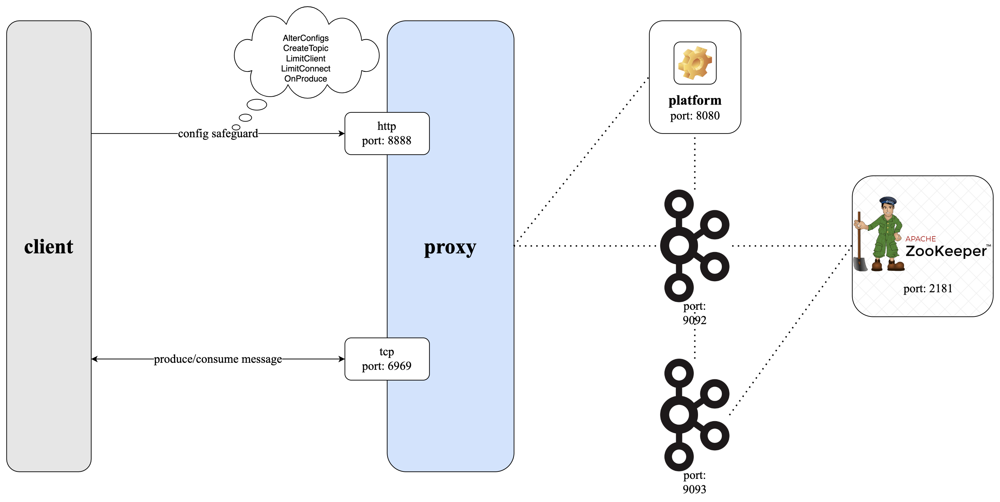

# Conduktor Gateway Safeguard Demo

## What is Conduktor Gateway Safeguard?

Kafka is an extremely configurable system. This flexibility is great but can lead to situations where inefficient choices are made that can have unexpeccted impact. Conduktor Gateway's safeguard feature set allows limits beyond the scope of regular Kafka to be imposed to ensure that the most efficient configuration is applied in Kafka. Safeguard is an ever expanding set of features, check out our website for the latest offering [conduktor.io](https://conduktor.io/).

* [Create topic policy](createTopic/Readme.md) - Limits on topic creation to ensure that any topics created in the cluster adhere to a minimum specification for Replication Factor and Partition count.
* [Alter broker config policy](alterConfigs/Readme.md) - Protect Kafka from inefficient configurations.
* [Produce policy](onProduce/Readme.md) - Protect Kafka from inefficient messages.
* [Limit Clients Calls](limitClient/Readme.md) - Limit client calls to Conduktor Gateway.
* [Limit Clients Connections](limitConnect/Readme.md) - Limit client connections.

### Architecture diagram

