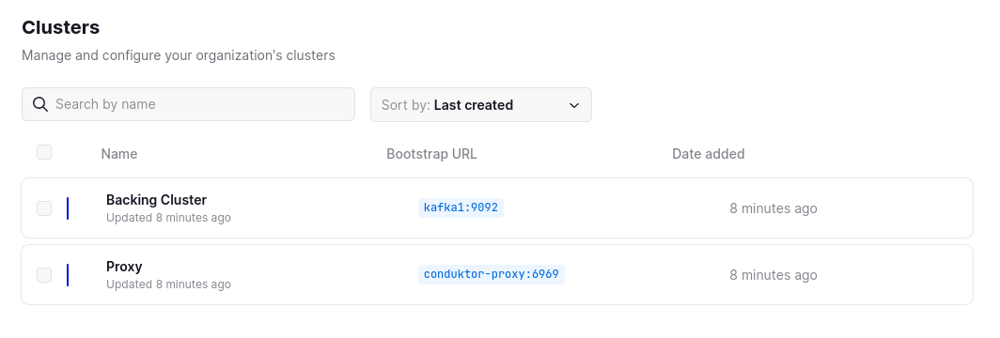

# Alter broker config policy

In this demo, we will impose limits on broker configuration changes to ensure that any configuration changed in the cluster adhere to the configured specification.

## Running the demo

### Step 1: Review the environment

As can be seen from `docker-compose.yaml` the demo environment consists of the following:

* A single Zookeeper Server
* A 2 node Kafka cluster
* A single Conduktor Gateway container
* A Conduktor Console container
* A Kafka Client container (this provides nothing more than a place to run kafka client commands)

### Step 2: Review the Console configuration

The `platform-config.yaml` defines 2 cluster configurations:

* Backing Kafka - this is a direct connection to the underlying Kafka cluster hosting the demo
* Gateway - a connection through Conduktor Gateway to the underlying Kafka

Note: Gateway and the backing Kafka can use different security schemes. 
In this case the backing Kafka is PLAINTEXT but the gateway is SASL_PLAIN.

### Step 3: Start the environment

Start the environment with

```bash
# setup environment
docker compose up --wait --detach
```

### Step 4: Create a topic

We create topics using the Kafka console tools, the below creates a topic named `safeguardTopic`

```bash
# Create a topic
docker compose exec kafka-client \
  kafka-topics \
    --bootstrap-server conduktor-gateway:6969 \
    --command-config /clientConfig/gateway.properties \
    --create --if-not-exists \
    --topic safeguardTopic
```

List the created topic

```bash
# Check it has been created
docker compose exec kafka-client \
  kafka-topics \
    --bootstrap-server conduktor-gateway:6969 \
    --command-config /clientConfig/gateway.properties \
    --list
```

### Step 4: Add the interceptor

Conduktor gateway provides a REST API used to add interceptors.


```bash
# Add alter topic config policy
docker-compose exec kafka-client \
curl \
    --user "admin:conduktor" \
    --request POST conduktor-gateway:8888/admin/interceptors/v1/vcluster/someCluster/users/someUser/interceptors/guard-alter-configs \
    --header 'Content-Type: application/json' \
    --data-raw '{
        "pluginClass": "io.conduktor.gateway.interceptor.safeguard.AlterBrokerConfigPolicyPlugin",
        "priority": 100,
        "config": {
            "minLogRetentionBytes": 10,
            "maxLogRetentionBytes": 100,
            "minLogRetentionMs": 10,
            "maxLogRetentionMs": 100,
            "minLogSegmentBytes": 10,
            "maxLogSegmentBytes": 100
        }
    }'
```

### Step 5: Attempt to alter config

Next we try to alter configs of safeguardTopic with a specification that does not match the above.

```bash
# Now, alter topic with invalid configs
docker compose exec kafka-client \
  kafka-configs \
    --bootstrap-server conduktor-gateway:6969 \
    --command-config /clientConfig/gateway.properties \
    --alter --topic safeguardTopic \
    --add-config retention.ms=10000,retention.bytes=10000,segment.bytes=10000
```

You should see an output similar to the following:

```bash
Error while executing config command with args '--bootstrap-server conduktor-gateway:6969 --command-config /clientConfig/gateway.properties --alter --topic test --add-config retention.ms=10000,retention.bytes=10000,segment.bytes=10000'
java.util.concurrent.ExecutionException: org.apache.kafka.common.errors.PolicyViolationException: Request parameters do not satisfy the configured policy. retention.ms is '10000', must not be greater than 100. segment.bytes is '10000', must not be greater than 100. retention.bytes is '10000', must not be greater than 100
```
### Step 6: Alter valid config

If we modify our command to meet the criteria the configuration is altered.

```bash
# alter topic with valid configs
docker compose exec kafka-client \
  kafka-configs \
    --bootstrap-server conduktor-gateway:6969 \
    --command-config /clientConfig/gateway.properties \
    --alter \
    --alter --topic safeguardTopic \
    --add-config retention.ms=50,retention.bytes=50,segment.bytes=50
```

```bash
# check configs has altered
docker compose exec kafka-client \
  kafka-configs \
    --bootstrap-server conduktor-gateway:6969 \
    --command-config /clientConfig/gateway.properties \
    --describe \
    --topic safeguardTopic
```

You should see an output similar to the following:
```bash
segment.bytes=50 sensitive=false synonyms={DYNAMIC_TOPIC_CONFIG:segment.bytes=50, DEFAULT_CONFIG:log.segment.bytes=1073741824}
retention.ms=50 sensitive=false synonyms={DYNAMIC_TOPIC_CONFIG:retention.ms=50}
retention.bytes=50 sensitive=false synonyms={DYNAMIC_TOPIC_CONFIG:retention.bytes=50, DEFAULT_CONFIG:log.retention.bytes=-1}
```

### Step 7: Log into the platform

> The remaining steps in this demo require a Conduktor Platform license. For more information on this [Arrange a technical demo](https://www.conduktor.io/contact/demo)

Once you have a license key, place it in `platform-config.yaml` under the key: `license` e.g.:

```yaml
license: "eyJhbGciOiJFUzI1NiIsInR5cCI6I..."
```

the start the Conduktor Platform container:

```bash
docker compose up --wait --detach conduktor-platform
```

From a browser, navigate to `http://localhost:8080` and use the following to log in (as specified in `platform-config.yaml`):

Username: bob@conduktor.io
Password: admin

### Step 8: View the clusters in Conduktor Platform

From Conduktor Platform navigate to Admin -> Clusters, you should see 2 clusters as below:



### Step 9: View topic configurations with Conduktor Platform

Navigate to `Console` and select the `gateway` cluster from the top right.
You should now see the safeguardTopic topic and clicking on it and select `Configuration` tab.

You should see an output similar to the following:


