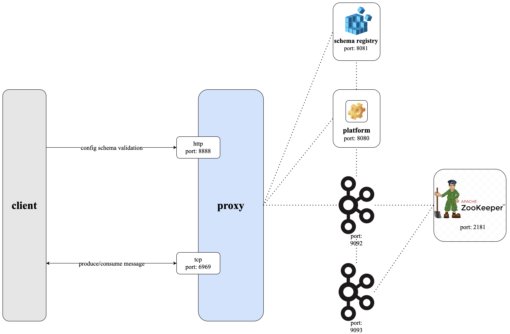

# Conduktor Gateway Schema Validation Demo

## What is Conduktor Gateway Schema Validation?

Conduktor Gateway's Schema Validation detects messages that have invalid schema information and rejects them. 

### Architecture diagram


## Running the demo

### Step 1: Review the environment

As can be seen from `docker-compose.yaml` the demo environment consists of the following:

* A single Zookeeper Server
* A 2 node Kafka cluster
* 2 Schema Registry containers
* A single Conduktor Gateway container
* A Kafka Client container (this provides nothing more than a place to run kafka client commands)

Note that there are 2 Schema registries. 

This means that schemas created by Kafka clients will not be valid in Gateway, enabling the test scenario.

### Step 2: Start the environment

Start the environment with

```bash
docker compose up --wait --detach

```

### Step 3: Create topics

Let's create a topic using the Kafka console tools, the below creates a topic named `sr-topic`.

```bash
docker compose exec kafka-client \
  kafka-topics \
    --bootstrap-server conduktor-gateway:6969 \
    --command-config /clientConfig/gateway.properties \
    --create --if-not-exists \
    --topic sr-topic
```

List the created topic

```bash
docker compose exec kafka-client \
  kafka-topics \
    --bootstrap-server conduktor-gateway:6969 \
    --command-config /clientConfig/gateway.properties \
    --list
```

### Step 4: Configure Schema validation

Conduktor Gateway provides a REST API that can be used to configure the schema validation interceptor. 

The command below will create an interceptor for validating that the records on topic `sr-topic` refer to a schema that exists in the schema registry referred to by the Gateway. 

```bash
docker compose exec kafka-client \
  curl \
    --user admin:conduktor \
    --request POST "conduktor-gateway:8888/admin/interceptors/v1/vcluster/someCluster/interceptor/sr-id-required" \
    --header 'Content-Type: application/json' \
    --data-raw '{
        "pluginClass": "io.conduktor.gateway.interceptor.safeguard.TopicRequiredSchemaIdPolicyPlugin",
        "priority": 100,
        "config": {
            "topic": "sr-topic",
            "schemaIdRequired": true
        }
    }'
```

Verify it exists.
(We use `jq` for readability, if you don't have this installed remove simply the `| jq` from the below command.)

```bash
docker compose exec kafka-client \
    curl \
        --silent \
        --user admin:conduktor \
        --request GET "conduktor-gateway:8888/admin/interceptors/v1/vcluster/someCluster/interceptor/sr-id-required" \
        --header 'Content-Type: application/json' | jq
```

### Step 5: Produce bad data to the topic

Let's produce a simple record to the topic.

```bash
echo '{"msg": "hello world"}' | 
  docker compose exec -T kafka-client \
      kafka-console-producer  \
          --bootstrap-server conduktor-gateway:6969 \
          --producer.config /clientConfig/gateway.properties \
          --topic sr-topic
```

The result is 

```
[2023-08-25 14:46:03,620] ERROR Error when sending message to topic sr-topic with key: null, value: 22 bytes with error: (org.apache.kafka.clients.producer.internals.ErrorLoggingCallback)
org.apache.kafka.common.errors.PolicyViolationException: Request parameters do not satisfy the configured policy. Topic 'sr-topic' with schemaId is required.
```

### Step 6: Produce good data to the topic

```bash
echo '{ 
    "name": "conduktor",
    "username": "test@conduktor.io",
    "password": "password1",
    "visa": "visa123456",
    "address": "Conduktor Towers, London" 
}' | jq -c | docker compose exec -T schema-registry \
    kafka-json-schema-console-producer  \
        --bootstrap-server conduktor-gateway:6969 \
        --producer.config /clientConfig/gateway.properties \
        --topic sr-topic \
        --property schema.registry.url=http://schema-registry-dev:8081 \
        --property value.schema='{ 
            "title": "User",
            "type": "object",
            "properties": { 
                "name": { "type": "string" },
                "username": { "type": "string" },
                "password": { "type": "string" },
                "visa": { "type": "string" },
                "address": { "type": "string" } 
            } 
        }'
```

### Step 6: Bringing the big guns: validating the schemas for real

Now instead of just making sure we have a schema Id, we'll make sure that it exists in the defined schema registry
... and that the payload can be deserizalized with it. Let's create our schema payload validation interceptor for that.

```bash
docker compose exec kafka-client \
  curl \
    --user admin:conduktor \
    --request POST "conduktor-gateway:8888/admin/interceptors/v1/vcluster/someCluster/interceptor/valid-schema-is-required" \
    --header 'Content-Type: application/json' \
    --data-raw '{
        "pluginClass": "io.conduktor.gateway.interceptor.safeguard.SchemaPayloadValidationPolicyPlugin",
        "priority": 100,
        "config": {
            "topic": "sr-topic",
            "schemaIdRequired": true,
            "validateSchema": true,
            "schemaRegistryConfig": {
                "host": "http://schema-registry:8081"
            }
        }
    }'
```

Verify it exists.

```bash
docker compose exec kafka-client \
    curl \
        --silent \
        --user admin:conduktor \
        --request GET "conduktor-gateway:8888/admin/interceptors/v1/vcluster/someCluster/interceptor/valid-schema-is-required" \
        --header 'Content-Type: application/json' | jq
```

Send data with a schema id Gateway does not know.

Gateway knows schemas from `http://schema-registry:8081` (we told it that in our interceptor creation), here we'll send data with ids from a schema registry it does not know. 


```bash
echo '{ 
    "name": "conduktor",
    "username": "test@conduktor.io",
    "password": "password1",
    "visa": "visa123456",
    "address": "Conduktor Towers, London" 
}' | jq -c | docker compose exec -T schema-registry \
    kafka-json-schema-console-producer  \
        --bootstrap-server conduktor-gateway:6969 \
        --producer.config /clientConfig/gateway.properties \
        --topic sr-topic \
        --property schema.registry.url=http://schema-registry-dev:8081 \
        --property value.schema='{ 
            "title": "User",
            "type": "object",
            "properties": { 
                "name": { "type": "string" },
                "username": { "type": "string" },
                "password": { "type": "string" },
                "visa": { "type": "string" },
                "address": { "type": "string" } 
            } 
        }'
```

And you get the following exception

```
org.apache.kafka.common.errors.PolicyViolationException: Request parameters do not satisfy the configured policy. Topic 'sr-topic' with schemaId is required.
```


### Step 6: Confirm there's not a schema in the schema-registry 

```bash
docker compose exec kafka-client \
  curl --silent http://schema-registry:8081/subjects/ | jq
```

outputs `[]`

There are no schemas.

What about in `schema-registry-dev`?


```bash
docker compose exec kafka-client \
  curl --silent http://schema-registry-dev:8081/subjects/ | jq
```

outputs 
```json
[
  "sr-topic-value"
]
```

Let's see this schema

```bash
docker compose exec kafka-client \
  curl --silent http://schema-registry-dev:8081/subjects/sr-topic-value/versions/1 | jq
```

produces:

```json
{
  "subject": "sr-topic-value",
  "version": 1,
  "id": 1,
  "schemaType": "JSON",
  "schema": "{\"title\":\"User\",\"type\":\"object\",\"properties\":{\"name\":{\"type\":\"string\"},\"username\":{\"type\":\"string\"},\"password\":{\"type\":\"string\"},\"visa\":{\"type\":\"string\"},\"address\":{\"type\":\"string\"}}}"
}
```
