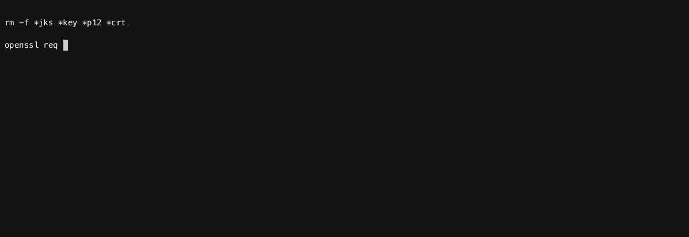

# SSL

When passwords are not enough, you can rely on TLS client certificate
But certificates do not host vcluster information, so let's map manually CN to vclusters.

## View the full demo in realtime

You can either follow all the steps manually, or just enjoy the recording

[](https://asciinema.org/a/hA7SQYteKFDmubJH7eqSlgcg0)

### Review the docker compose environment

As can be seen from `docker-compose.yaml` the demo environment consists of the following services:

* gateway1
* gateway2
* kafka1
* kafka2
* kafka3
* schema-registry
* zookeeper

```sh
cat docker-compose.yaml
```

<details>
  <summary>File content</summary>

```yaml
version: '3.7'
services:
  zookeeper:
    image: confluentinc/cp-zookeeper:latest
    hostname: zookeeper
    container_name: zookeeper
    environment:
      ZOOKEEPER_CLIENT_PORT: 2801
      ZOOKEEPER_TICK_TIME: 2000
    healthcheck:
      test: nc -zv 0.0.0.0 2801 || exit 1
      interval: 5s
      retries: 25
  kafka1:
    hostname: kafka1
    container_name: kafka1
    image: confluentinc/cp-kafka:latest
    ports:
    - 19092:19092
    environment:
      KAFKA_BROKER_ID: 1
      KAFKA_ZOOKEEPER_CONNECT: zookeeper:2801
      KAFKA_LISTENERS: INTERNAL://:9092,EXTERNAL_SAME_HOST://:19092
      KAFKA_ADVERTISED_LISTENERS: INTERNAL://kafka1:9092,EXTERNAL_SAME_HOST://localhost:19092
      KAFKA_LISTENER_SECURITY_PROTOCOL_MAP: INTERNAL:PLAINTEXT,EXTERNAL_SAME_HOST:PLAINTEXT
      KAFKA_INTER_BROKER_LISTENER_NAME: INTERNAL
      KAFKA_GROUP_INITIAL_REBALANCE_DELAY_MS: 0
      KAFKA_LOG4J_LOGGERS: kafka.authorizer.logger=INFO
      KAFKA_LOG4J_ROOT_LOGLEVEL: WARN
      KAFKA_AUTO_CREATE_TOPICS_ENABLE: false
    depends_on:
      zookeeper:
        condition: service_healthy
    healthcheck:
      test: nc -zv kafka1 9092 || exit 1
      interval: 5s
      retries: 25
  kafka2:
    hostname: kafka2
    container_name: kafka2
    image: confluentinc/cp-kafka:latest
    ports:
    - 19093:19093
    environment:
      KAFKA_BROKER_ID: 2
      KAFKA_ZOOKEEPER_CONNECT: zookeeper:2801
      KAFKA_LISTENERS: INTERNAL://:9093,EXTERNAL_SAME_HOST://:19093
      KAFKA_ADVERTISED_LISTENERS: INTERNAL://kafka2:9093,EXTERNAL_SAME_HOST://localhost:19093
      KAFKA_LISTENER_SECURITY_PROTOCOL_MAP: INTERNAL:PLAINTEXT,EXTERNAL_SAME_HOST:PLAINTEXT
      KAFKA_INTER_BROKER_LISTENER_NAME: INTERNAL
      KAFKA_GROUP_INITIAL_REBALANCE_DELAY_MS: 0
      KAFKA_LOG4J_LOGGERS: kafka.authorizer.logger=INFO
      KAFKA_LOG4J_ROOT_LOGLEVEL: WARN
      KAFKA_AUTO_CREATE_TOPICS_ENABLE: false
    depends_on:
      zookeeper:
        condition: service_healthy
    healthcheck:
      test: nc -zv kafka2 9093 || exit 1
      interval: 5s
      retries: 25
  kafka3:
    image: confluentinc/cp-kafka:latest
    hostname: kafka3
    container_name: kafka3
    ports:
    - 19094:19094
    environment:
      KAFKA_BROKER_ID: 3
      KAFKA_ZOOKEEPER_CONNECT: zookeeper:2801
      KAFKA_LISTENERS: INTERNAL://:9094,EXTERNAL_SAME_HOST://:19094
      KAFKA_ADVERTISED_LISTENERS: INTERNAL://kafka3:9094,EXTERNAL_SAME_HOST://localhost:19094
      KAFKA_LISTENER_SECURITY_PROTOCOL_MAP: INTERNAL:PLAINTEXT,EXTERNAL_SAME_HOST:PLAINTEXT
      KAFKA_INTER_BROKER_LISTENER_NAME: INTERNAL
      KAFKA_GROUP_INITIAL_REBALANCE_DELAY_MS: 0
      KAFKA_LOG4J_LOGGERS: kafka.authorizer.logger=INFO
      KAFKA_LOG4J_ROOT_LOGLEVEL: WARN
      KAFKA_AUTO_CREATE_TOPICS_ENABLE: false
    depends_on:
      zookeeper:
        condition: service_healthy
    healthcheck:
      test: nc -zv kafka3 9094 || exit 1
      interval: 5s
      retries: 25
  schema-registry:
    image: confluentinc/cp-schema-registry:latest
    hostname: schema-registry
    container_name: schema-registry
    ports:
    - 8081:8081
    environment:
      SCHEMA_REGISTRY_HOST_NAME: schema-registry
      SCHEMA_REGISTRY_KAFKASTORE_BOOTSTRAP_SERVERS: kafka1:9092,kafka2:9093,kafka3:9094
      SCHEMA_REGISTRY_LOG4J_ROOT_LOGLEVEL: WARN
      SCHEMA_REGISTRY_LISTENERS: http://0.0.0.0:8081
      SCHEMA_REGISTRY_KAFKASTORE_TOPIC: _schemas
      SCHEMA_REGISTRY_SCHEMA_REGISTRY_GROUP_ID: schema-registry
    volumes:
    - type: bind
      source: .
      target: /clientConfig
      read_only: true
    depends_on:
      kafka1:
        condition: service_healthy
      kafka2:
        condition: service_healthy
      kafka3:
        condition: service_healthy
    healthcheck:
      test: nc -zv schema-registry 8081 || exit 1
      interval: 5s
      retries: 25
  gateway1:
    image: conduktor/conduktor-gateway:2.5.0
    hostname: gateway1
    container_name: gateway1
    environment:
      KAFKA_BOOTSTRAP_SERVERS: kafka1:9092,kafka2:9093,kafka3:9094
      GATEWAY_ADVERTISED_HOST: localhost
      GATEWAY_MODE: GATEWAY_SECURITY
      GATEWAY_SECURITY_PROTOCOL: SSL
      GATEWAY_FEATURE_FLAGS_ANALYTICS: false
      GATEWAY_SSL_KEY_STORE_PATH: /config/keystore.jks
      GATEWAY_SSL_KEY_STORE_PASSWORD: 123456
      GATEWAY_SSL_KEY_PASSWORD: 123456
      GATEWAY_SSL_KEY_TYPE: pkcs12
      GATEWAY_SSL_TRUST_STORE_PATH: /config/truststore.jks
      GATEWAY_SSL_TRUST_STORE_PASSWORD: 123456
      GATEWAY_SSL_TRUST_STORE_TYPE: pkcs12
      GATEWAY_SSL_CLIENT_AUTH: REQUIRE
    depends_on:
      kafka1:
        condition: service_healthy
      kafka2:
        condition: service_healthy
      kafka3:
        condition: service_healthy
    ports:
    - 6969:6969
    - 6970:6970
    - 6971:6971
    - 8888:8888
    healthcheck:
      test: curl localhost:8888/health
      interval: 5s
      retries: 25
    volumes:
    - type: bind
      source: .
      target: /config
      read_only: true
  gateway2:
    image: conduktor/conduktor-gateway:2.5.0
    hostname: gateway2
    container_name: gateway2
    environment:
      KAFKA_BOOTSTRAP_SERVERS: kafka1:9092,kafka2:9093,kafka3:9094
      GATEWAY_ADVERTISED_HOST: localhost
      GATEWAY_MODE: GATEWAY_SECURITY
      GATEWAY_SECURITY_PROTOCOL: SSL
      GATEWAY_FEATURE_FLAGS_ANALYTICS: false
      GATEWAY_START_PORT: 7969
      GATEWAY_SSL_KEY_STORE_PATH: /config/keystore.jks
      GATEWAY_SSL_KEY_STORE_PASSWORD: 123456
      GATEWAY_SSL_KEY_PASSWORD: 123456
      GATEWAY_SSL_KEY_TYPE: jks
      GATEWAY_SSL_TRUST_STORE_PATH: /config/truststore.jks
      GATEWAY_SSL_TRUST_STORE_PASSWORD: 123456
      GATEWAY_SSL_TRUST_STORE_TYPE: jks
      GATEWAY_SSL_CLIENT_AUTH: REQUIRE
    depends_on:
      kafka1:
        condition: service_healthy
      kafka2:
        condition: service_healthy
      kafka3:
        condition: service_healthy
    ports:
    - 7969:7969
    - 7970:7970
    - 7971:7971
    - 8889:8888
    healthcheck:
      test: curl localhost:8888/health
      interval: 5s
      retries: 25
    volumes:
    - type: bind
      source: .
      target: /config
      read_only: true
networks:
  demo: null
```

</details>

 <details>
  <summary>docker compose ps</summary>

```
NAME              IMAGE                                    COMMAND                  SERVICE           CREATED          STATUS                    PORTS
kafka1            confluentinc/cp-kafka:latest             "/etc/confluent/dock…"   kafka1            23 seconds ago   Up 16 seconds (healthy)   9092/tcp, 0.0.0.0:19092->19092/tcp
kafka2            confluentinc/cp-kafka:latest             "/etc/confluent/dock…"   kafka2            23 seconds ago   Up 16 seconds (healthy)   9092/tcp, 0.0.0.0:19093->19093/tcp
kafka3            confluentinc/cp-kafka:latest             "/etc/confluent/dock…"   kafka3            23 seconds ago   Up 16 seconds (healthy)   9092/tcp, 0.0.0.0:19094->19094/tcp
schema-registry   confluentinc/cp-schema-registry:latest   "/etc/confluent/dock…"   schema-registry   23 seconds ago   Up 10 seconds (healthy)   0.0.0.0:8081->8081/tcp
zookeeper         confluentinc/cp-zookeeper:latest         "/etc/confluent/dock…"   zookeeper         23 seconds ago   Up 22 seconds (healthy)   2181/tcp, 2888/tcp, 3888/tcp

```

</details>

## 


```sh

rm -f *jks *key *p12 *crt

openssl req \
  -x509 \
  -newkey rsa:4096 \
  -sha256 \
  -days 3560 \
  -nodes \
  -keyout san.key \
  -out san.crt \
  -subj '/CN=username' \
  -extensions san \
  -config openssl.config

  openssl pkcs12 \
    -export \
    -in san.crt \
    -inkey san.key \
    -name brokers \
    -out san.p12 \
    -password "pass:123456"

  keytool \
    -noprompt \
    -alias brokers \
    -importkeystore \
    -deststorepass 123456 \
    -destkeystore keystore.jks \
    -srckeystore san.p12 \
    -srcstoretype PKCS12 \
    -srcstorepass 123456

  keytool \
    -noprompt \
    -import \
    -alias brokers \
    -file san.crt \
    -keypass 123456 \
    -destkeystore truststore.jks \
    -storepass 123456

echo """
bootstrap.servers=localhost:6969
security.protocol=SSL
ssl.truststore.location=$PWD/truststore.jks
ssl.truststore.password=123456
ssl.keystore.location=$PWD/keystore.jks
ssl.keystore.password=123456
""" > client.config
```

<details>
  <summary>Realtime command output</summary>

  

</details>


<details>
<summary>Command output</summary>

```sh


rm -f *jks *key *p12 *crt

openssl req \
  -x509 \
  -newkey rsa:4096 \
  -sha256 \
  -days 3560 \
  -nodes \
  -keyout san.key \
  -out san.crt \
  -subj '/CN=username' \
  -extensions san \
  -config openssl.config
.....+..+.+.........+++++++++++++++++++++++++++++++++++++++++++++*.+.......+...+.....+.+.........+......+......+...+..+.......+.....+......+....+...+........+......+....+.........+..+....+......+++++++++++++++++++++++++++++++++++++++++++++*..................+.+........................+...............+........+..........+...+........+......+...+.+......+.....................+...+.....+.........+.+.................+....+........+.+......+...+..+.+........+............+.........+...+...+...+.+.....+................+.........+...+..+...+......+.+.........+..+....+........+......+.......+...+......+...+.....+.......+......+............+...+.....+.......+......+..+...+.......+.....+....+...+.....+......+.........+..........+...........+....+..+.............+..+.+...+.........+......+......+...........+....+.....+.+...+...........+.....................+...+.......+........+............+....+..................+.....+......+....+..+.........+.+.....+.........+......+...+.......+...+........+..........+..............+.............+......+....................+......+......+...+.+......+..............................+.....+....+.........+............+........+.......+...+.....+.......+.........+......+..+................+.....+.........+...+............+...+..........+.....+....+.........+......+...........+...............+..........+............+.....+............+......+.......+...+........+.+.....+..........+......+........+....+........+........................+...+.......+...+............+..............+......+.+...+...........+...+......................+...+..+....+.....+................+...+..+....+............+..+......+.......+..+.+......+..............................+...+......+............+..+.....................+..........+...........+...+............+..........+...+........+...+....+...+.....+...+.........+....................................+...............+...................+..+..........+.....+.+.....+.......+...+..+...+....+.........+..+.............+.....+.+........+......+.......+..+..........+...........+.+.....+.........+...................+.....+......+.+...+...+..+...+..........+...+......+........+...+.........+...............+......+...+....+..+.+.........+.........+.....+.........+.+.........+......+...........+....+..............+.......+......+........+.......+............+......+.....+...............+......+...+.+......+......+..+......+....+...+...............+...+.........+..+......+.......+..+.........+.........+......+...............+......+....+...........+......+...+....+......+.........+......+..+....+........+...+...+.+...........+............+......+......+....+......+.....+...............+....+.....+....+..+....+.................+...............+.......+...........+......+...+......+....+.....+......+.+...........+..........+...+......+...+..................+...+.........+.....+.+.....+............+...+.+.....................+.....+.......+..+......+.......+........+...+.+.......................+......+.+.....+.+........+....+........+..........+.....+...+.......+...+......+...+..................+...+..+.......+....................+..........+..................+.....+...+.....................+....+.........+...+............+..+.........+.......+..+.......+......+..+............................+...+...........+...+......+....+...............+..+...+...............+...+..................+....+...+...+.....+....+.....+............+.............+......+............+..+.......+.....+.+.....+....+++++
...+++++++++++++++++++++++++++++++++++++++++++++*......+.........+.......+........+......+....+........+.......+..+...+.......+.....+....+.....+.+...+........+.......+..+.........+++++++++++++++++++++++++++++++++++++++++++++*.....+......+................+.....+....+.....+.........+..........+........+...+.........+...+++++
-----

  openssl pkcs12 \
    -export \
    -in san.crt \
    -inkey san.key \
    -name brokers \
    -out san.p12 \
    -password "pass:123456"

  keytool \
    -noprompt \
    -alias brokers \
    -importkeystore \
    -deststorepass 123456 \
    -destkeystore keystore.jks \
    -srckeystore san.p12 \
    -srcstoretype PKCS12 \
    -srcstorepass 123456
Import du fichier de clés san.p12 vers keystore.jks...

  keytool \
    -noprompt \
    -import \
    -alias brokers \
    -file san.crt \
    -keypass 123456 \
    -destkeystore truststore.jks \
    -storepass 123456
Certificat ajouté au fichier de clés

echo """
bootstrap.servers=localhost:6969
security.protocol=SSL
ssl.truststore.location=$PWD/truststore.jks
ssl.truststore.password=123456
ssl.keystore.location=$PWD/keystore.jks
ssl.keystore.password=123456
""" > client.config

```

</details>
      


## Starting the docker environment

Start all your docker processes, wait for them to be up and ready, then run in background

* `--wait`: Wait for services to be `running|healthy`. Implies detached mode.
* `--detach`: Detached mode: Run containers in the background

```sh
docker compose up --detach --wait
```

<details>
  <summary>Realtime command output</summary>

  

</details>


<details>
<summary>Command output</summary>

```sh

docker compose up --detach --wait
 Container zookeeper  Creating
 Container zookeeper  Created
 Container kafka2  Creating
 Container kafka3  Creating
 Container kafka1  Creating
 Container kafka2  Created
 Container kafka1  Created
 Container kafka3  Created
 Container gateway2  Creating
 Container schema-registry  Creating
 Container gateway1  Creating
 gateway1 The requested image's platform (linux/amd64) does not match the detected host platform (linux/arm64/v8) and no specific platform was requested 
 gateway2 The requested image's platform (linux/amd64) does not match the detected host platform (linux/arm64/v8) and no specific platform was requested 
 Container gateway2  Created
 Container gateway1  Created
 Container schema-registry  Created
 Container zookeeper  Starting
 Container zookeeper  Started
 Container zookeeper  Waiting
 Container zookeeper  Waiting
 Container zookeeper  Waiting
 Container zookeeper  Healthy
 Container kafka1  Starting
 Container zookeeper  Healthy
 Container kafka2  Starting
 Container zookeeper  Healthy
 Container kafka3  Starting
 Container kafka1  Started
 Container kafka3  Started
 Container kafka2  Started
 Container kafka1  Waiting
 Container kafka2  Waiting
 Container kafka3  Waiting
 Container kafka1  Waiting
 Container kafka2  Waiting
 Container kafka3  Waiting
 Container kafka2  Waiting
 Container kafka3  Waiting
 Container kafka1  Waiting
 Container kafka1  Healthy
 Container kafka2  Healthy
 Container kafka3  Healthy
 Container kafka2  Healthy
 Container kafka1  Healthy
 Container kafka1  Healthy
 Container gateway1  Starting
 Container kafka3  Healthy
 Container gateway2  Starting
 Container kafka3  Healthy
 Container kafka2  Healthy
 Container schema-registry  Starting
 Container gateway2  Started
 Container schema-registry  Started
 Container gateway1  Started
 Container gateway1  Waiting
 Container gateway2  Waiting
 Container zookeeper  Waiting
 Container kafka1  Waiting
 Container kafka2  Waiting
 Container kafka3  Waiting
 Container schema-registry  Waiting
 Container kafka1  Healthy
 Container kafka3  Healthy
 Container zookeeper  Healthy
 Container kafka2  Healthy
 Container schema-registry  Healthy
 Container gateway2  Healthy
 Container gateway1  Healthy

```

</details>
      


## Adding user mapping for CN=username


```sh
cat step-06-user-mapping.json | jq

curl \
    --request POST 'http://localhost:8888/admin/userMappings/v1' \
    --header 'Content-Type: application/json' \
    --user 'admin:conduktor' \
    --silent \
    --data "@step-06-user-mapping.json" | jq
```

<details>
  <summary>Realtime command output</summary>

  

</details>


<details>
<summary>Command output</summary>

```sh

cat step-06-user-mapping.json | jq
{
  "username": "CN=username"
}

curl \
    --request POST 'http://localhost:8888/admin/userMappings/v1' \
    --header 'Content-Type: application/json' \
    --user 'admin:conduktor' \
    --silent \
    --data "@step-06-user-mapping.json" | jq
{
  "message": "User mapping is created"
}

```

</details>
      


## Creating topic `foo` on `gateway1`

Creating topic `foo` on `gateway1`
* Topic `foo` with partitions:10 and replication-factor:1

```sh
kafka-topics \
    --bootstrap-server localhost:6969 \
    --command-config client.config \
    --replication-factor 1 \
    --partitions 10 \
    --create --if-not-exists \
    --topic foo
```

<details>
  <summary>Realtime command output</summary>

  

</details>


<details>
<summary>Command output</summary>

```sh

kafka-topics \
    --bootstrap-server localhost:6969 \
    --command-config client.config \
    --replication-factor 1 \
    --partitions 10 \
    --create --if-not-exists \
    --topic foo
Created topic foo.

```

</details>
      


## Listing topics in `gateway1`


```sh
kafka-topics \
    --bootstrap-server localhost:6969 \
    --command-config client.config \
    --list
```

<details>
  <summary>Realtime command output</summary>

  

</details>


<details>
<summary>Command output</summary>

```sh

kafka-topics \
    --bootstrap-server localhost:6969 \
    --command-config client.config \
    --list
__consumer_offsets
_acls
_auditLogs
_consumerGroupSubscriptionBackingTopic
_encryptionConfig
_interceptorConfigs
_license
_offsetStore
_schemas
_topicMappings
_topicRegistry
_userMapping
foo

```

</details>
      


## Listing topics in `kafka1`


```sh
kafka-topics \
    --bootstrap-server localhost:19092,localhost:19093,localhost:19094 \
    --list
```

<details>
  <summary>Realtime command output</summary>

  

</details>


<details>
<summary>Command output</summary>

```sh

kafka-topics \
    --bootstrap-server localhost:19092,localhost:19093,localhost:19094 \
    --list
__consumer_offsets
_acls
_auditLogs
_consumerGroupSubscriptionBackingTopic
_encryptionConfig
_interceptorConfigs
_license
_offsetStore
_schemas
_topicMappings
_topicRegistry
_userMapping
foo

```

</details>
      


